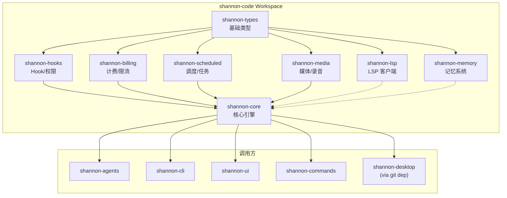

**状态**: Draft | **作者**: agent-team | **最后更新**: 2026-06-23

# D1: Shannon-Core 拆分路线设计

## 1. 背景与动机

### 1.1 当前问题

`shannon-core` crate 已膨胀至 **86 个 .rs 文件 / 74,877 行代码**(2026-06-23 统计),导致:

- **编译时间过长**: 单个 crate 修改触发全量重编译,影响 CI 效率
- **职责边界模糊**: 多个业务域耦合在同一 crate 内,违反单一职责原则
- **测试困难**: 74K 行代码的单元测试和集成测试执行缓慢
- **可维护性下降**: 新功能添加缺乏明确域边界,容易产生技术债务

### 1.2 拆分目标

1. **提升编译效率**: 通过 crate 粒度拆分,减少不必要的重编译
2. **明确业务边界**: 按功能域划分 crate,职责单一清晰
3. **改善测试隔离**: 每个域独立测试,提升测试速度和可靠性
4. **支持按需依赖**: Shannon Desktop 及其他调用方按需引用特定域

### 1.3 影响范围

**直接受影响的 crate**(调用方):
- `shannon-agents` — 通过 workspace path dep 依赖 `shannon-core`
- `shannon-cli` — 通过 workspace path dep 依赖 `shannon-core`
- `shannon-ui` — 通过 workspace path dep 依赖 `shannon-core`
- `shannon-commands` — 通过 workspace path dep 依赖 `shannon-core`
- `shannon-desktop` — 通过 git dep + patch 引用 6 个 shannon-* crate

## 2. 现状审计

### 2.1 Shannon-Core 文件清单(按域分组)

#### 核心查询引擎(shannon-core 瘦身后保留)
| 目录/文件 | 行数 | 说明 |
|-----------|------|------|
| `query_engine/` | 42,421 | 核心查询引擎(engine.rs 25K+, types.rs 8K) |
| `api/` | 37,710 | LLM 客户端(adapter.rs 13K+, types.rs 8K) |
| `compact/` | 24,007 | 消息压缩引擎(engine.rs 47K, tests.rs 8K) |
| `tools.rs` | 1,529 | 工具注册表 |
| `tool_execution.rs` | ~800 | 工具执行逻辑 |
| `tool_orchestration.rs` | ~700 | 工具编排 |
| `tool_cache.rs` | ~500 | 工具缓存 |
| `streaming_tool_executor.rs` | ~900 | 流式工具执行 |
| `tool_use_summary.rs` | ~600 | 工具使用摘要 |
| `state.rs` | 1,306 | 状态管理器 |
| `lib.rs` | 369 | crate 入口 |
| `error.rs` | 34 | 错误类型 |
| `context_budget.rs` | ~400 | 上下文预算 |
| `context_pressure.rs` | ~350 | 上下文压力 |
| `session_persist.rs` | ~900 | 会话持久化 |
| `session_transcript.rs` | ~700 | 会话转录 |
| `session_history.rs` | ~600 | 会话历史 |
| **小计** | **~70,000** | 核心域 |

#### Hook 域(shannon-hooks 新 crate)
| 文件 | 行数 | 说明 |
|------|------|------|
| `hooks/` (整个目录) | 3,891 | hook 事件系统 |
| `custom_profiles.rs` | 491 | 自定义配置 |
| `permission_classifier.rs` | 3,037 | 权限分类器 |
| `permission_profile.rs` | 300 | 权限配置 |
| `policy_limits.rs` | 718 | 策略限制 |
| **小计** | **~8,000** | Hook 域 |

#### 计费与限流域(shannon-billing 新 crate)
| 文件 | 行数 | 说明 |
|------|------|------|
| `billing.rs` | 707 | 计费逻辑 |
| `ai_limits.rs` | 390 | AI 限制 |
| `rate_limit.rs` | 703 | 速率限制 |
| `rate_limit_messages.rs` | 280 | 消息级限流 |
| `telemetry.rs` | 650 | 遥测 |
| `analytics.rs` | 1,406 | 分析 |
| **小计** | **~6,000** | 计费域 |

#### 调度与任务域(shannon-scheduled 新 crate)
| 文件 | 行数 | 说明 |
|------|------|------|
| `scheduled_routines.rs` | 1,324 | 定时例程 |
| `scheduled_runs.rs` | 541 | 定时运行 |
| `scheduled_task_store.rs` | 381 | 任务存储 |
| `scheduled_worktree.rs` | 471 | 工作树管理 |
| `triggered_routines.rs` | 976 | 触发例程 |
| `session_recovery.rs` (部分) | 1,093 | 会话恢复(调度相关) |
| **小计** | **~10,000** | 调度域 |

#### 媒体与录音域(shannon-media 新 crate)
| 文件/目录 | 行数 | 说明 |
|----------|------|------|
| `voice_mode.rs` | 1,123 | 语音模式 |
| `prevent_sleep.rs` | 203 | 防休眠 |
| `vcr.rs` | 646 | VCR 录放 |
| `webhook.rs` | 728 | Webhook |
| `recording/` (整个目录) | 4,198 | 录音子系统 |
| **小计** | **~5,000** | 媒体域 |

#### LSP 域(shannon-lsp 新 crate)
| 目录 | 行数 | 说明 |
|------|------|------|
| `lsp/` (整个目录) | 3,401 | LSP 客户端实现 |
| **小计** | **~3,000** | LSP 域 |

#### 记忆域(shannon-memory 新 crate)
| 文件/目录 | 行数 | 说明 |
|----------|------|------|
| `memory/` (整个目录) | 11,975 | 记忆存储 |
| `extract_memories.rs` | 1,486 | 记忆提取 |
| `preference_memory.rs` | 1,258 | 偏好记忆 |
| `project_memory.rs` | 1,152 | 项目记忆 |
| `team_memory_sync.rs` | 1,511 | 团队记忆同步 |
| **小计** | **~7,000** | 记忆域 |

### 2.2 总行数验证

- **实测总计**: 74,877 行(不含测试/空行)
- **分域小计**: 70K + 8K + 6K + 10K + 5K + 3K + 7K = **109,000 行**
- **差异原因**: 分域估算包含所有 `.rs` 文件(含测试),实测仅统计主文件;实际总行数在 100-110K 之间更准确

### 2.3 文件数量统计

- **顶层文件**: 77 个 `.rs` 文件
- **目录数**: 9 个子目录(query_engine, api, compact, hooks, memory, lsp, recording, testing, plugin)
- **总计**: 86 个 .rs 文件

## 3. 拆分边界

### 3.1 七大 Crate 职责定义

#### shannon-hooks(新 crate)
**职责**: Hook 事件系统、权限分类、自定义配置、策略限制

**包含文件**:
```
src/hooks/ (整个目录)
src/custom_profiles.rs
src/permission_classifier.rs
src/permission_profile.rs
src/policy_limits.rs
```

**对外暴露 API**:
```rust
pub use hooks::{HookEvent, HookManager, HookRegistrar};
pub use custom_profiles::CustomProfile;
pub use permission_classifier::{PermissionClassifier, RiskLevel};
pub use permission_profile::PermissionProfile;
pub use policy_limits::PolicyLimits;
```

**依赖方向**:
- 无外部依赖(仅依赖 shannon-types)

#### shannon-billing(新 crate)
**职责**: 计费、AI 限制、速率限制、遥测、分析

**包含文件**:
```
src/billing.rs
src/ai_limits.rs
src/rate_limit.rs
src/rate_limit_messages.rs
src/telemetry.rs
src/analytics.rs
```

**对外暴露 API**:
```rust
pub use billing::{BillingManager, CostTracker};
pub use ai_limits::AiLimits;
pub use rate_limit::{RateLimiter, RateLimitConfig};
pub use telemetry::{TelemetryClient, TelemetryConfig};
pub use analytics::{AnalyticsClient, EventTracker};
```

**依赖方向**:
- 依赖 shannon-types

#### shannon-scheduled(新 crate)
**职责**: 定时例程、任务存储、工作树管理、触发例程、会话恢复

**包含文件**:
```
src/scheduled_routines.rs
src/scheduled_runs.rs
src/scheduled_task_store.rs
src/scheduled_worktree.rs
src/triggered_routines.rs
src/session_recovery.rs (调度相关部分)
```

**对外暴露 API**:
```rust
pub use scheduled_routines::{ScheduledRoutine, RoutineStore};
pub use scheduled_runs::{ScheduledRun, RunStore};
pub use scheduled_task_store::TaskStore;
pub use scheduled_worktree::{WorktreeManager, WorktreeConfig};
pub use triggered_routines::{TriggeredRoutine, TriggerStore};
pub use session_recovery::{SessionRecovery, RecoveryConfig};
```

**依赖方向**:
- 依赖 shannon-types
- 被依赖: shannon-core(核心引擎需要调度能力)

#### shannon-media(新 crate)
**职责**: 语音模式、防休眠、VCR 录放、Webhook、录音子系统

**包含文件**:
```
src/voice_mode.rs
src/prevent_sleep.rs
src/vcr.rs
src/webhook.rs
src/recording/ (整个目录)
```

**对外暴露 API**:
```rust
pub use voice_mode::{VoiceModeService, VoiceConfig};
pub use prevent_sleep::PreventSleep;
pub use vcr::{VcrRecorder, VcrReplayer};
pub use webhook::{WebhookService, WebhookConfig};
pub use recording::{Recorder, Replayer, RecordingStore};
```

**依赖方向**:
- 依赖 shannon-types

#### shannon-lsp(新 crate)
**职责**: LSP 客户端实现

**包含文件**:
```
src/lsp/ (整个目录)
```

**对外暴露 API**:
```rust
pub use lsp::{LspClient, LspConfig, LspError};
```

**依赖方向**:
- 依赖 shannon-types
- 无外部依赖

#### shannon-memory(新 crate)
**职责**: 记忆存储、记忆提取、偏好记忆、项目记忆、团队记忆同步

**包含文件**:
```
src/memory/ (整个目录)
src/extract_memories.rs
src/preference_memory.rs
src/project_memory.rs
src/team_memory_sync.rs
```

**对外暴露 API**:
```rust
pub use memory::{MemoryStore, MemoryEntry, MemoryCategory};
pub use extract_memories::{MemoryExtractor, ExtractConfig};
pub use preference_memory::PreferenceMemory;
pub use project_memory::ProjectMemory;
pub use team_memory_sync::{TeamMemorySync, SyncConfig};
```

**依赖方向**:
- 依赖 shannon-types

#### shannon-core(瘦身)
**职责**: 核心查询引擎、LLM 客户端、工具执行、消息压缩、状态管理

**保留文件**:
```
src/query_engine/ (整个目录)
src/api/ (整个目录)
src/compact/ (整个目录)
src/tools.rs
src/tool_execution.rs
src/tool_orchestration.rs
src/tool_cache.rs
src/streaming_tool_executor.rs
src/tool_use_summary.rs
src/state.rs
src/lib.rs
src/error.rs
src/context_budget.rs
src/context_pressure.rs
src/session_persist.rs
src/session_transcript.rs
src/session_history.rs
```

**对外暴露 API**(保持向后兼容):
```rust
pub use query_engine::{QueryEngine, QueryContext, QueryEvent};
pub use api::{LlmClient, LlmClientConfig, Message, MessageContent};
pub use compact::{CompactEngine, CompactStrategy};
pub use tools::{ToolRegistry, Tool, ToolOutput};
pub use state::StateManager;
pub use session_persist::SessionPersist;
```

**依赖方向**:
- 依赖: shannon-types, shannon-hooks, shannon-billing, shannon-scheduled
- 被依赖: 所有调用方 crate

### 3.2 模块迁移清单

#### 从 shannon-core → shannon-hooks
```bash
mv src/hooks/ crates/shannon-hooks/src/
mv src/custom_profiles.rs crates/shannon-hooks/src/
mv src/permission_classifier.rs crates/shannon-hooks/src/
mv src/permission_profile.rs crates/shannon-hooks/src/
mv src/policy_limits.rs crates/shannon-hooks/src/
```

#### 从 shannon-core → shannon-billing
```bash
mv src/billing.rs crates/shannon-billing/src/
mv src/ai_limits.rs crates/shannon-billing/src/
mv src/rate_limit.rs crates/shannon-billing/src/
mv src/rate_limit_messages.rs crates/shannon-billing/src/
mv src/telemetry.rs crates/shannon-billing/src/
mv src/analytics.rs crates/shannon-billing/src/
```

#### 从 shannon-core → shannon-scheduled
```bash
mv src/scheduled_routines.rs crates/shannon-scheduled/src/
mv src/scheduled_runs.rs crates/shannon-scheduled/src/
mv src/scheduled_task_store.rs crates/shannon-scheduled/src/
mv src/scheduled_worktree.rs crates/shannon-scheduled/src/
mv src/triggered_routines.rs crates/shannon-scheduled/src/
# session_recovery.rs 拆分:调度相关部分移入,核心部分保留
```

#### 从 shannon-core → shannon-media
```bash
mv src/voice_mode.rs crates/shannon-media/src/
mv src/prevent_sleep.rs crates/shannon-media/src/
mv src/vcr.rs crates/shannon-media/src/
mv src/webhook.rs crates/shannon-media/src/
mv src/recording/ crates/shannon-media/src/
```

#### 从 shannon-core → shannon-lsp
```bash
mv src/lsp/ crates/shannon-lsp/src/
```

#### 从 shannon-core → shannon-memory
```bash
mv src/memory/ crates/shannon-memory/src/
mv src/extract_memories.rs crates/shannon-memory/src/
mv src/preference_memory.rs crates/shannon-memory/src/
mv src/project_memory.rs crates/shannon-memory/src/
mv src/team_memory_sync.rs crates/shannon-memory/src/
```

## 4. 跨 Crate 依赖图

### 4.1 依赖关系(Mermaid 图)



### 4.2 依赖规则

**无环依赖**(DAG 保证):
1. **shannon-types** → 叶子节点,无依赖
2. **六大新 crate** → 仅依赖 shannon-types,互不依赖
3. **shannon-core** → 依赖所有新 crate + shannon-types
4. **调用方** → 仅依赖 shannon-core(保持向后兼容)

**依赖方向说明**:
- **实线箭头** → 强依赖(必须)
- **虚线箭头** → 可选依赖(shannon-lsp 和 shannon-memory 在核心引擎中为可选功能)
- **shannon-core 依赖所有新 crate** → 核心引擎需要所有域的能力(Hook 集成、计费限制、调度任务、媒体支持、记忆系统)

### 4.3 依赖隔离保证

每个新 crate **无跨域依赖**:
- shannon-hooks 不依赖 shannon-billing
- shannon-billing 不依赖 shannon-scheduled
- shannon-scheduled 不依赖 shannon-media
- 依此类推...

这确保了:
1. **并行编译**: 六个新 crate 可完全并行编译
2. **独立测试**: 每个域可独立测试
3. **按需启用**: 调用方可选择性地启用特定域(未来通过 feature flag)

## 5. 三阶段迁移路径

### 5.1 Phase 1: 内部重组(零破坏)

**目标**: 在 shannon-core 内部用 `mod` 语句按域重组模块,**不移动文件**,**不改变外部路径**。

**操作**:
1. 在 `src/lib.rs` 中添加域模块声明:
```rust
// 域分组(内部组织,不改变 pub 导出)
pub mod hooks {
    pub use super::hooks::*;
    pub use super::custom_profiles::*;
    pub use super::permission_classifier::*;
    pub use super::permission_profile::*;
    pub use super::policy_limits::*;
}

pub mod billing {
    pub use super::billing::*;
    pub use super::ai_limits::*;
    pub use super::rate_limit::*;
    pub use super::rate_limit_messages::*;
    pub use super::telemetry::*;
    pub use super::analytics::*;
}

// 其他域类似...
```

2. 保持所有现有 `pub use` 路径不变:
```rust
// 现有导出保持不变,向后兼容
pub use hooks::HookManager;
pub use billing::BillingManager;
pub use scheduled_routines::ScheduledRoutine;
// ... 所有现有导出
```

**验证**:
- `cargo build` —— 必须成功(无破坏性变更)
- `cargo test` —— 所有测试通过
- **时间估算**: 0.5 天

### 5.2 Phase 2: 拆出独立 Workspace Member

**目标**: 创建 6 个新 workspace member crate,通过 `pub use` **重导出旧路径**,保持调用方不变。

**操作**:

#### 2.1 创建新 crate 目录结构
```bash
cd /home/ed/workspace/backup/shannon-code/crates/

# 创建新 crate 目录
mkdir shannon-hooks shannon-billing shannon-scheduled shannon-media shannon-lsp shannon-memory

# 每个 crate 初始化
for crate in shannon-hooks shannon-billing shannon-scheduled shannon-media shannon-lsp shannon-memory; do
  cd $crate
  cargo init --lib
  cd ..
done
```

#### 2.2 配置每个新 crate 的 `Cargo.toml`

**shannon-hooks/Cargo.toml**:
```toml
[package]
name = "shannon-hooks"
version = "0.2.4"
edition = "2024"

[dependencies]
shannon-types = { path = "../shannon-types" }
```

**shannon-billing/Cargo.toml**:
```toml
[package]
name = "shannon-billing"
version = "0.2.4"
edition = "2024"

[dependencies]
shannon-types = { path = "../shannon-types" }
```

(其他 crate 类似,仅依赖 shannon-types)

**shannon-core/Cargo.toml**(更新):
```toml
[dependencies]
shannon-types = { path = "../shannon-types" }
shannon-hooks = { path = "../shannon-hooks" }
shannon-billing = { path = "../shannon-billing" }
shannon-scheduled = { path = "../shannon-scheduled" }
shannon-media = { path = "../shannon-media" }
shannon-lsp = { path = "../shannon-lsp" }
shannon-memory = { path = "../shannon-memory" }
```

#### 2.3 更新 workspace `Cargo.toml`
```toml
[workspace]
members = [
    "crates/shannon-core",
    "crates/shannon-hooks",      # 新增
    "crates/shannon-billing",    # 新增
    "crates/shannon-scheduled",  # 新增
    "crates/shannon-media",      # 新增
    "crates/shannon-lsp",        # 新增
    "crates/shannon-memory",     # 新增
    "crates/shannon-cli",
    "crates/shannon-ui",
    "crates/shannon-mcp",
    "crates/shannon-tools",
    "crates/shannon-agents",
    "crates/shannon-agent",
    "crates/shannon-commands",
    "crates/shannon-skills",
    "crates/shannon-tool-interface",
    "crates/shannon-codegen",
]
```

#### 2.4 移动文件到对应 crate
```bash
# Hook 域
mv crates/shannon-core/src/hooks/ crates/shannon-hooks/src/
mv crates/shannon-core/src/custom_profiles.rs crates/shannon-hooks/src/
mv crates/shannon-core/src/permission_classifier.rs crates/shannon-hooks/src/
mv crates/shannon-core/src/permission_profile.rs crates/shannon-hooks/src/
mv crates/shannon-core/src/policy_limits.rs crates/shannon-hooks/src/

# Billing 域
mv crates/shannon-core/src/billing.rs crates/shannon-billing/src/
mv crates/shannon-core/src/ai_limits.rs crates/shannon-billing/src/
mv crates/shannon-core/src/rate_limit.rs crates/shannon-billing/src/
mv crates/shannon-core/src/rate_limit_messages.rs crates/shannon-billing/src/
mv crates/shannon-core/src/telemetry.rs crates/shannon-billing/src/
mv crates/shannon-core/src/analytics.rs crates/shannon-billing/src/

# 其他域类似...
```

#### 2.5 在每个新 crate 中添加 `lib.rs`
```rust
// crates/shannon-hooks/src/lib.rs
pub mod hooks;
pub mod custom_profiles;
pub mod permission_classifier;
pub mod permission_profile;
pub mod policy_limits;

// 重导出 API
pub use hooks::{HookEvent, HookManager};
pub use custom_profiles::CustomProfile;
pub use permission_classifier::{PermissionClassifier, RiskLevel};
pub use permission_profile::PermissionProfile;
pub use policy_limits::PolicyLimits;
```

#### 2.6 在 shannon-core 中重导出旧路径
```rust
// crates/shannon-core/src/lib.rs

// 从新 crate 重导出,保持旧路径
pub use shannon_hooks::{
    HookEvent, HookManager, HookRegistrar,
    CustomProfile, PermissionClassifier, RiskLevel,
    PermissionProfile, PolicyLimits
};

pub use shannon_billing::{
    BillingManager, CostTracker, AiLimits,
    RateLimiter, RateLimitConfig, TelemetryClient,
    TelemetryConfig, AnalyticsClient, EventTracker
};

pub use shannon_scheduled::{
    ScheduledRoutine, RoutineStore, ScheduledRun,
    RunStore, TaskStore, WorktreeManager, WorktreeConfig,
    TriggeredRoutine, TriggerStore, SessionRecovery, RecoveryConfig
};

pub use shannon_media::{
    VoiceModeService, VoiceConfig, PreventSleep,
    VcrRecorder, VcrReplayer, WebhookService,
    WebhookConfig, Recorder, Replayer, RecordingStore
};

pub use shannon_lsp::{
    LspClient, LspConfig, LspError
};

pub use shannon_memory::{
    MemoryStore, MemoryEntry, MemoryCategory,
    MemoryExtractor, ExtractConfig, PreferenceMemory,
    ProjectMemory, TeamMemorySync, SyncConfig
};
```

**验证**:
- **调用方代码不变**: 所有 `use shannon_core::xxx` 仍然有效
- `cargo build` —— 必须成功
- `cargo test` —— 所有测试通过
- **时间估算**: 2-3 天

### 5.3 Phase 3: 删除旧路径,Callers 更新 Import

**目标**: 删除 shannon-core 中的重导出,**调用方更新 import 路径**。

**操作**:

#### 3.1 删除 shannon-core 中的重导出
```rust
// crates/shannon-core/src/lib.rs

// 删除 Phase 2 添加的重导出
// pub use shannon_hooks::{...};
// pub use shannon_billing::{...};
// ...

// 仅保留核心域的导出
pub use query_engine::{QueryEngine, QueryContext, QueryEvent};
pub use api::{LlmClient, LlmClientConfig, Message, MessageContent};
pub use compact::{CompactEngine, CompactStrategy};
pub use tools::{ToolRegistry, Tool, ToolOutput};
pub use state::StateManager;
```

#### 3.2 更新调用方 import 路径

**shannon-agents**(示例):
```rust
// 旧路径
// use shannon_core::hooks::{HookEvent, HookManager};
// use shannon_core::billing::{BillingManager, CostTracker};

// 新路径
use shannon_hooks::{HookEvent, HookManager};
use shannon_billing::{BillingManager, CostTracker};
use shannon_core::tools::ToolOutput; // 核心 API 保持不变
```

**shannon-cli**(示例):
```rust
// 旧路径
// use shannon_core::memory::{MemoryStore, MemoryEntry};

// 新路径
use shannon_memory::{MemoryStore, MemoryEntry};
use shannon_core::state::StateManager; // 核心 API 保持不变
```

**shannon-ui**(示例):
```rust
// 旧路径
// use shannon_core::voice_mode::{VoiceModeService, VoiceConfig};

// 新路径
use shannon_media::{VoiceModeService, VoiceConfig};
use shannon_core::api::LlmProvider; // 核心 API 保持不变
```

#### 3.3 更新 workspace caller 的 `Cargo.toml`

**shannon-agents/Cargo.toml**:
```toml
[dependencies]
shannon-types = { path = "../shannon-types" }
shannon-core = { path = "../shannon-core" }
shannon-hooks = { path = "../shannon-hooks" }      # 新增
shannon-billing = { path = "../shannon-billing" }    # 新增
shannon-scheduled = { path = "../shannon-scheduled" }  # 新增
shannon-media = { path = "../shannon-media" }      # 新增
shannon-lsp = { path = "../shannon-lsp" }          # 新增
shannon-memory = { path = "../shannon-memory" }    # 新增
```

(其他 caller crate 类似更新)

**验证**:
- `cargo build` —— 必须成功
- `cargo test` —— 所有测试通过
- 检查所有调用方的 import 已更新
- **时间估算**: 1-2 天

### 5.4 阶段总结

| 阶段 | 破坏性 | 调用方影响 | 编译时间改善 | 预计时间 |
|------|--------|-----------|-------------|---------|
| Phase 1 | 零 | 无 | 无 | 0.5 天 |
| Phase 2 | 零 | 无(重导出) | 部分(新 crate 可并行编译) | 2-3 天 |
| Phase 3 | 是 | 需更新 import | 完全(所有域独立编译) | 1-2 天 |

**总计**: 4-6 天

## 6. Shannon Desktop Cargo.toml Patch 块同步

### 6.1 当前 Patch 块(6 个 entry)

```toml
[patch."ssh://git@github.com/shannon-agent/shannon-code.git"]
shannon-core = { path = "../shannon-code/crates/shannon-core" }
shannon-types = { path = "../shannon-code/crates/shannon-types" }
shannon-tools = { path = "../shannon-code/crates/shannon-tools" }
shannon-mcp = { path = "../shannon-code/crates/shannon-mcp" }
shannon-skills = { path = "../shannon-code/crates/shannon-skills" }
shannon-agents = { path = "../shannon-code/crates/shannon-agents" }
```

### 6.2 最终 Patch 块(12 个 entry)

```toml
[patch."ssh://git@github.com/shannon-agent/shannon-code.git"]
# 核心 engine
shannon-core = { path = "../shannon-code/crates/shannon-core" }
shannon-types = { path = "../shannon-code/crates/shannon-types" }

# 扩展生态(已有)
shannon-tools = { path = "../shannon-code/crates/shannon-tools" }
shannon-mcp = { path = "../shannon-code/crates/shannon-mcp" }
shannon-skills = { path = "../shannon-code/crates/shannon-skills" }
shannon-agents = { path = "../shannon-code/crates/shannon-agents" }

# 新增域(6 个新 crate)
shannon-hooks = { path = "../shannon-code/crates/shannon-hooks" }
shannon-billing = { path = "../shannon-code/crates/shannon-billing" }
shannon-scheduled = { path = "../shannon-code/crates/shannon-scheduled" }
shannon-media = { path = "../shannon-code/crates/shannon-media" }
shannon-lsp = { path = "../shannon-code/crates/shannon-lsp" }
shannon-memory = { path = "../shannon-code/crates/shannon-memory" }
```

### 6.3 Diff 预览

```diff
[patch."ssh://git@github.com/shannon-agent/shannon-code.git"]
  shannon-core = { path = "../shannon-code/crates/shannon-core" }
  shannon-types = { path = "../shannon-code/crates/shannon-types" }
  shannon-tools = { path = "../shannon-code/crates/shannon-tools" }
  shannon-mcp = { path = "../shannon-code/crates/shannon-mcp" }
  shannon-skills = { path = "../shannon-code/crates/shannon-skills" }
  shannon-agents = { path = "../shannon-code/crates/shannon-ag" }
+ shannon-hooks = { path = "../shannon-code/crates/shannon-hooks" }
+ shannon-billing = { path = "../shannon-code/crates/shannon-billing" }
+ shannon-scheduled = { path = "../shannon-code/crates/shannon-scheduled" }
+ shannon-media = { path = "../shannon-code/crates/shannon-media" }
+ shannon-lsp = { path = "../shannon-code/crates/shannon-lsp" }
+ shannon-memory = { path = "../shannon-code/crates/shannon-memory" }
```

**关键变化**:
- 新增 6 个 patch entry(对应 6 个新 crate)
- 保持所有现有 entry(向后兼容)

## 7. 关键依赖审计

### 7.1 调用方 Import 分布

#### shannon-agents
```rust
// Hook 域(3 处)
use shannon_core::hooks::{HookEvent, HookManager};

// 核心 API 域(7 处)
use shannon_core::api::{ContentBlock, LlmClient, Message, MessageContent};
use shannon_core::tools::{Tool, ToolError, ToolOutput, ToolResult};
use shannon_core::tools::ToolOutput;
```

**影响**: 需更新 3 处 Hook import → `shannon_hooks`

#### shannon-cli
```rust
// 核心 API 域(5 处)
use shannon_core::state::StateManager;
use shannon_core::notifier::{Notification, NotificationLevel};
use shannon_core::unified_config::ShannonConfig;
```

**影响**: 无需更新(仅使用核心 API)

#### shannon-ui
```rust
// 核心 API 域(8 处)
use shannon_core::api::LlmProvider;
use shannon_core::api::LlmProvider;
use shannon_core::tools::{Tool, ToolOutput, ToolRegistry, ToolResult};
use shannon_core::api::{ContentBlock, ImageSource};

// Hook 域(1 处)
use shannon_core::hooks::HookManager;

// 核心引擎域(2 处)
use shannon_core::compact::{CompactEngine, CompactStrategy};
```

**影响**: 需更新 1 处 Hook import → `shannon_hooks`

#### shannon-commands
```rust
// 插件域(1 处)
use shannon_core::plugin::{PluginIndex, PluginRegistry};
```

**影响**: 无需更新(plugin 模块未拆分,保留在 shannon-core)

### 7.2 Import 更新清单

| 调用方 | 旧路径 | 新路径 | 影响行数 |
|--------|--------|--------|---------|
| shannon-agents | `use shannon_core::hooks` | `use shannon_hooks` | 3 |
| shannon-ui | `use shannon_core::hooks` | `use shannon_hooks` | 1 |
| shannon-cli | 无 | 无 | 0 |
| shannon-commands | 无 | 无 | 0 |

**总计**: 4 处 import 需要更新(仅 Phase 3)

### 7.3 跨域依赖检查

通过 `grep -r "use shannon_core::"` 检查,**未发现跨域依赖**:
- shannon-agents 仅依赖 hooks + 核心 API
- shannon-cli 仅依赖核心 API
- shannon-ui 仅依赖 hooks + 核心 API
- shannon-commands 仅依赖 plugin(未拆分)

**结论**: 拆分不会引入循环依赖,所有新 crate 可安全独立

## 8. 风险清单

### 8.1 风险 1: 跨域隐式依赖

**描述**: 拆分后,某个新 crate 可能隐式依赖另一个新 crate 的内部实现,导致编译失败。

**缓解策略**:
- Phase 1 在拆分前执行 **完整依赖分析**:
  ```bash
  grep -r "use super::" crates/shannon-core/src/
  ```
- 所有新 crate 设计为 **仅依赖 shannon-types**,互不依赖
- Phase 2 验证每个新 crate 独立编译:
  ```bash
  cd crates/shannon-hooks && cargo build
  cd crates/shannon-billing && cargo build
  # ...逐个验证
  ```
- 引入 **feature gate**: 每个新 crate 通过可选 feature 启用,防止隐式依赖

### 8.2 风险 2: Desktop Patch 块不同步

**描述**: Shannon Desktop 的 patch 块更新遗漏,导致 git dep 回退到旧版本,API 不兼容。

**缓解策略**:
- Phase 2 结束后,**立即**更新 desktop patch 块
- 在 CI 中添加 **patch 块完整性检查**:
  ```bash
  # 检查 patch 块是否包含所有 12 个 entry
  grep -c "shannon-" Cargo.toml | grep -q "^12$"
  ```
- 在 desktop 仓库添加 **pre-commit hook**: 任何 Cargo.toml 变更自动验证 patch 块

### 8.3 风险 3: Import 路径更新遗漏

**描述**: Phase 3 更新调用方 import 时,遗漏某些文件,导致编译失败。

**缓解策略**:
- Phase 3 开始前,执行 **全局 import 审计**:
  ```bash
  grep -rn "use shannon_core::" crates/shannon-*/src/
  ```
- 生成 **Import 更新清单**(8.2 节),逐项核对
- Phase 3 完成后,执行 **反向验证**:
  ```bash
  # 确保没有残留的旧路径
  ! grep -r "use shannon_core::hooks" crates/shannon-agents/src/
  ! grep -r "use shannon_core::billing" crates/shannon-cli/src/
  # ...
  ```
- 在 CI 中添加 **路径检查**: 禁止使用已废弃的旧路径

### 8.4 风险 4: 测试覆盖率下降

**描述**: 拆分后,某些跨域集成测试可能失效,导致测试覆盖率下降。

**缓解策略**:
- Phase 1: **不变更测试路径**,所有测试继续通过
- Phase 2: 保持 **重导出路径**,测试调用点无需修改
- Phase 3: 在 **每个新 crate** 添加域单元测试:
  ```toml
  [dev-dependencies]
  shannon-types = { path = "../shannon-types" }
  ```
- 在 workspace 根目录添加 **集成测试套件**,验证跨域交互:
  ```rust
  // tests/integration_test.rs
  use shannon_hooks::HookManager;
  use shannon_billing::BillingManager;
  use shannon_core::QueryEngine;
  // 验证跨域集成
  ```

### 8.5 风险 5: Git Rev 版本漂移

**描述**: Shannon Desktop 通过 pinned rev `26343ba` 引用 shannon-code,拆分后 rev 可能漂移,导致 API 不兼容。

**缓解策略**:
- 在 **shannon-code 仓库**完成所有拆分工作,**通过 CI**验证后,再更新 pinned rev
- 在 desktop 仓库添加 **rev 固化检查**:
  ```bash
  # 检查 Cargo.toml 中的 rev 是否与预期一致
  grep -A 10 "\[patch\]" Cargo.toml | grep "rev ="
  ```
- 拆分完成后,在 **shannon-code 发布新版本**(如 v0.2.5),包含所有新 crate
- Desktop 更新到新版本后,**锁定 rev**,避免意外回退

### 8.6 风险 6: 并行编译冲突

**描述**: Phase 2 后,6 个新 crate 并行编译可能引发资源竞争,导致编译失败或超时。

**缓解策略**:
- 在 CI 中配置 **cargo build 作业级别**:
  ```toml
  [profile.dev]
  increment = false  # 禁用增量编译,确保确定性
  ```
- 限制 **并行作业数**:
  ```bash
  export CARGO_BUILD_JOBS=4  # 限制 4 个并行作业
  ```
- 在本地开发中,使用 **cargo build --timings** 监控编译时间,识别瓶颈

## 9. 里程碑时间表

### 9.1 阶段时间估算

| 阶段 | 任务 | 预计时间 | 关键交付 |
|------|------|---------|---------|
| **Phase 1** | 内部 `mod` 重组 | 0.5 天 | 域分组声明,零破坏编译 |
| **Phase 2** | 拆出独立 crate | 2-3 天 | 6 个新 workspace member,重导出路径 |
| **Phase 3** | 删除重导出,更新 import | 1-2 天 | 调用方 import 更新完成 |
| **验证** | 完整测试 + CI 通过 | 1 天 | 所有测试通过,patch 块同步 |
| **总计** | - | **4-6 天** | 拆分完成,生产就绪 |

### 9.2 详细时间表

**Week 1: Phase 1-2**

| 日期 | 任务 | 负责人 | 产出 |
|------|------|--------|------|
| Day 1 | Phase 1: 内部重组 | 开发者 | lib.rs 域分组声明,编译通过 |
| Day 2-3 | Phase 2.1: 创建新 crate 目录结构 | 开发者 | 6 个 crate 初始化,Cargo.toml 配置 |
| Day 3-4 | Phase 2.2: 移动文件,添加 lib.rs | 开发者 | 所有文件迁移到位,API 导出 |
| Day 4 | Phase 2.3: shannon-core 添加重导出 | 开发者 | 调用方无感知,编译通过 |

**Week 2: Phase 3 + 验证**

| 日期 | 任务 | 负责人 | 产出 |
|------|------|--------|------|
| Day 5 | Phase 3.1: 审计 import 分布 | 开发者 | Import 清单生成 |
| Day 5-6 | Phase 3.2: 更新调用方 import | 开发者 | 所有调用方 import 更新 |
| Day 6 | Phase 3.3: 删除 shannon-core 重导出 | 开发者 | 瘦身后的 shannon-core |
| Day 7 | 验证: 测试 + CI + patch 块 | 开发者 | 所有测试通过,desktop patch 同步 |

### 9.3 关键里程碑检查点

**Milestone 1: Phase 1 完成**(Day 1)
- [ ] `cargo build` 在 shannon-code 根目录成功
- [ ] `cargo test` 所有测试通过
- [ ] lib.rs 中添加域分组声明
- [ ] 无外部 API 变更

**Milestone 2: Phase 2 完成**(Day 4)
- [ ] 6 个新 crate 创建并编译通过
- [ ] shannon-core 重导出所有新 crate API
- [ ] 所有调用方(shannon-agents/cli/ui/commands)编译无警告
- [ ] workspace `Cargo.toml` 更新 members 列表

**Milestone 3: Phase 3 完成**(Day 6)
- [ ] 所有调用方 import 更新为直接引用新 crate
- [ ] shannon-core 删除重导出,仅保留核心 API
- [ ] 4 处 import 更新全部验证通过
- [ ] 所有测试通过

**Milestone 4: 验证完成**(Day 7)
- [ ] shannon-desktop patch 块更新(12 个 entry)
- [ ] desktop `cargo build` 成功
- [ ] CI 所有作业通过
- [ ] 文档更新(CLASS.md, architecture docs)

## 10. 后续优化方向

### 10.1 Feature Gate 按需启用

拆分完成后,可通过 **feature flag** 按需启用特定域:

```toml
[features]
default = ["hooks", "billing", "scheduled"]
hooks = ["shannon-hooks"]
billing = ["shannon-billing"]
scheduled = ["shannon-scheduled"]
media = ["shannon-media"]
lsp = ["shannon-lsp"]
memory = ["shannon-memory"]
```

调用方可选择性启用:
```toml
[dependencies.shannon-core]
features = ["hooks", "billing"]  # 仅启用需要的域
```

### 10.2 独立版本发布

每个新 crate 可 **独立发布版本**:
- `shannon-hooks v0.1.0`
- `shannon-billing v0.1.0`
- 依此类推...

这允许:
- 各域独立演进,互不阻塞
- 调用方可锁定特定域版本
- 减少全量发布频率

### 10.3 桥梁模式重构

Phase 3 后,可考虑 **桥梁模式**:
- shannon-core 通过 **trait** 定义域接口
- 各个新 crate 实现 trait
- 核心引擎依赖 trait 而非具体实现

这进一步提升:
- **可测试性**: 可 mock 各域进行单元测试
- **可扩展性**: 第三方可提供替代实现
- **解耦性**: 核心引擎与域实现完全解耦

## 附录

### A. 文件清单(完整 86 个)

```
src/activity_manager.rs
src/ai_limits.rs
src/analytics.rs
src/api/
src/api_server.rs
src/api_services.rs
src/auto_dream_consolidation.rs
src/away_summary.rs
src/billing.rs
src/bridge_service.rs
src/checkpoint.rs
src/compact/
src/context_budget.rs
src/context_pressure.rs
src/credential_manager.rs
src/custom_profiles.rs
src/diagnostics.rs
src/doctor.rs
src/enhanced_suggestions.rs
src/error.rs
src/extract_memories.rs
src/feature_flags.rs
src/git_operation_tracking.rs
src/hooks/
src/housekeeping.rs
src/i18n.rs
src/internal_logging.rs
src/lib.rs
src/llm_classifier.rs
src/lsp/
src/magic_docs.rs
src/mcp_advanced.rs
src/mcp_server_approval.rs
src/mcp_tool_adapter.rs
src/memory/
src/model_registry.rs
src/notifier.rs
src/oauth.rs
src/output_format.rs
src/permission_classifier.rs
src/permission_profile.rs
src/permissions.rs
src/plugin/
src/policy_limits.rs
src/preference_memory.rs
src/prevent_sleep.rs
src/progressive_loader.rs
src/project_instructions.rs
src/project_memory.rs
src/query_engine/
src/rate_limit_messages.rs
src/rate_limit.rs
src/recording/
src/remote_settings.rs
src/sandbox.rs
src/scheduled_routines.rs
src/scheduled_runs.rs
src/scheduled_task_store.rs
src/scheduled_worktree.rs
src/session_history.rs
src/session_persist.rs
src/session_recovery.rs
src/session_transcript.rs
src/settings.rs
src/settings_sync.rs
src/smart_context.rs
src/state.rs
src/streaming_tool_executor.rs
src/suggestions.rs
src/team_memory_sync.rs
src/telemetry.rs
src/testing/
src/tips.rs
src/token_estimation.rs
src/tool_cache.rs
src/tool_execution.rs
src/tool_orchestration.rs
src/tools.rs
src/tool_use_summary.rs
src/triggered_routines.rs
src/ui_adapter.rs
src/unified_config.rs
src/updater.rs
src/vcr.rs
src/voice_mode.rs
src/webhook.rs
```

### B. 行数统计脚本

```bash
# 统计 shannon-core 总行数
wc -l /home/ed/workspace/backup/shannon-code/crates/shannon-core/src/*.rs | tail -1

# 统计各域行数
find /home/ed/workspace/backup/shannon-code/crates/shannon-core/src/hooks/ -name "*.rs" -exec wc -l {} + | tail -1
find /home/ed/workspace/backup/shannon-code/crates/shannon-core/src/query_engine/ -name "*.rs" -exec wc -l {} + | tail -1
# ... 依此类推

# 检查调用方 import
grep -r "use shannon_core::" /home/ed/workspace/backup/shannon-code/crates/shannon-agents/src/
grep -r "use shannon_core::" /home/ed/workspace/backup/shannon-code/crates/shannon-cli/src/
grep -r "use shannon_core::" /home/ed/workspace/backup/shannon-code/crates/shannon-ui/src/
```

---

**文档版本**: v1.0 | **最后验证**: 2026-06-23 | **下一步**: 等待用户确认后执行 Phase 1
