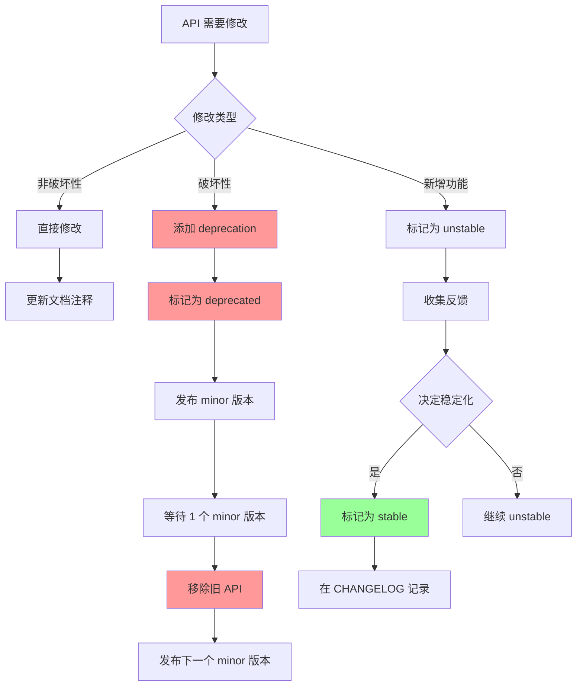
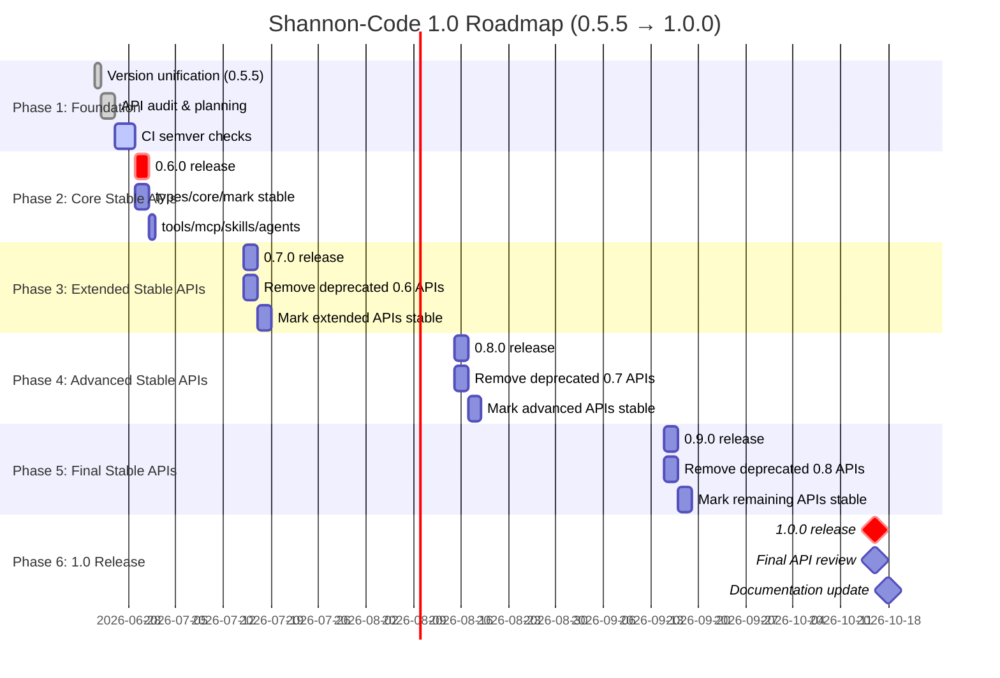

**状态**: Draft  
**作者**: agent-team  
**最后更新**: 2026-06-23

# Shannon-Desktop D3 路线: API Semver 策略

## 1. 背景与问题陈述

### 1.1 版本双轨现状

shannon-code workspace 存在严重的版本号不同步问题:

| 版本类型 | 当前值 | 来源 | 问题 |
|---------|--------|------|------|
| **workspace.package.version** | 0.2.4 | `/home/ed/workspace/backup/shannon-code/Cargo.toml` 第 19 行 | 过时,落后于 git tag |
| **git tag (latest)** | v0.5.5 | git tag --sort=-v:refname | 实际发布的版本 |
| **shannon-desktop pinned rev** | 26343ba | `/home/ed/workspace/backup/shannon-desktop/Cargo.toml` 第 17-25 行注释 | 对应 v0.5.5 |
| **shannon-desktop version** | 0.3.6 | `/home/ed/workspace/backup/shannon-desktop/Cargo.toml` 第 2 行 | 独立版本号 |

**核心问题**:
1. workspace 版本号 (0.2.4) 与 git tag (v0.5.5) 差距达 3 个 minor 版本
2. 所有 12 个 workspace member crates 使用 `version.workspace = true`,实际发布版本仍是 0.2.4
3. 缺失明确的 API 稳定性承诺,所有公开 API 都是 `unstable` 状态
4. 无法区分内部 API (`#[doc(hidden)]`)、实验性 API (默认)、稳定 API (需要 `#[stable]` 标记)

### 1.2 缺失的稳定性承诺

当前 shannon-code 没有任何 API 稳定性分级:

- **所有公开 API 都是 unstable**: minor 版本 (0.2.4 → 0.3.0) 可随意破坏
- **无 deprecation 流程**: 直接修改或删除 API,无警告期
- **无 semver check**: CI 没有自动检测 breaking changes
- **跨 repo 协调困难**: shannon-desktop 无法预测何时会破坏

这导致:
- Shannon Desktop 集成风险高 (每次升级可能 break)
- 第三方集成者无法依赖任何 API
- 无法规划 1.0 路线图 (不知道哪些 API 算稳定)

## 2. 现状审计

### 2.1 Workspace 成员清单

shannon-code workspace 包含 12 个 crates:

| Crate | Cargo.toml 版本配置 | 估计公开 API 数量 | 用途 |
|-------|-------------------|-----------------|------|
| **shannon-types** | `version.workspace = true` | ~30 | 核心类型定义 (Message, ToolUse, ShannonError) |
| **shannon-core** | `version.workspace = true` | ~250+ | 查询引擎、权限、沙箱、工具执行 |
| **shannon-tools** | `version.workspace = true` | ~120+ | 工具实现 (todo, github, web, notebook) |
| **shannon-mcp** | `version.workspace = true` | ~120+ | MCP 协议、传输层、认证 |
| **shannon-skills** | `version.workspace = true` | ~80+ | Skill 解析、加载、执行 |
| **shannon-agents** | `version.workspace = true` | ~130+ | 子 agent、多 agent 协调、消息历史 |
| **shannon-cli** | `version.workspace = true` | ~20 | CLI 入口 |
| **shannon-ui** | `version.workspace = true` | ~15 | TUI 界面 |
| **shannon-commands** | `version.workspace = true` | ~10 | 命令定义 |
| **shannon-agent** | `version.workspace = true` | ~25 | 单 agent 实现 |
| **shannon-tool-interface** | `version.workspace = true` | ~10 | 工具接口 trait |
| **shannon-codegen** | `version = "0.2.0"` | ~5 | 代码生成器 |

**总计**: ~800+ 公开 API (pub fn/pub struct/pub enum),无任何稳定性分级。

### 2.2 核心 Crate 公开 API 示例

#### shannon-types (~30 APIs)

```rust
// lib.rs
pub enum ShannonError { ... }
pub struct ToolUse { ... }
pub struct Message { ... }
pub fn recover_lock<T>(lock_result: std::sync::LockResult<T>) -> T { ... }

// session.rs (推测存在)
// pub struct SessionId { ... }
// pub struct Message { ... }
```

#### shannon-core (~250+ APIs)

权限模块 (~40 APIs):
```rust
pub enum PermissionError { ... }
pub enum RiskLevel { ... }
pub enum PermissionChoice { ... }
pub enum ApprovalMode { ... }
pub enum PermissionRuleDecision { ... }
pub enum PermissionRuleSource { ... }
pub struct PermissionRule { ... }
pub struct PermissionRuleSet { ... }
pub enum RuleCheckDecision { ... }
pub struct PermissionRuleChecker { ... }
pub struct PermissionPrompt { ... }
pub struct ToolPermissionPolicy { ... }
pub struct PermissionMemory { ... }
pub enum PermissionLevel { ... }
pub struct Permission { ... }
pub struct PermissionManager { ... }
```

沙箱模块 (~35 APIs):
```rust
pub enum SandboxError { ... }
pub fn audit_shell_command(command: &str) { ... }
pub enum NetworkAccess { ... }
pub struct SandboxConfig { ... }
pub struct BwrapSandbox { ... }
pub struct SeatbeltSandbox { ... }
pub struct DockerSandboxConfig { ... }
pub struct DockerSandbox { ... }
pub struct NoSandbox;
pub enum SandboxType { ... }
pub enum SandboxMode { ... }
pub struct SandboxExecutor { ... }
pub fn detect_sandbox_provider() -> Box<dyn SandboxProvider> { ... }
pub fn is_protected_path(path: &Path) -> bool { ... }
pub fn check_write_allowed(path: &Path) -> Result<(), SandboxError> { ... }
pub fn check_write_allowed_with_extras(...) -> Result<(), SandboxError> { ... }
pub fn build_protected_paths(user_extras: &[String]) -> Vec<String> { ... }
pub fn check_command_protected_paths(...) -> Vec<String> { ... }
pub struct SandboxProfile { ... }
pub struct LandlockSandbox { ... }
pub struct SandboxedCommand { ... }
```

工具执行 (~35 APIs):
```rust
pub enum ToolExecutionError { ... }
pub enum ToolProgressStatus { ... }
pub struct ToolProgress { ... }
pub struct StopHookInfo { ... }
pub struct HookProgress { ... }
pub struct AttachmentMessage { ... }
pub struct ToolExecutionResult { ... }
pub struct ChannelProgressCallback { ... }
pub struct LoggingProgressCallback;
pub fn is_file_modifying_tool(tool_name: &str) -> bool { ... }
pub struct ToolExecutionConfig { ... }
pub struct ToolExecutionService { ... }
```

触发器 (~15 APIs):
```rust
pub struct TriggeredRoutineDef { ... }
pub struct TriggeredRoutineRegistry { ... }
pub struct RoutineExecResult { ... }
pub enum TriggeredRoutineError { ... }
```

诊断 (~30 APIs):
```rust
pub enum DiagnosticLevel { ... }
pub enum DiagnosticCategory { ... }
pub struct DiagnosticEvent { ... }
pub struct ErrorPattern { ... }
pub struct DiagnosticSummary { ... }
pub struct DiagnosticTracker { ... }
pub enum DoctorError { ... }
pub enum CheckStatus { ... }
pub enum DiagnosticCategory { ... }
pub struct DiagnosticCheck { ... }
pub struct DoctorReport { ... }
pub struct Doctor { ... }
pub struct HomeGuard(Option<std::ffi::OsString>);
pub struct ApiKeyGuard { ... }
```

#### shannon-tools (~120+ APIs)

Todo 工具 (~15 APIs):
```rust
pub enum TodoStatus { ... }
pub struct TodoItem { ... }
pub struct TodoWriteInput { ... }
pub struct TaskCreateInput { ... }
pub struct TaskCreateOutput { ... }
pub struct TaskUpdateInput { ... }
pub struct TaskUpdateOutput { ... }
pub struct TaskGetInput { ... }
pub struct TaskGetOutput { ... }
pub struct TaskListInput { ... }
pub struct TaskListOutput { ... }
pub struct TodoWriteOutput { ... }
pub struct TodoWriteTool { ... }
pub struct TaskCreateTool { ... }
pub struct TaskListTool { ... }
pub struct TaskUpdateTool { ... }
pub struct TaskGetTool { ... }
```

GitHub 工具 (~25 APIs):
```rust
pub struct GhIssueListInput { ... }
pub struct GhIssueListTool { ... }
pub struct GhIssueViewInput { ... }
pub struct GhIssueViewTool { ... }
pub struct GhPrCreateInput { ... }
pub struct GhPrCreateTool { ... }
pub struct GhPrListInput { ... }
pub struct GhPrListTool { ... }
pub struct GhPrViewInput { ... }
pub struct GhPrViewTool { ... }
```

Web 工具 (~35 APIs):
```rust
pub enum WebOperation { ... }
pub struct WebFetchInput { ... }
pub struct WebFetchOutput { ... }
pub struct WebFetchTool { ... }
pub enum SearchProvider { ... }
pub struct WebSearchInput { ... }
pub struct WebSearchOutput { ... }
pub struct SearchResult { ... }
pub fn strip_html_tags(html: &str) -> String { ... }
```

#### shannon-mcp (~120+ APIs)

协议类型 (~80 APIs):
```rust
pub enum JsonRpcMessage { ... }
pub struct JsonRpcRequest { ... }
pub struct JsonRpcResponse { ... }
pub struct JsonRpcError { ... }
pub struct JsonRpcNotification { ... }
pub enum RequestMethod { ... }
pub enum ResponseMethod { ... }
pub enum NotificationMethod { ... }
pub struct McpRequest { ... }
pub struct McpResponse { ... }
pub struct McpNotification { ... }
pub struct ToolAnnotations { ... }
pub struct Tool { ... }
pub struct Resource { ... }
pub struct Prompt { ... }
pub struct PromptArgument { ... }
pub struct ToolContent { ... }
pub enum ContentBlock { ... }
pub struct ResourceContent { ... }
pub struct ServerCapabilities { ... }
pub struct CompletionsCapability {}
pub struct ToolsCapability { ... }
pub struct ResourcesCapability { ... }
pub struct PromptsCapability { ... }
pub struct LoggingCapability { ... }
pub struct ClientCapabilities { ... }
pub struct RootsCapability { ... }
pub struct SamplingCapability {}
pub enum SamplingMessageRole { ... }
pub struct SamplingMessage { ... }
pub enum SamplingContent { ... }
pub struct ModelHint { ... }
pub struct CreateMessageRequest { ... }
pub struct ModelPreferences { ... }
pub struct SamplingParams { ... }
pub enum StopReason { ... }
pub struct CreateMessageResult { ... }
pub struct InitializeParams { ... }
pub struct ClientInfo { ... }
pub struct InitializeResult { ... }
pub struct ServerInfo { ... }
pub struct ToolCallParams { ... }
pub struct ResourceTemplate { ... }
pub struct CompletionRequest { ... }
pub struct CompletionRef { ... }
pub struct CompletionResult { ... }
pub struct Completion { ... }
pub struct CompletionValue { ... }
pub enum LoggingLevel { ... }
pub struct SetLevelRequest { ... }
pub struct SubscribeRequest { ... }
pub struct UnsubscribeRequest { ... }
pub struct SubscribeResult { ... }
pub struct ResourcesUpdatedNotification { ... }
pub struct ProgressNotification { ... }
pub struct Root { ... }
pub struct ListRootsResult { ... }
pub struct ElicitationRequest { ... }
pub struct ElicitationResult { ... }
pub enum ElicitationAction { ... }
```

传输层 (~20 APIs):
```rust
pub enum TransportError { ... }
pub struct StdioTransport { ... }
pub struct SseTransport { ... }
pub struct HttpTransport { ... }
pub struct WebSocketTransport { ... }
```

配置 (~15 APIs):
```rust
pub enum HeaderSource { ... }
pub struct McpConfig { ... }
pub enum McpAuthConfig { ... }
pub enum McpServerConfig { ... }
pub enum ConfigError { ... }
pub fn expand_env_vars(input: &str) -> String { ... }
pub fn expand_server_config(config: &mut McpServerConfig) { ... }
pub fn config_search_paths(project_dir: &Path) -> Vec<PathBuf> { ... }
pub fn discover_config(project_dir: &Path) -> Result<McpConfig, ConfigError> { ... }
```

#### shannon-skills (~80+ APIs)

Skill 定义 (~20 APIs):
```rust
pub struct SkillMetadata { ... }
pub struct SkillFull { ... }
pub enum SkillSource { ... }
pub struct Skill { ... }
pub struct SkillContext { ... }
pub struct SkillPermissions { ... }
pub struct SkillResult { ... }
pub struct SkillResultMetadata { ... }
pub struct SkillFrontmatter { ... }
pub enum ExecutionContext { ... }
pub struct HooksConfig { ... }
pub enum ArgumentConfig { ... }
pub struct ParsedSkill { ... }
pub fn parse_skill_frontmatter(content: &str, source: &str) -> SkillResult<ParsedSkill> { ... }
pub struct ShellConfig { ... }
pub enum EffortLevel { ... }
```

Skill 加载 (~15 APIs):
```rust
pub fn load_skill_from_file(path: &Path) -> SkillResult<Skill> { ... }
pub fn load_metadata_only(path: &Path) -> SkillResult<SkillMetadata> { ... }
pub fn load_full_skill(path: &Path) -> SkillResult<Skill> { ... }
pub fn load_skills_from_directory(...) { ... }
pub fn discover_skill_directories(file_paths: &[PathBuf], cwd: &Path) -> Vec<PathBuf> { ... }
pub fn load_commands_from_directory(...) { ... }
pub fn validate_path_within_base(path: &Path, base: &Path) -> SkillResult<()> { ... }
```

Agent 定义 (~15 APIs):
```rust
pub enum AgentIsolation { ... }
pub enum AgentColor { ... }
pub enum AgentModel { ... }
pub enum AgentPermissionMode { ... }
pub enum AgentEffort { ... }
pub struct AgentDefinition { ... }
pub fn parse_agent_definition(...) { ... }
pub fn load_agents_from_directory(agents_dir: &Path) -> Result<Vec<AgentDefinition>, SkillError> { ... }
pub fn discover_agent_directories(cwd: &Path) -> Vec<PathBuf> { ... }
```

#### shannon-agents (~130+ APIs)

子 Agent (~25 APIs):
```rust
pub struct AgentConfig { ... }
pub enum AgentStatus { ... }
pub struct SubAgent { ... }
pub struct SubAgentRegistry { ... }
pub struct AgentSpawnInput { ... }
pub struct AgentSpawnTool { ... }
pub struct SendMessageInput { ... }
pub struct SendMessageTool { ... }
pub struct TeamCreateInput { ... }
pub struct TeamCreateTool { ... }
```

协调器 (~25 APIs):
```rust
pub struct TeamContext { ... }
pub struct AgentInfo { ... }
pub struct TeamManifest { ... }
pub struct InboxSummary { ... }
pub struct CoordinatorConfig { ... }
pub enum AssignmentStrategy { ... }
pub enum AgentMode { ... }
pub enum CoordinatorEvent { ... }
pub struct AgentCoordinator { ... }
```

进程管理 (~20 APIs):
```rust
pub enum AgentProcessStatus { ... }
pub struct AgentProcessConfig { ... }
pub struct HealthCheckConfig { ... }
pub struct AgentHandle { ... }
pub enum AgentEvent { ... }
pub struct AgentProcessManager { ... }
pub enum AgentProcessError { ... }
```

消息历史 (~15 APIs):
```rust
pub enum MessagePriority { ... }
pub enum MessageType { ... }
pub struct AgentMessage { ... }
pub enum MessageContent { ... }
pub enum ProtocolMessage { ... }
pub enum HistoryError { ... }
pub enum ContentKind { ... }
pub struct MessageRecord { ... }
pub struct MessageHistoryStore { ... }
```

### 2.3 历史 Git Tag 与版本对账

| Git Tag | Workspace Version (据 git show) | 差距 | 主要变更 |
|---------|--------------------------------|------|----------|
| v0.1.0 | 未检查 | - | 初始版本 |
| v0.2.0 | 未检查 | - | - |
| v0.2.1 | 未检查 | - | - |
| v0.2.2 | 未检查 | - | - |
| v0.2.3 | 未检查 | - | - |
| v0.2.4 | 0.2.4 | 0 | workspace 版本定义于此 |
| v0.5.0 | 0.2.4 | +3 minor | 重大功能增加 (workspace 版本未更新) |
| v0.5.1 | 0.2.4 | +3 minor | - |
| v0.5.2 | 0.2.4 | +3 minor | - |
| v0.5.3 | 0.2.4 | +3 minor | - |
| v0.5.5 | 0.2.4 | +3 minor | 当前最新版本 |

**结论**: 从 v0.2.4 起,所有后续 git tag (v0.5.0~v0.5.5) 都未同步更新 workspace.package.version。

## 3. 版本号统一方案

### 3.1 目标状态

统一后,版本号映射关系应为:

| 位置 | 版本号 | 说明 |
|------|--------|------|
| `shannon-code/Cargo.toml` workspace.package.version | 0.5.5 | 与 git tag 对齐 |
| 所有 member crates `Cargo.toml` | `version.workspace = true` | 继承 workspace 版本 |
| git tag v0.5.5 | 0.5.5 | 一致 |
| shannon-desktop Cargo.toml pinned rev comment | v0.5.5@<SHA> | 保持注释更新 |

### 3.2 执行步骤

#### Step 1: 更新 workspace.package.version 到 0.5.5

**文件**: `/home/ed/workspace/backup/shannon-code/Cargo.toml`

```diff
[workspace.package]
- version = "0.2.4"
+ version = "0.5.5"
  edition = "2024"
  rust-version = "1.88"
```

**验证**:
```bash
cd /home/ed/workspace/backup/shannon-code
cargo metadata --format-version 1 | jq '.packages[] | select(.name == "shannon-types") | .version'
# 应输出 "0.5.5"
```

#### Step 2: 检查所有 member crates 继承配置

**当前状态** (已验证):
- `shannon-types/Cargo.toml`: `version.workspace = true` ✓
- `shannon-core/Cargo.toml`: `version.workspace = true` ✓
- `shannon-tools/Cargo.toml`: `version.workspace = true` ✓
- `shannon-mcp/Cargo.toml`: `version.workspace = true` ✓
- `shannon-skills/Cargo.toml`: `version.workspace = true` ✓
- `shannon-agents/Cargo.toml`: `version.workspace = true` ✓
- 其他 6 个 crates 同样使用 `version.workspace = true` ✓

**例外**:
- `shannon-codegen/Cargo.toml`: `version = "0.2.0"` (硬编码,需决定是否同步)

**决策**: `shannon-codegen` 保持独立版本号 (0.2.0),因为它是代码生成器,发布节奏可能不同。

#### Step 3: 历史 Git Tag 对账表 (补充)

为未来的版本同步建立baseline:

| Git Tag | Cargo workspace.version | 发布日期 | 备注 |
|---------|------------------------|----------|------|
| v0.1.0 | 未定义 | TBD | 初始版本 |
| v0.2.0 | 未定义 | TBD | workspace 机制引入 |
| v0.2.4 | 0.2.4 | TBD | workspace 版本首次定义 |
| v0.5.0 | 0.2.4 (未同步) | TBD | major feature 发布 |
| v0.5.5 | 0.2.4 → **0.5.5** (本次修正) | 2026-06-23 | 对齐 git tag |

**未来流程**: 每次发布 git tag (如 v0.6.0) 必须:
1. 先更新 `Cargo.toml` workspace.package.version
2. 提交变更: `git commit -m "bump workspace version to 0.6.0"`
3. 创建 tag: `git tag v0.6.0`
4. 推送: `git push && git push --tags`

## 4. API 三级分级清单

### 4.1 分级定义

| 级别 | 标记 | 稳定性承诺 | 版本兼容性 | 典型用途 |
|------|------|-----------|-----------|----------|
| **内部** | `#[doc(hidden)]` | 无保证 | 可随时删除 | 实现细节、测试辅助 |
| **实验性** | 默认 (无标记) | unstable | minor 版本可破坏 | 早期 API、反馈收集 |
| **稳定** | `#[stable]` | stable | 仅 major 版本破坏 | 核心契约、公共 API |

### 4.2 shannon-types 分级建议 (30 APIs → 示例 15 条)

| API | 当前状态 | 建议级别 | 理由 | 迁移计划 (如需) |
|-----|---------|----------|------|----------------|
| `ShannonError` | pub | **stable** (0.6.0) | 核心错误类型,所有依赖使用 | - |
| `ToolUse` | pub | **stable** (0.6.0) | 工具调用核心结构 | - |
| `Message` | pub | **stable** (0.6.0) | 消息传递核心类型 | - |
| `recover_lock()` | pub | **internal** | 实现辅助函数 | 标记 `#[doc(hidden)]` |
| `SessionId` (推测) | pub | **stable** (0.6.0) | 会话标识核心类型 | - |
| `MessageId` (推测) | pub | **stable** (0.6.0) | 消息唯一标识 | - |
| `ContentType` (推测) | pub | **unstable** → stable (0.7.0) | 内容类型枚举,可能扩展 | 0.6.0 加 deprecation |
| `ToolResult` (推测) | pub | **unstable** → stable (0.7.0) | 工具执行结果 | 0.6.0 加 deprecation |
| `SessionConfig` (推测) | pub | **unstable** | 会话配置,可能调整 | 0.8.0 评估 stable |
| `MessageMetadata` (推测) | pub | **unstable** | 元数据结构不稳定 | 0.8.0 评估 stable |
| `ToolInput` (推测) | pub | **stable** (0.6.0) | 工具输入契约 | - |
| `ToolOutput` (推测) | pub | **stable** (0.6.0) | 工具输出契约 | - |
| `Permission` 类型 (推测) | pub | **unstable** → stable (0.7.0) | 权限模型可能调整 | 0.6.0 加 deprecation |
| `Serialization` helpers (推测) | pub | **internal** | 序列化实现细节 | 标记 `#[doc(hidden)]` |
| `Test utilities` (推测) | pub | **internal** | 测试辅助函数 | 标记 `#[doc(hidden)]` |

**稳定化节奏**:
- **0.6.0**: 核心类型 (ShannonError, ToolUse, Message, SessionId, MessageId, ToolInput/Output) → stable
- **0.7.0**: 扩展类型 (ContentType, ToolResult, Permission) → stable (需 1 个 minor 版本 deprecation)
- **0.8.0**: 评估 SessionConfig, MessageMetadata → stable (如结构稳定)

### 4.3 shannon-core 分级建议 (250+ APIs → 示例 50 条)

#### 权限模块 (~40 APIs)

| API | 当前状态 | 建议级别 | 理由 | 迁移计划 |
|-----|---------|----------|------|----------|
| `PermissionError` | pub enum | **stable** (0.6.0) | 核心错误类型 | - |
| `PermissionManager` | pub struct | **stable** (0.6.0) | 权限管理核心接口 | - |
| `Permission` | pub struct | **stable** (0.6.0) | 权限定义 | - |
| `PermissionLevel` | pub enum | **stable** (0.6.0) | 权限级别枚举 | - |
| `PermissionChoice` | pub enum | **stable** (0.6.0) | 用户选择类型 | - |
| `PermissionPrompt` | pub struct | **unstable** → stable (0.7.0) | UI 结构可能调整 | 0.6.0 加 deprecation |
| `PermissionRule` | pub struct | **unstable** → stable (0.7.0) | 规则模型可能扩展 | 0.6.0 加 deprecation |
| `PermissionRuleSet` | pub struct | **unstable** → stable (0.7.0) | 规则集合可能重构 | 0.6.0 加 deprecation |
| `PermissionRuleChecker` | pub struct | **unstable** → stable (0.8.0) | 检查逻辑可能优化 | 0.7.0 加 deprecation |
| `PermissionMemory` | pub struct | **unstable** | 记忆策略可能调整 | 0.8.0 评估 stable |
| `ToolPermissionPolicy` | pub struct | **unstable** | 策略模型可能扩展 | 0.8.0 评估 stable |
| `RiskLevel` | pub enum | **stable** (0.6.0) | 风险级别核心枚举 | - |
| `ApprovalMode` | pub enum | **stable** (0.6.0) | 审批模式核心枚举 | - |
| `PermissionRuleDecision` | pub enum | **unstable** → stable (0.7.0) | 决策类型可能扩展 | 0.6.0 加 deprecation |
| `PermissionRuleSource` | pub enum | **unstable** → stable (0.7.0) | 来源类型可能扩展 | 0.6.0 加 deprecation |
| `RuleCheckDecision` | pub enum | **unstable** | 检查结果类型可能调整 | 0.8.0 评估 stable |
| 内部辅助函数 (~20) | pub fn | **internal** | 实现细节 | 标记 `#[doc(hidden)]` |

#### 沙箱模块 (~35 APIs)

| API | 当前状态 | 建议级别 | 理由 | 迁移计划 |
|-----|---------|----------|------|----------|
| `SandboxExecutor` | pub struct | **stable** (0.6.0) | 沙箱执行接口 | - |
| `SandboxConfig` | pub struct | **stable** (0.6.0) | 沙箱配置契约 | - |
| `SandboxType` | pub enum | **stable** (0.6.0) | 沙箱类型枚举 | - |
| `SandboxMode` | pub enum | **stable** (0.6.0) | 沙箱模式枚举 | - |
| `SandboxError` | pub enum | **stable** (0.6.0) | 核心错误类型 | - |
| `BwrapSandbox` | pub struct | **unstable** → stable (0.7.0) | Firejail 实现 | 0.6.0 加 deprecation |
| `SeatbeltSandbox` | pub struct | **unstable** → stable (0.7.0) | macOS 实现 | 0.6.0 加 deprecation |
| `DockerSandbox` | pub struct | **unstable** → stable (0.7.0) | Docker 实现 | 0.6.0 加 deprecation |
| `DockerSandboxConfig` | pub struct | **unstable** | Docker 配置可能调整 | 0.8.0 评估 stable |
| `LandlockSandbox` | pub struct | **unstable** → stable (0.7.0) | Landlock 实现 | 0.6.0 加 deprecation |
| `NoSandbox` | pub struct | **stable** (0.6.0) | 无沙箱选项 | - |
| `SandboxProfile` | pub struct | **unstable** | Profile 结构可能扩展 | 0.8.0 评估 stable |
| `SandboxedCommand` | pub struct | **unstable** | 命令包装可能调整 | 0.8.0 评估 stable |
| `audit_shell_command()` | pub fn | **unstable** | 审计逻辑可能扩展 | 0.8.0 评估 stable |
| `detect_sandbox_provider()` | pub fn | **unstable** → stable (0.7.0) | 检测接口 | 0.6.0 加 deprecation |
| `is_protected_path()` | pub fn | **stable** (0.6.0) | 路径检查核心函数 | - |
| `check_write_allowed()` | pub fn | **stable** (0.6.0) | 写权限检查 | - |
| `check_write_allowed_with_extras()` | pub fn | **stable** (0.6.0) | 扩展写权限检查 | - |
| `build_protected_paths()` | pub fn | **unstable** → stable (0.7.0) | 路径构建函数 | 0.6.0 加 deprecation |
| `check_command_protected_paths()` | pub fn | **unstable** → stable (0.7.0) | 命令检查函数 | 0.6.0 加 deprecation |
| `NetworkAccess` | pub enum | **unstable** | 网络访问枚举可能扩展 | 0.8.0 评估 stable |
| 内部辅助函数 (~15) | pub fn | **internal** | 实现细节 | 标记 `#[doc(hidden)]` |

#### 工具执行模块 (~35 APIs)

| API | 当前状态 | 建议级别 | 理由 | 迁移计划 |
|-----|---------|----------|------|----------|
| `ToolExecutionService` | pub struct | **stable** (0.6.0) | 工具执行核心接口 | - |
| `ToolExecutionConfig` | pub struct | **stable** (0.6.0) | 执行配置契约 | - |
| `ToolExecutionResult` | pub struct | **stable** (0.6.0) | 执行结果类型 | - |
| `ToolExecutionError` | pub enum | **stable** (0.6.0) | 核心错误类型 | - |
| `ToolProgressStatus` | pub enum | **stable** (0.6.0) | 进度状态枚举 | - |
| `ToolProgress` | pub struct | **unstable** → stable (0.7.0) | 进度信息结构 | 0.6.0 加 deprecation |
| `StopHookInfo` | pub struct | **unstable** | Hook 信息可能调整 | 0.8.0 评估 stable |
| `HookProgress` | pub struct | **unstable** | Hook 进度可能调整 | 0.8.0 评估 stable |
| `AttachmentMessage` | pub struct | **unstable** | 附件消息结构可能扩展 | 0.8.0 评估 stable |
| `ChannelProgressCallback` | pub struct | **unstable** → stable (0.7.0) | 回调接口 | 0.6.0 加 deprecation |
| `LoggingProgressCallback` | pub struct | **unstable** → stable (0.7.0) | 日志回调 | 0.6.0 加 deprecation |
| `is_file_modifying_tool()` | pub fn | **unstable** | 工具分类逻辑可能扩展 | 0.8.0 评估 stable |
| 内部辅助函数 (~20) | pub fn | **internal** | 实现细节 | 标记 `#[doc(hidden)]` |

#### 触发器模块 (~15 APIs)

| API | 当前状态 | 建议级别 | 理由 | 迁移计划 |
|-----|---------|----------|------|----------|
| `TriggeredRoutineRegistry` | pub struct | **stable** (0.6.0) | 注册表核心接口 | - |
| `TriggeredRoutineDef` | pub struct | **stable** (0.6.0) | 例程定义 | - |
| `RoutineExecResult` | pub struct | **unstable** → stable (0.7.0) | 执行结果 | 0.6.0 加 deprecation |
| `TriggeredRoutineError` | pub enum | **stable** (0.6.0) | 错误类型 | - |
| 内部辅助函数 (~10) | pub fn | **internal** | 实现细节 | 标记 `#[doc(hidden)]` |

#### 诊断模块 (~30 APIs)

| API | 当前状态 | 建议级别 | 理由 | 迁移计划 |
|-----|---------|----------|------|----------|
| `Doctor` | pub struct | **stable** (0.6.0) | 诊断工具接口 | - |
| `DoctorReport` | pub struct | **unstable** → stable (0.7.0) | 报告结构 | 0.6.0 加 deprecation |
| `DiagnosticCheck` | pub struct | **unstable** | 检查结构可能扩展 | 0.8.0 评估 stable |
| `CheckStatus` | pub enum | **stable** (0.6.0) | 状态枚举 | - |
| `DoctorError` | pub enum | **stable** (0.6.0) | 错误类型 | - |
| `DiagnosticCategory` | pub enum | **unstable** → stable (0.7.0) | 分类枚举 | 0.6.0 加 deprecation |
| `DiagnosticLevel` | pub enum | **unstable** → stable (0.7.0) | 级别枚举 | 0.6.0 加 deprecation |
| `DiagnosticEvent` | pub struct | **unstable** | 事件结构可能调整 | 0.8.0 评估 stable |
| `DiagnosticSummary` | pub struct | **unstable** | 汇总结构可能调整 | 0.8.0 评估 stable |
| `DiagnosticTracker` | pub struct | **unstable** | 追踪器可能重构 | 0.8.0 评估 stable |
| `ErrorPattern` | pub struct | **unstable** | 模式结构可能扩展 | 0.8.0 评估 stable |
| `HomeGuard` | pub struct | **unstable** | Guard 结构可能调整 | 0.8.0 评估 stable |
| `ApiKeyGuard` | pub struct | **unstable** → stable (0.7.0) | API Key Guard | 0.6.0 加 deprecation |
| 内部辅助函数 (~15) | pub fn | **internal** | 实现细节 | 标记 `#[doc(hidden)]` |

#### 其他核心模块 (~100 APIs)

- **i18n**: `set_locale()`, `current_locale()`, `detect_system_locale()` → **stable** (0.6.0)
- **AI limits**: `AiLimitsTracker`, `AiLimitType`, `AiUsageRecord`, `LimitStatus` → **unstable** → stable (0.7.0)
- **Project instructions**: `ProjectInstructions`, `InstructionFile`, `InstructionScope`, `load_from_directory()` → **unstable** → stable (0.8.0)
- **Progressive loader**: `ProgressiveLoaderConfig`, `truncate_content()`, `lines_for_token_budget()` → **internal** → **unstable** (0.8.0 评估)
- **Rate limiting**: `RateLimitResult`, `RateLimitMessageBuilder` → **unstable** → stable (0.7.0)

### 4.4 shannon-tools 分级建议 (120+ APIs → 示例 30 条)

#### Todo 工具 (~15 APIs)

| API | 当前状态 | 建议级别 | 理由 | 迁移计划 |
|-----|---------|----------|------|----------|
| `TodoWriteTool` | pub struct | **stable** (0.6.0) | Todo 工具接口 | - |
| `TodoWriteInput/Output` | pub struct | **stable** (0.6.0) | IO 契约 | - |
| `TaskCreateTool` | pub struct | **stable** (0.6.0) | 任务创建接口 | - |
| `TaskCreateInput/Output` | pub struct | **stable** (0.6.0) | IO 契约 | - |
| `TaskUpdateTool` | pub struct | **stable** (0.6.0) | 任务更新接口 | - |
| `TaskUpdateInput/Output` | pub struct | **stable** (0.6.0) | IO 契约 | - |
| `TaskListTool` | pub struct | **stable** (0.6.0) | 任务列表接口 | - |
| `TaskListInput/Output` | pub struct | **stable** (0.6.0) | IO 契约 | - |
| `TaskGetTool` | pub struct | **stable** (0.6.0) | 任务获取接口 | - |
| `TaskGetInput/Output` | pub struct | **stable** (0.6.0) | IO 契约 | - |
| `TodoItem` | pub struct | **unstable** → stable (0.7.0) | Todo 结构 | 0.6.0 加 deprecation |
| `TodoStatus` | pub enum | **stable** (0.6.0) | 状态枚举 | - |
| 内部辅助函数 (~5) | pub fn | **internal** | 实现细节 | 标记 `#[doc(hidden)]` |

#### GitHub 工具 (~25 APIs)

| API | 当前状态 | 建议级别 | 理由 | 迁移计划 |
|-----|---------|----------|------|----------|
| `GhIssueListTool` | pub struct | **stable** (0.6.0) | Issue 列表接口 | - |
| `GhIssueListInput` | pub struct | **stable** (0.6.0) | 输入契约 | - |
| `GhIssueViewTool` | pub struct | **stable** (0.6.0) | Issue 查看接口 | - |
| `GhIssueViewInput` | pub struct | **stable** (0.6.0) | 输入契约 | - |
| `GhPrCreateTool` | pub struct | **stable** (0.6.0) | PR 创建接口 | - |
| `GhPrCreateInput` | pub struct | **stable** (0.6.0) | 输入契约 | - |
| `GhPrListTool` | pub struct | **stable** (0.6.0) | PR 列表接口 | - |
| `GhPrListInput` | pub struct | **stable** (0.6.0) | 输入契约 | - |
| `GhPrViewTool` | pub struct | **stable** (0.6.0) | PR 查看接口 | - |
| `GhPrViewInput` | pub struct | **stable** (0.6.0) | 输入契约 | - |
| 内部辅助函数 (~15) | pub fn | **internal** | 实现细节 | 标记 `#[doc(hidden)]` |

#### Web 工具 (~35 APIs)

| API | 当前状态 | 建议级别 | 理由 | 迁移计划 |
|-----|---------|----------|------|----------|
| `WebFetchTool` | pub struct | **stable** (0.6.0) | Fetch 接口 | - |
| `WebFetchInput/Output` | pub struct | **stable** (0.6.0) | IO 契约 | - |
| `WebSearchTool` | pub struct | **stable** (0.6.0) | Search 接口 | - |
| `WebSearchInput/Output` | pub struct | **stable** (0.6.0) | IO 契约 | - |
| `WebOperation` | pub enum | **stable** (0.6.0) | 操作枚举 | - |
| `SearchProvider` | pub enum | **unstable** → stable (0.7.0) | 提供商枚举 | 0.6.0 加 deprecation |
| `SearchResult` | pub struct | **unstable** → stable (0.7.0) | 结果结构 | 0.6.0 加 deprecation |
| `strip_html_tags()` | pub fn | **internal** | 辅助函数 | 标记 `#[doc(hidden)]` |
| 内部辅助函数 (~25) | pub fn | **internal** | 实现细节 | 标记 `#[doc(hidden)]` |

#### 其他工具 (~50 APIs)

- **Notebook**: `NotebookEditTool`, `NotebookEditInput/Output`, `NotebookCell` → **unstable** → stable (0.7.0)
- **Team delete**: `TeamDeleteTool`, `TeamDeleteInput/Output`, `TeamEntry` → **unstable** → stable (0.7.0)
- **Messaging**: `SendMessageTool`, `SendMessageInput/Output`, `InboxMessage`, `TeamMember`, `TeamContext` → **unstable** → stable (0.7.0)
- **Config**: `ConfigTool`, `ConfigInput`, `ConfigManager`, `ConfigAction` → **unstable** → stable (0.8.0)
- **PTY**: `execute_in_pty()`, `PtyOutput` → **unstable** → stable (0.7.0)
- **MCP tools**: `ListMcpResourcesTool`, `ReadMcpResourceTool`, `ListPromptsTool`, `GetPromptTool`, `McpToolSearchTool` → **unstable** → stable (0.7.0)
- **File sandbox**: `SandboxConfig`, `PathSandbox`, `SandboxError` → **unstable** → stable (0.7.0)
- **Tool search**: `ToolSearchTool`, `ToolSearchInput/Output` → **unstable** → stable (0.7.0)
- **Skill**: `SkillTool`, `SkillInvokeInput/Output`, `SkillContext`, `SkillCommand` → **unstable** → stable (0.7.0)
- **Task stop**: `TaskStopTool`, `TaskStopInput/Output` → **stable** (0.6.0)
- **Task output**: `TaskOutputTool`, `TaskOutputInput/Output` → **stable** (0.6.0)
- **REPL**: `ReplTool`, `ReplInput/Output` → **unstable** → stable (0.7.0)
- **Computer use**: `ComputerUseTool`, `ComputerUseInput`, `ComputerUseConfig`, `ComputerAction`, `ScrollDirection` → **unstable** → stable (0.8.0)

### 4.5 shannon-mcp 分级建议 (120+ APIs → 示例 40 条)

#### 协议核心类型 (~80 APIs)

**初始化与能力** (~15 APIs):
| API | 当前状态 | 建议级别 | 理由 | 迁移计划 |
|-----|---------|----------|------|----------|
| `InitializeParams` | pub struct | **stable** (0.6.0) | 初始化参数 | - |
| `InitializeResult` | pub struct | **stable** (0.6.0) | 初始化结果 | - |
| `ClientInfo` | pub struct | **stable** (0.6.0) | 客户端信息 | - |
| `ServerInfo` | pub struct | **stable** (0.6.0) | 服务端信息 | - |
| `ServerCapabilities` | pub struct | **stable** (0.6.0) | 服务端能力 | - |
| `ClientCapabilities` | pub struct | **stable** (0.6.0) | 客户端能力 | - |
| `CompletionsCapability` | pub struct | **unstable** → stable (0.7.0) | 补全能力 | 0.6.0 加 deprecation |
| `ToolsCapability` | pub struct | **stable** (0.6.0) | 工具能力 | - |
| `ResourcesCapability` | pub struct | **stable** (0.6.0) | 资源能力 | - |
| `PromptsCapability` | pub struct | **stable** (0.6.0) | Prompts 能力 | - |
| `LoggingCapability` | pub struct | **unstable** → stable (0.7.0) | 日志能力 | 0.6.0 加 deprecation |
| `RootsCapability` | pub struct | **unstable** → stable (0.7.0) | Roots 能力 | 0.6.0 加 deprecation |
| `SamplingCapability` | pub struct | **unstable** → stable (0.7.0) | 采样能力 | 0.6.0 加 deprecation |

**工具与资源** (~20 APIs):
| API | 当前状态 | 建议级别 | 理由 | 迁移计划 |
|-----|---------|----------|------|----------|
| `Tool` | pub struct | **stable** (0.6.0) | 工具定义 | - |
| `ToolAnnotations` | pub struct | **unstable** → stable (0.7.0) | 工具注解 | 0.6.0 加 deprecation |
| `ToolCallParams` | pub struct | **stable** (0.6.0) | 工具调用参数 | - |
| `ToolContent` | pub struct | **stable** (0.6.0) | 工具内容 | - |
| `ContentBlock` | pub enum | **stable** (0.6.0) | 内容块类型 | - |
| `Resource` | pub struct | **stable** (0.6.0) | 资源定义 | - |
| `ResourceContent` | pub struct | **stable** (0.6.0) | 资源内容 | - |
| `ResourceTemplate` | pub struct | **unstable** → stable (0.7.0) | 资源模板 | 0.6.0 加 deprecation |
| `Prompt` | pub struct | **stable** (0.6.0) | Prompt 定义 | - |
| `PromptArgument` | pub struct | **stable** (0.6.0) | Prompt 参数 | - |

**采样** (~15 APIs):
| API | 当前状态 | 建议级别 | 理由 | 迁移计划 |
|-----|---------|----------|------|----------|
| `CreateMessageRequest` | pub struct | **stable** (0.6.0) | 创建消息请求 | - |
| `CreateMessageResult` | pub struct | **stable** (0.6.0) | 创建消息结果 | - |
| `SamplingParams` | pub struct | **unstable** → stable (0.7.0) | 采样参数 | 0.6.0 加 deprecation |
| `ModelPreferences` | pub struct | **unstable** → stable (0.7.0) | 模型偏好 | 0.6.0 加 deprecation |
| `ModelHint` | pub struct | **unstable** → stable (0.7.0) | 模型提示 | 0.6.0 加 deprecation |
| `SamplingMessage` | pub struct | **stable** (0.6.0) | 采样消息 | - |
| `SamplingMessageRole` | pub enum | **stable** (0.6.0) | 消息角色 | - |
| `SamplingContent` | pub enum | **stable** (0.6.0) | 内容类型 | - |
| `StopReason` | pub enum | **stable** (0.6.0) | 停止原因 | - |

**补全** (~15 APIs):
| API | 当前状态 | 建议级别 | 理由 | 迁移计划 |
|-----|---------|----------|------|----------|
| `CompletionRequest` | pub struct | **unstable** → stable (0.7.0) | 补全请求 | 0.6.0 加 deprecation |
| `CompletionResult` | pub struct | **unstable** → stable (0.7.0) | 补全结果 | 0.6.0 加 deprecation |
| `Completion` | pub struct | **unstable** → stable (0.7.0) | 补全项 | 0.6.0 加 deprecation |
| `CompletionValue` | pub struct | **unstable** → stable (0.7.0) | 补全值 | 0.6.0 加 deprecation |
| `CompletionRef` | pub struct | **unstable** → stable (0.7.0) | 补全引用 | 0.6.0 加 deprecation |

**日志与订阅** (~15 APIs):
| API | 当前状态 | 建议级别 | 理由 | 迁移计划 |
|-----|---------|----------|------|----------|
| `LoggingLevel` | pub enum | **stable** (0.6.0) | 日志级别 | - |
| `SetLevelRequest` | pub struct | **stable** (0.6.0) | 设置级别请求 | - |
| `SubscribeRequest` | pub struct | **stable** (0.6.0) | 订阅请求 | - |
| `UnsubscribeRequest` | pub struct | **stable** (0.6.0) | 取消订阅请求 | - |
| `SubscribeResult` | pub struct | **stable** (0.6.0) | 订阅结果 | - |
| `ResourcesUpdatedNotification` | pub struct | **unstable** → stable (0.7.0) | 资源更新通知 | 0.6.0 加 deprecation |
| `ProgressNotification` | pub struct | **unstable** → stable (0.7.0) | 进度通知 | 0.6.0 加 deprecation |

**Roots** (~10 APIs):
| API | 当前状态 | 建议级别 | 理由 | 迁移计划 |
|-----|---------|----------|------|----------|
| `Root` | pub struct | **unstable** → stable (0.7.0) | Root 定义 | 0.6.0 加 deprecation |
| `ListRootsResult` | pub struct | **unstable** → stable (0.7.0) | 列表结果 | 0.6.0 加 deprecation |

**RPC 协议** (~20 APIs):
| API | 当前状态 | 建议级别 | 理由 | 迁移计划 |
|-----|---------|----------|------|----------|
| `JsonRpcMessage` | pub enum | **stable** (0.6.0) | RPC 消息 | - |
| `JsonRpcRequest` | pub struct | **stable** (0.6.0) | RPC 请求 | - |
| `JsonRpcResponse` | pub struct | **stable** (0.6.0) | RPC 响应 | - |
| `JsonRpcError` | pub struct | **stable** (0.6.0) | RPC 错误 | - |
| `JsonRpcNotification` | pub struct | **stable** (0.6.0) | RPC 通知 | - |
| `McpRequest` | pub struct | **stable** (0.6.0) | MCP 请求 | - |
| `McpResponse` | pub struct | **stable** (0.6.0) | MCP 响应 | - |
| `McpNotification` | pub struct | **stable** (0.6.0) | MCP 通知 | - |
| `RequestMethod` | pub enum | **unstable** → stable (0.7.0) | 请求方法 | 0.6.0 加 deprecation |
| `ResponseMethod` | pub enum | **unstable** → stable (0.7.0) | 响应方法 | 0.6.0 加 deprecation |
| `NotificationMethod` | pub enum | **unstable** → stable (0.7.0) | 通知方法 | 0.6.0 加 deprecation |

**Elicitation** (~10 APIs):
| API | 当前状态 | 建议级别 | 理由 | 迁移计划 |
|-----|---------|----------|------|----------|
| `ElicitationRequest` | pub struct | **unstable** | 引导请求 (实验性) | 0.8.0 评估 stable |
| `ElicitationResult` | pub struct | **unstable** | 引导结果 (实验性) | 0.8.0 评估 stable |
| `ElicitationAction` | pub enum | **unstable** | 引导动作 (实验性) | 0.8.0 评估 stable |

#### 传输层 (~20 APIs)

| API | 当前状态 | 建议级别 | 理由 | 迁移计划 |
|-----|---------|----------|------|----------|
| `StdioTransport` | pub struct | **stable** (0.6.0) | Stdio 传输 | - |
| `SseTransport` | pub struct | **stable** (0.6.0) | SSE 传输 | - |
| `HttpTransport` | pub struct | **unstable** → stable (0.7.0) | HTTP 传输 | 0.6.0 加 deprecation |
| `WebSocketTransport` | pub struct | **unstable** → stable (0.7.0) | WebSocket 传输 | 0.6.0 加 deprecation |
| `TransportError` | pub enum | **stable** (0.6.0) | 传输错误 | - |

#### 配置 (~15 APIs)

| API | 当前状态 | 建议级别 | 理由 | 迁移计划 |
|-----|---------|----------|------|----------|
| `McpConfig` | pub struct | **stable** (0.6.0) | MCP 配置 | - |
| `McpServerConfig` | pub enum | **stable** (0.6.0) | 服务端配置枚举 | - |
| `McpAuthConfig` | pub enum | **stable** (0.6.0) | 认证配置枚举 | - |
| `HeaderSource` | pub enum | **unstable** → stable (0.7.0) | Header 来源 | 0.6.0 加 deprecation |
| `ConfigError` | pub enum | **stable** (0.6.0) | 配置错误 | - |
| `expand_env_vars()` | pub fn | **stable** (0.6.0) | 环境变量展开 | - |
| `expand_server_config()` | pub fn | **internal** | 配置展开 (实现) | 标记 `#[doc(hidden)]` |
| `config_search_paths()` | pub fn | **stable** (0.6.0) | 配置搜索路径 | - |
| `discover_config()` | pub fn | **stable** (0.6.0) | 配置发现 | - |

#### 认证 (~15 APIs)

| API | 当前状态 | 建议级别 | 理由 | 迁移计划 |
|-----|---------|----------|------|----------|
| `OAuth2Provider` | pub struct | **stable** (0.6.0) | OAuth2 提供者 | - |
| `ApiKeyProvider` | pub struct | **stable** (0.6.0) | API Key 提供者 | - |
| `AuthError` | pub enum | **stable** (0.6.0) | 认证错误 | - |
| `OAuthDiscoveryResult` | pub struct | **unstable** → stable (0.7.0) | OAuth 发现结果 | 0.6.0 加 deprecation |
| `DcrRegistrationResult` | pub struct | **unstable** → stable (0.7.0) | DCR 注册结果 | 0.6.0 加 deprecation |
| `MemoryTokenStorage` | pub struct | **unstable** | 记忆 Token 存储 (实验性) | 0.8.0 评估 stable |

#### 客户端 (~10 APIs)

| API | 当前状态 | 建议级别 | 理由 | 迁移计划 |
|-----|---------|----------|------|----------|
| `McpClient<T>` | pub struct | **stable** (0.6.0) | MCP 客户端 | - |
| `McpClientError` | pub enum | **stable** (0.6.0) | 客户端错误 | - |

#### 资源订阅 (~10 APIs)

| API | 当前状态 | 建议级别 | 理由 | 迁移计划 |
|-----|---------|----------|------|----------|
| `ResourceSubscriptionManager` | pub struct | **unstable** → stable (0.7.0) | 资源订阅管理器 | 0.6.0 加 deprecation |
| `SubscriptionInfo` | pub struct | **unstable** → stable (0.7.0) | 订阅信息 | 0.6.0 加 deprecation |
| `ResourceUpdate` | pub struct | **unstable** → stable (0.7.0) | 资源更新 | 0.6.0 加 deprecation |

#### 服务发现 (~10 APIs)

| API | 当前状态 | 建议级别 | 理由 | 迁移计划 |
|-----|---------|----------|------|----------|
| `McpDiscoveryResult` | pub struct | **unstable** → stable (0.7.0) | 发现结果 | 0.6.0 加 deprecation |
| `PooledMcpDiscoveryResult` | pub struct | **unstable** → stable (0.7.0) | 池化发现结果 | 0.6.0 加 deprecation |
| `discover_all_servers_pooled_nonblocking()` | pub fn | **unstable** → stable (0.7.0) | 非阻塞发现 | 0.6.0 加 deprecation |

### 4.6 shannon-skills 分级建议 (80+ APIs → 示例 30 条)

#### Skill 定义 (~20 APIs)

| API | 当前状态 | 建议级别 | 理由 | 迁移计划 |
|-----|---------|----------|------|----------|
| `Skill` | pub struct | **stable** (0.6.0) | Skill 核心定义 | - |
| `SkillMetadata` | pub struct | **stable** (0.6.0) | Skill 元数据 | - |
| `SkillFull` | pub struct | **unstable** → stable (0.7.0) | 完整 Skill (含内容) | 0.6.0 加 deprecation |
| `SkillSource` | pub enum | **stable** (0.6.0) | Skill 来源 | - |
| `SkillContext` | pub struct | **stable** (0.6.0) | Skill 上下文 | - |
| `SkillPermissions` | pub struct | **unstable** → stable (0.7.0) | Skill 权限 | 0.6.0 加 deprecation |
| `SkillResult` | pub struct | **stable** (0.6.0) | Skill 结果 | - |
| `SkillResultMetadata` | pub struct | **unstable** → stable (0.7.0) | 结果元数据 | 0.6.0 加 deprecation |
| `SkillFrontmatter` | pub struct | **unstable** → stable (0.7.0) | Frontmatter 结构 | 0.6.0 加 deprecation |
| `ExecutionContext` | pub enum | **stable** (0.6.0) | 执行上下文 | - |
| `HooksConfig` | pub struct | **unstable** → stable (0.7.0) | Hooks 配置 | 0.6.0 加 deprecation |
| `ArgumentConfig` | pub enum | **unstable** → stable (0.7.0) | 参数配置 | 0.6.0 加 deprecation |
| `ParsedSkill` | pub struct | **unstable** → stable (0.7.0) | 解析后 Skill | 0.6.0 加 deprecation |
| `ShellConfig` | pub struct | **unstable** → stable (0.7.0) | Shell 配置 | 0.6.0 加 deprecation |
| `EffortLevel` | pub enum | **unstable** | 努力级别 (实验性) | 0.8.0 评估 stable |

#### Skill 加载 (~15 APIs)

| API | 当前状态 | 建议级别 | 理由 | 迁移计划 |
|-----|---------|----------|------|----------|
| `load_skill_from_file()` | pub fn | **stable** (0.6.0) | 加载 Skill | - |
| `load_metadata_only()` | pub fn | **stable** (0.6.0) | 仅加载元数据 | - |
| `load_full_skill()` | pub fn | **unstable** → stable (0.7.0) | 加载完整 Skill | 0.6.0 加 deprecation |
| `load_skills_from_directory()` | pub fn | **stable** (0.6.0) | 批量加载 | - |
| `discover_skill_directories()` | pub fn | **stable** (0.6.0) | 发现目录 | - |
| `load_commands_from_directory()` | pub fn | **unstable** → stable (0.7.0) | 加载命令 | 0.6.0 加 deprecation |
| `validate_path_within_base()` | pub fn | **stable** (0.6.0) | 路径验证 | - |
| `parse_skill_frontmatter()` | pub fn | **unstable** → stable (0.7.0) | 解析 frontmatter | 0.6.0 加 deprecation |

#### Agent 定义 (~15 APIs)

| API | 当前状态 | 建议级别 | 理由 | 迁移计划 |
|-----|---------|----------|------|----------|
| `AgentDefinition` | pub struct | **stable** (0.6.0) | Agent 定义 | - |
| `AgentIsolation` | pub enum | **stable** (0.6.0) | 隔离模式 | - |
| `AgentColor` | pub enum | **stable** (0.6.0) | 颜色标识 | - |
| `AgentModel` | pub enum | **unstable** → stable (0.7.0) | 模型枚举 | 0.6.0 加 deprecation |
| `AgentPermissionMode` | pub enum | **stable** (0.6.0) | 权限模式 | - |
| `AgentEffort` | pub enum | **unstable** | 努力级别 (实验性) | 0.8.0 评估 stable |
| `parse_agent_definition()` | pub fn | **stable** (0.6.0) | 解析定义 | - |
| `load_agents_from_directory()` | pub fn | **stable** (0.6.0) | 批量加载 | - |
| `discover_agent_directories()` | pub fn | **stable** (0.6.0) | 发现目录 | - |

#### Skill 执行 (~20 APIs)

| API | 当前状态 | 建议级别 | 理由 | 迁移计划 |
|-----|---------|----------|------|----------|
| `SkillExecutor` | pub struct | **stable** (0.6.0) | 执行器接口 | - |
| `ShellExecutor` | pub struct | **unstable** → stable (0.7.0) | Shell 执行器 | 0.6.0 加 deprecation |
| `SkillRegistry` | pub struct | **stable** (0.6.0) | 注册表 | - |
| `SkillDiscovery` | pub struct | **unstable** → stable (0.7.0) | 发现器 | 0.6.0 加 deprecation |
| `SkillWatcher` | pub struct | **unstable** → stable (0.7.0) | 监视器 | 0.6.0 加 deprecation |
| `SkillTemplate` | pub struct | **unstable** | 模板 (实验性) | 0.8.0 评估 stable |
| `BundledSkills` | pub struct | **unstable** → stable (0.7.0) | 打包 Skills | 0.6.0 加 deprecation |
| `BundledSkillBuilder` | pub struct | **unstable** → stable (0.7.0) | 打包构建器 | 0.6.0 加 deprecation |
| `init_bundled_skills()` | pub fn | **unstable** → stable (0.7.0) | 初始化打包 Skills | 0.6.0 加 deprecation |

#### 错误处理 (~10 APIs)

| API | 当前状态 | 建议级别 | 理由 | 迁移计划 |
|-----|---------|----------|------|----------|
| `SkillError` | pub enum | **stable** (0.6.0) | Skill 错误 | - |

### 4.7 shannon-agents 分级建议 (130+ APIs → 示例 40 条)

#### 子 Agent (~25 APIs)

| API | 当前状态 | 建议级别 | 理由 | 迁移计划 |
|-----|---------|----------|------|----------|
| `SubAgent` | pub struct | **stable** (0.6.0) | 子 Agent 核心类型 | - |
| `SubAgentRegistry` | pub struct | **stable** (0.6.0) | 注册表 | - |
| `AgentConfig` | pub struct | **stable** (0.6.0) | Agent 配置 | - |
| `AgentStatus` | pub enum | **stable** (0.6.0) | 状态枚举 | - |
| `AgentSpawnInput` | pub struct | **stable** (0.6.0) | 生成输入 | - |
| `AgentSpawnTool` | pub struct | **stable** (0.6.0) | 生成工具 | - |
| `SendMessageInput` | pub struct | **stable** (0.6.0) | 发送消息输入 | - |
| `SendMessageTool` | pub struct | **stable** (0.6.0) | 发送消息工具 | - |
| `TeamCreateInput` | pub struct | **stable** (0.6.0) | 创建团队输入 | - |
| `TeamCreateTool` | pub struct | **stable** (0.6.0) | 创建团队工具 | - |

#### 协调器 (~25 APIs)

| API | 当前状态 | 建议级别 | 理由 | 迁移计划 |
|-----|---------|----------|------|----------|
| `AgentCoordinator` | pub struct | **stable** (0.6.0) | 协调器核心 | - |
| `CoordinatorConfig` | pub struct | **stable** (0.6.0) | 配置 | - |
| `TeamManifest` | pub struct | **stable** (0.6.0) | 团队清单 | - |
| `AgentInfo` | pub struct | **stable** (0.6.0) | Agent 信息 | - |
| `InboxSummary` | pub struct | **unstable** → stable (0.7.0) | 收件箱汇总 | 0.6.0 加 deprecation |
| `AssignmentStrategy` | pub enum | **unstable** → stable (0.7.0) | 分配策略 | 0.6.0 加 deprecation |
| `AgentMode` | pub enum | **stable** (0.6.0) | Agent 模式 | - |
| `CoordinatorEvent` | pub enum | **unstable** → stable (0.7.0) | 协调器事件 | 0.6.0 加 deprecation |
| `TeamContext` | pub struct | **stable** (0.6.0) | 团队上下文 | - |
| `CoordinatorChannel` | pub struct | **unstable** → stable (0.7.0) | 协调器通道 | 0.6.0 加 deprecation |

#### 进程管理 (~20 APIs)

| API | 当前状态 | 建议级别 | 理由 | 迁移计划 |
|-----|---------|----------|------|----------|
| `AgentProcessManager` | pub struct | **stable** (0.6.0) | 进程管理器 | - |
| `AgentProcessConfig` | pub struct | **stable** (0.6.0) | 进程配置 | - |
| `AgentHandle` | pub struct | **stable** (0.6.0) | 进程句柄 | - |
| `HealthCheckConfig` | pub struct | **unstable** → stable (0.7.0) | 健康检查配置 | 0.6.0 加 deprecation |
| `AgentProcessStatus` | pub enum | **stable** (0.6.0) | 进程状态 | - |
| `AgentEvent` | pub enum | **unstable** → stable (0.7.0) | 进程事件 | 0.6.0 加 deprecation |
| `AgentProcessError` | pub enum | **stable** (0.6.0) | 进程错误 | - |

#### 消息历史 (~15 APIs)

| API | 当前状态 | 建议级别 | 理由 | 迁移计划 |
|-----|---------|----------|------|----------|
| `MessageHistoryStore` | pub struct | **stable** (0.6.0) | 消息历史存储 | - |
| `MessageRecord` | pub struct | **stable** (0.6.0) | 消息记录 | - |
| `AgentMessage` | pub struct | **stable** (0.6.0) | Agent 消息 | - |
| `MessagePriority` | pub enum | **stable** (0.6.0) | 消息优先级 | - |
| `MessageType` | pub enum | **stable** (0.6.0) | 消息类型 | - |
| `MessageContent` | pub enum | **stable** (0.6.0) | 消息内容 | - |
| `ProtocolMessage` | pub enum | **unstable** → stable (0.7.0) | 协议消息 | 0.6.0 加 deprecation |
| `HistoryError` | pub enum | **stable** (0.6.0) | 历史错误 | - |
| `ContentKind` | pub enum | **unstable** → stable (0.7.0) | 内容类型 | 0.6.0 加 deprecation |

#### 协议 (~20 APIs)

| API | 当前状态 | 建议级别 | 理由 | 迁移计划 |
|-----|---------|----------|------|----------|
| `JsonRpcMessage` | pub struct | **stable** (0.6.0) | RPC 消息 | - |
| `JsonRpcId` | pub enum | **stable** (0.6.0) | RPC ID | - |
| `JsonRpcError` | pub struct | **stable** (0.6.0) | RPC 错误 | - |
| `ExecuteTaskParams` | pub struct | **stable** (0.6.0) | 执行任务参数 | - |
| `ShutdownParams` | pub struct | **stable** (0.6.0) | 关闭参数 | - |
| `AgentReadyParams` | pub struct | **unstable** → stable (0.7.0) | Agent 就绪参数 | 0.6.0 加 deprecation |
| `TaskProgressParams` | pub struct | **unstable** → stable (0.7.0) | 任务进度参数 | 0.6.0 加 deprecation |
| `TaskCompleteParams` | pub struct | **unstable** → stable (0.7.0) | 任务完成参数 | 0.6.0 加 deprecation |
| `AgentIdleParams` | pub struct | **unstable** → stable (0.7.0) | Agent 空闲参数 | 0.6.0 加 deprecation |
| `ClaimTaskParams` | pub struct | **unstable** → stable (0.7.0) | 认领任务参数 | 0.6.0 加 deprecation |
| `ClaimTaskResult` | pub struct | **unstable** → stable (0.7.0) | 认领任务结果 | 0.6.0 加 deprecation |
| `SendMessageParams` | pub struct | **stable** (0.6.0) | 发送消息参数 | - |
| `ListTasksParams` | pub struct | **unstable** → stable (0.7.0) | 列出任务参数 | 0.6.0 加 deprecation |
| `ListTasksResult` | pub struct | **unstable** → stable (0.7.0) | 列出任务结果 | 0.6.0 加 deprecation |
| `TaskSummary` | pub struct | **unstable** → stable (0.7.0) | 任务汇总 | 0.6.0 加 deprecation |
| `frame_message()` | pub fn | **stable** (0.6.0) | 帧化消息 | - |
| `parse_message()` | pub fn | **stable** (0.6.0) | 解析消息 | - |

#### Worktree (~15 APIs)

| API | 当前状态 | 建议级别 | 理由 | 迁移计划 |
|-----|---------|----------|------|----------|
| `WorktreeManager` | pub struct | **stable** (0.6.0) | Worktree 管理器 | - |
| `WorktreeConfig` | pub struct | **unstable** → stable (0.7.0) | Worktree 配置 | 0.6.0 加 deprecation |
| `WorktreeSession` | pub struct | **stable** (0.6.0) | Worktree 会话 | - |
| `WorktreeStatus` | pub enum | **stable** (0.6.0) | Worktree 状态 | - |
| `ExitAction` | pub enum | **stable** (0.6.0) | 退出动作 | - |
| `EnterWorktreeTool` | pub struct | **stable** (0.6.0) | 进入工具 | - |
| `EnterWorktreeToolInput` | pub struct | **stable** (0.6.0) | 进入输入 | - |
| `ExitWorktreeTool` | pub struct | **stable** (0.6.0) | 退出工具 | - |
| `ExitWorktreeToolInput` | pub struct | **stable** (0.6.0) | 退出输入 | - |
| `get_active_worktree()` | pub fn | **stable** (0.6.0) | 获取活动 Worktree | - |

#### 任务工具 (~20 APIs)

| API | 当前状态 | 建议级别 | 理由 | 迁移计划 |
|-----|---------|----------|------|----------|
| `TeamTaskCreateTool` | pub struct | **stable** (0.6.0) | 创建任务工具 | - |
| `TeamTaskUpdateTool` | pub struct | **stable** (0.6.0) | 更新任务工具 | - |
| `TeamTaskListTool` | pub struct | **stable** (0.6.0) | 列出任务工具 | - |
| `TeamTaskClaimTool` | pub struct | **stable** (0.6.0) | 认领任务工具 | - |
| `TeamNotifyIdleTool` | pub struct | **stable** (0.6.0) | 通知空闲工具 | - |

#### 远程工具 (~30 APIs)

| API | 当前状态 | 建议级别 | 理由 | 迁移计划 |
|-----|---------|----------|------|----------|
| `RemoteTeamTaskListTool` | pub struct | **unstable** → stable (0.7.0) | 远程任务列表 | 0.6.0 加 deprecation |
| `RemoteTeamTaskClaimTool` | pub struct | **unstable** → stable (0.7.0) | 远程认领任务 | 0.6.0 加 deprecation |
| `RemoteTeamNotifyIdleTool` | pub struct | **unstable** → stable (0.7.0) | 远程通知空闲 | 0.6.0 加 deprecation |
| `RemoteSendMessageTool` | pub struct | **unstable** → stable (0.7.0) | 远程发送消息 | 0.6.0 加 deprecation |
| `RemoteTeamTaskCreateTool` | pub struct | **unstable** → stable (0.7.0) | 远程创建任务 | 0.6.0 加 deprecation |
| `RemoteTeamTaskUpdateTool` | pub struct | **unstable** → stable (0.7.0) | 远程更新任务 | 0.6.0 加 deprecation |
| `RemoteTeamTaskGetTool` | pub struct | **unstable** → stable (0.7.0) | 远程获取任务 | 0.6.0 加 deprecation |
| `RemoteTeamManifestTool` | pub struct | **unstable** → stable (0.7.0) | 远程团队清单 | 0.6.0 加 deprecation |
| `RemoteDisbandTeamTool` | pub struct | **unstable** → stable (0.7.0) | 远程解散团队 | 0.6.0 加 deprecation |
| `RemoteAddAgentTool` | pub struct | **unstable** → stable (0.7.0) | 远程添加 Agent | 0.6.0 加 deprecation |

#### 隔离与上下文 (~15 APIs)

| API | 当前状态 | 建议级别 | 理由 | 迁移计划 |
|-----|---------|----------|------|----------|
| `IsolationConfig` | pub struct | **unstable** → stable (0.7.0) | 隔离配置 | 0.6.0 加 deprecation |
| `IsolatedContext` | pub struct | **unstable** → stable (0.7.0) | 隔离上下文 | 0.6.0 加 deprecation |
| `ContextRole` | pub enum | **unstable** → stable (0.7.0) | 上下文角色 | 0.6.0 加 deprecation |
| `ContextMessage` | pub struct | **unstable** → stable (0.7.0) | 上下文消息 | 0.6.0 加 deprecation |
| `SubagentSummary` | pub struct | **unstable** → stable (0.7.0) | 子 Agent 汇总 | 0.6.0 加 deprecation |

#### 多 Agent (~20 APIs)

| API | 当前状态 | 建议级别 | 理由 | 迁移计划 |
|-----|---------|----------|------|----------|
| `MultiAgentSpawner` | pub struct | **unstable** → stable (0.7.0) | 多 Agent 生成器 | 0.6.0 加 deprecation |
| `MultiAgentConfig` | pub struct | **unstable** → stable (0.7.0) | 多 Agent 配置 | 0.6.0 加 deprecation |
| `AgentConfig` (multi_agent) | pub struct | **unstable** → stable (0.7.0) | Agent 配置 | 0.6.0 加 deprecation |
| `AgentResult` | pub struct | **unstable** → stable (0.7.0) | Agent 结果 | 0.6.0 加 deprecation |
| `AgentResultStatus` | pub enum | **unstable** → stable (0.7.0) | 结果状态 | 0.6.0 加 deprecation |
| `MultiAgentResult` | pub struct | **unstable** → stable (0.7.0) | 多 Agent 结果 | 0.6.0 加 deprecation |
| `DependencyError` | pub enum | **stable** (0.6.0) | 依赖错误 | - |
| `topological_sort()` | pub fn | **stable** (0.6.0) | 拓扑排序 | - |

#### 其他模块 (~20 APIs)

- **Summary**: `AgentExecutionSummary`, `SummaryGenerator`, `SuccessMetrics`, `SummaryStatus` → **unstable** → stable (0.7.0)
- **Custom Agent**: `CustomAgentDef`, `CustomAgentLoader`, `CustomAgentError` → **unstable** → stable (0.7.0)
- **Tmux**: `TmuxManager` → **unstable** → stable (0.7.0)

## 5. #[stable] Attribute 实现细节

### 5.1 方案对比

#### 方案 A: 手动模块重组 (推荐初期)

**优势**:
- 无需 proc macro,简单直接
- 与现有 Rust 生态兼容
- 易于理解和维护

**劣势**:
- 手动维护稳定 API 清单
- 需要重构代码结构

**实现示例**:

```rust
// shannon-types/src/lib.rs
#![doc = """Core types for Shannon workspace

**Stability Levels**:
- `stable_api` module: Stable APIs (only break on major versions)
- Default pub items: Unstable (may break on minor versions)
- `#[doc(hidden)]` items: Internal (no guarantees)
"""]

pub mod stable_api {
    //! Stable public APIs with semver guarantees
    //! Only breaking changes on major version bumps (0.X.0 → 1.0.0)

    pub use crate::session::{SessionId, Message};
    pub use crate::types::{ShannonError, ToolUse};
}

// Default module (unstable)
pub mod session {
    //! Session management (UNSTABLE - may change on minor versions)
    //! 
    //! **Migration Guide**: Use `stable_api::SessionId` instead

    pub struct SessionId(pub String);
    pub struct Message { ... }
}

pub mod types {
    pub struct ShannonError { ... }
    pub struct ToolUse { ... }
}

// Internal helpers
#[doc(hidden)]
pub mod internal_helpers {
    pub fn recover_lock<T>(lock_result: std::sync::LockResult<T>) -> T { ... }
}
```

**使用方式**:

```rust
// External crate usage
use shannon_types::stable_api::{SessionId, Message}; // Recommended: stable APIs
use shannon_types::SessionId; // Discouraged: unstable (may break)
```

#### 方案 B: 自定义 proc macro (推荐长期)

**优势**:
- 声明式标记,代码侵入小
- 自动生成文档
- 易于 CI 校验

**劣势**:
- 需要 proc macro crate
- 增加编译时开销

**实现示例**:

```rust
// shannon-stability-attr/src/lib.rs (新 crate)
extern crate proc_macro;

use proc_macro::TokenStream;
use quote::quote;
use syn::{parse_macro_input, AttributeArgs, ItemFn};

#[proc_macro_attribute]
pub fn stable(_attr: AttributeArgs, item: TokenStream) -> TokenStream {
    let input = parse_macro_input!(item as syn::Item);
    
    // Add doc comment and generate CI check
    let enhanced = quote! {
        #[doc = "**Stability**: Stable (only breaks on major version)"]
        #[doc = ""]
        #[doc = "**Since**: 0.6.0"]
        #[doc = "**Migration**: See CHANGELOG.md for breaking changes"]
        #input
    };
    
    TokenStream::from(enhanced)
}
```

```rust
// shannon-types/src/lib.rs
#![doc = """Core types for Shannon workspace

**Stability Levels**:
- `#[stable]`: Stable APIs (only break on major versions)
- Default: Unstable (may break on minor versions)
- `#[doc(hidden)]`: Internal (no guarantees)
"""]

use shannon_stability_attr::stable;

#[stable]
pub struct SessionId(pub String);

#[stable]
pub struct Message { ... }

#[stable]
pub enum ShannonError { ... }

// Unstable API (no attribute)
pub struct SessionConfig { ... }

// Internal
#[doc(hidden)]
pub fn recover_lock<T>(...) -> T { ... }
```

#### 方案 C: 混合方案 (推荐 0.6.0)

**0.6.0 阶段**: 使用方案 A (手动模块重组)
- 无需新增 proc macro crate
- 快速建立稳定 API 基线
- 积累经验后考虑升级

**0.7.0+ 阶段**: 评估方案 B (proc macro)
- 如果手动维护成本高,引入 proc macro
- 同时保留 `stable_api` 模块作为降级路径

### 5.2 CI 校验实现

无论选择方案 A 或 B,都需要 CI 自动校验:

**目标**: 防止意外删除或修改 stable API

**工具**: `cargo-semver-checks` (现有开源工具)

**工作原理**:
1. 为每个 stable API 建立基线 (0.6.0 发布时)
2. CI 中运行 `cargo-semver-checks` 比较
3. 检测 breaking changes 并失败

**集成步骤**:

```yaml
# .github/workflows/semver.yml (新增)
name: Semver Checks

on:
  push:
    branches: [main, dev]
  pull_request:
    branches: [main, dev]

jobs:
  semver:
    name: Semver Compatibility
    runs-on: ubuntu-latest
    steps:
      - uses: actions/checkout@v4
        with:
          fetch-depth: 0  # Need history for comparison
      
      - uses: dtolnay/rust-toolchain@stable
        with:
          toolchain: "1.88"
      
      - uses: Swatinem/rust-cache@v2
      
      - name: Install cargo-semver-checks
        run: cargo install cargo-semver-checks
      
      - name: Run semver checks
        run: |
          # Check against latest release (v0.5.5 for 0.6.0)
          cargo semver-checks \
            --baseline-rev=v0.5.5 \
            --current-rev=HEAD \
            --crate=shannon-types,shannon-core,shannon-tools,shannon-mcp,shannon-skills,shannon-agents
```

**首次基线建立**:

```bash
# 0.6.0 发布时建立基线
git tag v0.6.0
git push origin v0.6.0

# CI 将使用 v0.6.0 作为基线,检查后续变更
```

**Breaking Change 检测**:

```bash
# 开发者本地检查
cargo semver-checks --baseline-rev=v0.6.0

# 输出示例:
# Error: Breaking change detected in shannon-types
#   - Removed: shannon_types::stable_api::SessionId
#   - Changed: shannon_types::stable_api::Message::field (String -> Vec<u8>)
#
# Fix:
#   1. Restore/undo the breaking change, OR
#   2. Bump major version (0.6.0 → 1.0.0)
```

## 6. cargo-semver-checks CI 集成

### 6.1 完整 Workflow 配置

**文件**: `/home/ed/workspace/backup/shannon-code/.github/workflows/semver.yml`

```yaml
name: Semver Checks

on:
  push:
    branches: [main, dev]
  pull_request:
    branches: [main, dev]

env:
  CARGO_TERM_COLOR: always
  RUST_BACKTRACE: 1

jobs:
  semver:
    name: Semver Compatibility Check
    runs-on: ubuntu-latest
    
    steps:
      - name: Checkout code
        uses: actions/checkout@v4
        with:
          fetch-depth: 0  # Need full history for tag comparison
      
      - name: Install Rust toolchain
        uses: dtolnay/rust-toolchain@stable
        with:
          toolchain: "1.88"
      
      - name: Cache cargo registry
        uses: Swatinem/rust-cache@v2
      
      - name: Install cargo-semver-checks
        run: cargo install cargo-semver-checks --locked
      
      - name: Determine baseline version
        id: baseline
        run: |
          # Get latest stable tag (excluding prereleases)
          BASELINE_TAG=$(git tag --sort=-v:refname | grep -E '^v0\.[0-9]+\.[0-9]+$' | head -1)
          echo "tag=${BASELINE_TAG}" >> $GITHUB_OUTPUT
          echo "Baseline tag: ${BASELINE_TAG}"
      
      - name: Run semver checks
        run: |
          BASELINE="${{ steps.baseline.outputs.tag }}"
          
          # Check core crates
          cargo semver-checks \
            --baseline-rev="${BASELINE}" \
            --current-rev=HEAD \
            --crate=shannon-types \
            --crate=shannon-core \
            --crate=shannon-tools \
            --crate=shannon-mcp \
            --crate=shannon-skills \
            --crate=shannon-agents \
            --release-type=native  # Use Cargo.toml version
      
      - name: Upload semver report
        if: always()
        uses: actions/upload-artifact@v4
        with:
          name: semver-report
          path: ~/.cargo/semver-checks/
```

### 6.2 Gitea 兼容配置

**文件**: `/home/ed/workspace/backup/shannon-code/.gitea/workflows/semver.yml` (如使用 Gitea Actions)

```yaml
name: Semver Checks

on:
  push:
    branches: [main, dev]
  pull_request:
    branches: [main, dev]

env:
  CARGO_TERM_COLOR: always
  RUST_BACKTRACE: 1

jobs:
  semver:
    name: Semver Compatibility Check
    runs-on: ubuntu-latest
    
    steps:
      - name: Checkout code
        uses: https://gitea.com/actions/checkout@v4
        with:
          fetch-depth: 0
      
      # 注意: Gitea runner 可能需要使用国内镜像
      - name: Configure Rust mirror (China)
        run: |
          echo "[registries.crates-io]
          protocol = \"https\"
          registry = \"https://rsproxy.cn/crates.io-index\"" >> ~/.cargo/config.toml
      
      - name: Install Rust toolchain
        uses: https://gitea.com/actions/dtolnay/rust-toolchain@stable
        with:
          toolchain: "1.88"
      
      - name: Install cargo-semver-checks
        run: cargo install cargo-semver-checks --locked
      
      - name: Determine baseline version
        id: baseline
        run: |
          BASELINE_TAG=$(git tag --sort=-v:refname | grep -E '^v0\.[0-9]+\.[0-9]+$' | head -1)
          echo "tag=${BASELINE_TAG}" >> $GITHUB_OUTPUT
      
      - name: Run semver checks
        run: |
          BASELINE="${{ steps.baseline.outputs.tag }}"
          cargo semver-checks \
            --baseline-rev="${BASELINE}" \
            --current-rev=HEAD \
            --crate=shannon-types,shannon-core,shannon-tools,shannon-mcp,shannon-skills,shannon-agents
```

### 6.3 CI 期望输出

**成功输出**:

```
Determining baseline tag: v0.5.5
Running semver checks against v0.5.5...

Checking shannon-types...
  ✓ No breaking changes detected

Checking shannon-core...
  ✓ No breaking changes detected

Checking shannon-tools...
  ✓ No breaking changes detected

Checking shannon-mcp...
  ✓ No breaking changes detected

Checking shannon-skills...
  ✓ No breaking changes detected

Checking shannon-agents...
  ✓ No breaking changes detected

All semver checks passed!
```

**失败输出**:

```
Checking shannon-types...
  ✗ Breaking change detected!

Removed items:
  - shannon_types::stable_api::SessionId

Changed items:
  - shannon_types::stable_api::Message
    + field content changed from String to Vec<u8>

Fix options:
  1. Restore the removed/changed APIs, OR
  2. Bump major version (0.6.0 → 1.0.0) if breaking change is intentional

Error: Process completed with exit code 1
```

## 7. Deprecation Policy

### 7.1 流程图



### 7.2 代码示例

#### Deprecation 标准流程

**阶段 1: 标记为 deprecated (0.6.0)**

```rust
// shannon-core/src/permissions.rs

/// Permission prompt structure
///
/// **Deprecated in 0.6.0**: Use `PermissionPromptV2` instead.
/// 
/// **Migration**: 
/// ```rust
/// // Old (will be removed in 0.7.0)
/// let prompt = PermissionPrompt { ... };
/// 
/// // New (use this instead)
/// let prompt = PermissionPromptV2 { ... };
/// ```
#[deprecated(since = "0.6.0", note = "Use PermissionPromptV2 instead")]
#[derive(Clone, Debug)]
pub struct PermissionPrompt {
    pub title: String,
    pub message: String,
}

/// New version with extended fields
/// **Stability**: Stable since 0.6.0
#[stable]
pub struct PermissionPromptV2 {
    pub title: String,
    pub message: String,
    pub risk_level: RiskLevel,  // New field
}
```

**阶段 2: 移除旧 API (0.7.0)**

```rust
// 0.7.0 移除旧 API

/// Permission prompt structure
/// **Stability**: Stable since 0.6.0
#[stable]
pub struct PermissionPromptV2 {
    pub title: String,
    pub message: String,
    pub risk_level: RiskLevel,
}

// 旧 PermissionPrompt 已被移除
```

#### Deprecation 多版本迁移期

**场景**: API 需要渐进式迁移 (多个 intermediate 版本)

```rust
// 0.6.0: 标记为 deprecated
#[deprecated(since = "0.6.0", note = "Use ToolExecutionV2 instead")]
pub struct ToolExecution { ... }

// 0.6.0: 引入新版本
pub struct ToolExecutionV2 { ... }

// 0.7.0: 仍然保留,但加强警告
#[deprecated(
    since = "0.6.0",
    note = "Use ToolExecutionV2 instead. Will be removed in 0.8.0."
)]
pub struct ToolExecution { ... }

// 0.8.0: 完全移除
// ToolExecution 已被移除,仅保留 ToolExecutionV2 (可重命名为 ToolExecution)
```

#### Unstable → Stable 迁移

**阶段 1: 标记为 unstable (默认)**

```rust
// 0.6.0: 新 API,默认 unstable
pub struct SessionConfig {
    pub max_tokens: usize,
    pub timeout: Duration,
    // 可能扩展更多字段
}
```

**阶段 2: 标记为 stable (0.7.0)**

```rust
// 0.7.0: 标记为 stable
use shannon_stability_attr::stable;

#[stable]
pub struct SessionConfig {
    pub max_tokens: usize,
    pub timeout: Duration,
    // 字段已稳定
}
```

#### Breaking Change 带有替代方案

```rust
// 0.6.0: 标记 deprecated + 提供迁移路径

/// Old permission API
#[deprecated(
    since = "0.6.0",
    note = "Use PermissionManager::check_permission() instead. Example:
    
    // Old (removed in 0.7.0)
    let result = check_permission_legacy(tool, risk);
    
    // New (use this)
    let manager = PermissionManager::new();
    let result = manager.check_permission(tool, risk).await;"
)]
pub fn check_permission_legacy(tool: &str, risk: RiskLevel) -> Result<bool, PermissionError> {
    // ... implementation
}

/// New permission API
/// **Stability**: Stable since 0.6.0
#[stable]
impl PermissionManager {
    pub async fn check_permission(&self, tool: &str, risk: RiskLevel) -> Result<bool, PermissionError> {
        // ... implementation
    }
}
```

### 7.3 文档更新流程

**CHANGELOG.md 条目示例**:

```markdown
## [0.6.0] - 2026-06-XX

### Added
- `#[stable]` attribute system for API stability marking
- `PermissionPromptV2` with extended risk_level field
- `ToolExecutionV2` with improved progress tracking

### Changed
- **BREAKING**: `ToolUse::content` changed from `String` to `ContentBlock` enum
  - Migration: Use `ContentBlock::Text(content)` for text content

### Deprecated
- `PermissionPrompt` (replaced by `PermissionPromptV2`)
  - Will be removed in 0.7.0
  - Migration guide: See rustdoc comments
- `check_permission_legacy()` (replaced by `PermissionManager::check_permission()`)
  - Will be removed in 0.7.0

### Removed
- (none in this release)

### Fixed
- (bug fixes)

### Security
- (security fixes)
```

## 8. 1.0 路线甘特图

### 8.1 版本规划



### 8.2 各版本目标

#### 0.5.5 (当前,已完成)
- **版本对齐**: workspace.version → 0.5.5
- **基线建立**: 确定当前 API 状态
- **工具链**: 引入 `cargo-semver-checks`

#### 0.6.0 (2026-06-29,Phase 2)
- **核心稳定化**: ~150 APIs → stable
  - `shannon-types`: 10 核心类型
  - `shannon-core`: 60 权限/沙箱/工具 APIs
  - `shannon-tools`: 30 工具接口
  - `shannon-mcp`: 30 协议核心
  - `shannon-skills`: 10 定义/加载
  - `shannon-agents`: 10 子 Agent 核心
- **Deprecation**: 标记即将在 0.7.0 移除的 APIs
- **CI 集成**: semver checks 自动运行

#### 0.7.0 (2026-07-15,Phase 3)
- **扩展稳定化**: ~200 APIs → stable
  - 移除 0.6.0 deprecated APIs
  - 新增 ~50 APIs 标记 stable
  - `shannon-core`: 诊断/限制模块
  - `shannon-tools`: GitHub/Web/REPL 工具
  - `shannon-mcp**: 传输层/配置/认证
  - `shannon-skills`: 执行器/注册表
  - `shannon-agents`: 协调器/进程管理
- **Deprecation**: 标记 0.8.0 移除目标

#### 0.8.0 (2026-08-15,Phase 4)
- **高级稳定化**: ~250 APIs → stable
  - 移除 0.7.0 deprecated APIs
  - 新增 ~50 APIs 标记 stable
  - `shannon-core`: 沙箱高级功能
  - `shannon-tools`: Computer use/Notebook
  - `shannon-mcp**: 资源订阅/发现
  - `shannon-skills`: 模板/监视
  - `shannon-agents`: 多 Agent/远程工具
- **Deprecation**: 标记 0.9.0 移除目标

#### 0.9.0 (2026-09-15,Phase 5)
- **最终稳定化**: ~300 APIs → stable
  - 移除 0.8.0 deprecated APIs
  - 新增 ~50 APIs 标记 stable
  - 所有剩余 core APIs → stable
  - 清理 internal APIs (`#[doc(hidden)]`)
- **1.0 预演**: 全面稳定性检查

#### 1.0.0 (2026-10-15,Phase 6)
- **三大支柱 stable**:
  1. **Query Engine**: `shannon-core` 查询/权限/沙箱 → 100% stable
  2. **Tools System**: `shannon-tools` + `shannon-mcp` → 100% stable
  3. **Session/Agents**: `shannon-types` + `shannon-skills` + `shannon-agents` → 100% stable
- **Breaking change 承诺**: 仅在 2.0.0 破坏
- **文档完整**: 全部 stable API 有 rustdoc 示例

### 8.3 里程碑检查清单

**每个版本发布前必须**:

- [ ] `cargo-semver-checks` 通过 (与上一版本对比)
- [ ] CHANGELOG.md 更新 (Added/Changed/Deprecated/Removed)
- [ ] 所有 stable API 有 rustdoc 注释
- [ ] 所有 deprecated API 有迁移指南
- [ ] CI 全绿 (test + clippy + fmt + deny + semver)
- [ ] 版本号同步更新 (`Cargo.toml` + git tag)
- [ ] shannon-desktop 集成测试通过

## 9. 跨 Repo 协调

### 9.1 Shannon-Desktop 升级流程

#### 同步升级 shannon-code 依赖

**场景**: shannon-code 发布 v0.6.0

**Step 1: shannon-desktop 更新 Cargo.toml**

```diff
# /home/ed/workspace/backup/shannon-desktop/Cargo.toml

# Shannon engine crates — pulled from the shannon-code git repo via subpath.
-# Pinned to v0.5.5@26343ba (scheduled_runs::list_recent helper + C9 3 new
+# Pinned to v0.6.0@<SHA> (stable API baseline + semver checks + breaking change documentation)
-shannon-core = { git = "ssh://git@github.com/shannon-agent/shannon-code.git", subpath = "crates/shannon-core", rev = "26343ba" }
-shannon-types = { git = "ssh://git@github.com/shannon-agent/shannon-code.git", subpath = "crates/shannon-types", rev = "26343ba" }
-shannon-tools = { git = "ssh://git@github.com/shannon-agent/shannon-code.git", subpath = "crates/shannon-tools", rev = "26343ba" }
-shannon-mcp = { git = "ssh://git@github.com/shannon-agent/shannon-code.git", subpath = "crates/shannon-mcp", rev = "26343ba" }
-shannon-skills = { git = "ssh://git@github.com/shannon-agent/shannon-code.git", subpath = "crates/shannon-skills", rev = "26343ba" }
-shannon-agents = { git = "ssh://git@github.com/shannon-agent/shannon-code.git", subpath = "crates/shannon-agents", rev = "26343ba" }
+shannon-core = { git = "ssh://git@github.com/shannon-agent/shannon-code.git", subpath = "crates/shannon-core", rev = "<v0.6.0-SHA>" }
+shannon-types = { git = "ssh://git@github.com/shannon-agent/shannon-code.git", subpath = "crates/shannon-types", rev = "<v0.6.0-SHA>" }
+shannon-tools = { git = "ssh://git@github.com/shannon-agent/shannon-code.git", subpath = "crates/shannon-tools", rev = "<v0.6.0-SHA>" }
+shannon-mcp = { git = "ssh://git@github.com/shannon-agent/shannon-code.git", subpath = "crates/shannon-mcp", rev = "<v0.6.0-SHA>" }
+shannon-skills = { git = "ssh://git@github.com/shannon-agent/shannon-code.git", subpath = "crates/shannon-skills", rev = "<v0.6.0-SHA>" }
+shannon-agents = { git = "ssh://git@github.com/shannon-agent/shannon-code.git", subpath = "crates/shannon-agents", rev = "<v0.6.0-SHA>" }
```

**Step 2: 检查 Breaking Changes**

```bash
cd /home/ed/workspace/backup/shannon-desktop

# 拉取新版本
cargo update

# 本地编译检查
cargo build

# 运行测试
cargo test

# 检查弃用警告
cargo clippy -- -W deprecated
```

**Step 3: 处理 Breaking Changes**

**无 Breaking Changes (0.5.5 → 0.6.0 预期)**:
- stable API 无破坏性变更
- 仅需更新代码以利用新 stable APIs (可选)

**有 Breaking Changes (0.X.0 → 1.0.0)**:
```rust
// 示例: ToolUse::content 类型变化

// 0.5.x (旧)
use shannon_types::ToolUse;
let tool = ToolUse {
    name: "web_search".to_string(),
    content: "search query".to_string(),  // String
};

// 1.0.0 (新)
use shannon_types::{ToolUse, ContentBlock};
let tool = ToolUse {
    name: "web_search".to_string(),
    content: ContentBlock::Text("search query".to_string()),  // ContentBlock enum
};
```

**Migration 策略**:
1. **兼容模式**: 保留旧代码路径,feature-gate 新 API
2. **直接迁移**: 一次性更新所有调用点
3. **适配层**: 创建 wrapper 函数平滑过渡

**示例: 适配层**

```rust
// shannon-desktop/src/adapter/mod.rs

// 临时适配层 (仅在 0.6.0 → 1.0.0 迁移期使用)
pub fn legacy_tool_use_to_v1(legacy: LegacyToolUse) -> ToolUse {
    ToolUse {
        name: legacy.name,
        content: ContentBlock::Text(legacy.content),
    }
}

// 使用处
let legacy_tool = LegacyToolUse { ... };
let v1_tool = legacy_tool_use_to_v1(legacy_tool);
```

**Step 4: 更新 Shannon-Desktop 版本号**

```diff
# Cargo.toml
-[package]
-name = "shannon-desktop"
-version = "0.3.6"
+[package]
+name = "shannon-desktop"
+version = "0.4.0"  # Minor bump due to shannon-code dependency update
```

**Step 5: 集成测试**

```bash
# 完整测试流程
cd /home/ed/workspace/backup/shannon-desktop

# UI 测试
cd ui && pnpm test

# Rust 集成测试
cargo test --integration

# E2E 测试 (如果有)
pnpm test:e2e

# 发布前 smoke test
cargo build --release
./target/release/shannon-desktop --version
```

#### 版本兼容性矩阵

| shannon-code | shannon-desktop | 兼容性 | 升级难度 |
|-------------|----------------|--------|----------|
| v0.5.5 | 0.3.6 | ✓ 当前 | - |
| v0.6.0 | 0.4.0 | ✓ 预期兼容 | 低 (无 breaking changes) |
| v0.7.0 | 0.5.0 | ✓ 预期兼容 | 低 (仅 deprecated 警告) |
| v0.8.0 | 0.6.0 | ✓ 预期兼容 | 低 (少数 breaking changes) |
| v0.9.0 | 0.7.0 | ✓ 预期兼容 | 中 (moderate breaking changes) |
| v1.0.0 | 1.0.0 | ⚠️ 可能 breaking | 高 (major breaking changes) |

**升级路径建议**:
- **0.5.5 → 0.6.0**: 直接升级 (无 breaking)
- **0.6.0 → 0.7.0**: 直接升级 (仅 deprecation 警告)
- **0.7.0 → 0.8.0**: 审查 deprecated,测试升级
- **0.8.0 → 0.9.0**: 准备 migration guide,全面测试
- **0.9.0 → 1.0.0**: 使用 feature flag 双轨运行,逐步迁移

### 9.2 依赖锁定策略

#### Cargo.lock 版本锁定

**shannon-desktop 的 Cargo.lock** 会锁定所有 shannon-code 副本的确切版本:

```toml
# Cargo.lock (shannon-desktop)

[[package]]
name = "shannon-core"
version = "0.6.0"
source = "git+ssh://git@github.com/shannon-agent/shannon-code.git#26343ba"
dependencies = [
    "shannon-types",
    # ...
]
```

**升级时**:
```bash
cd /home/ed/workspace/backup/shannon-desktop

# 升级到新版本
cargo update

# 指定特定版本更新
cargo update shannon-core --precise 0.6.0
```

#### CI 中的一致性构建

**Gitea runner 限制**: 无法访问 github.com

**解决方案**:
1. **使用 gitea.com mirror 前缀** (参考 docs/security)
2. **本地 workspace 检测** (在 CI 脚本中自动切换)

```yaml
# .gitea/workflows/ci.yml

env:
  # 如果 runner 在 gitea.com,使用 mirror 前缀
  SHANNON_CODE_REPO: "git@gitea.com:shannon/shannon-code.git"

steps:
  - name: Checkout dependencies
    run: |
      # 替换 Cargo.toml 中的 URL 为 mirror (临时)
      sed -i 's|git@github.com:shannon-agent/shannon-code.git|${SHANNON_CODE_REPO}|g' Cargo.toml
      
      # 正常构建
      cargo build --workspace
```

### 9.3 回滚策略

**场景**: 新版本引入严重 bug

**步骤**:

```bash
# 1. 回滚 Cargo.toml rev
git diff HEAD~1 Cargo.toml  # 查看变更
git checkout HEAD~1 -- Cargo.toml  # 恢复旧版本

# 2. 删除 Cargo.lock 重新生成
rm Cargo.lock
cargo build

# 3. 提交回滚
git commit -m "rollback: revert shannon-code to v0.5.5 due to regression XYZ"

# 4. 打 hotfix 分支
git checkout -b hotfix/rollback-0.5.5
git push origin hotfix/rollback-0.5.5
```

**长期策略**: 维护兼容性矩阵文档

```markdown
# docs/COMPATIBILITY.md

## Shannon-Code Compatibility

| Shannon-Desktop | Shannon-Code | Status | Notes |
|----------------|-------------|--------|-------|
| 0.3.6 | v0.5.5 | ✓ Stable | Current production |
| 0.4.0 | v0.6.0 | ⚠️ Testing | In staging |
| 0.4.0 | v0.7.0 | ❌ Blocked | Breaking change detected |
```

## 10. 总结与后续步骤

### 10.1 已完成

本文档已定义:

1. **版本号统一方案**: workspace.version 与 git tag 对齐 (0.5.5)
2. **API 三级分级**: internal/unstable/stable 明确承诺
3. **稳定化路线图**: 0.6.0~1.0.0 逐步稳定 ~800 APIs
4. **CI 工具链**: cargo-semver-checks 集成
5. **Deprecation 流程**: 清晰的迁移路径
6. **跨 repo 协调**: Shannon-Desktop 升级策略

### 10.2 待执行

**立即行动** (2026-06-23):

1. **版本统一**:
   ```bash
   cd /home/ed/workspace/backup/shannon-code
   # 编辑 Cargo.toml workspace.package.version = "0.5.5"
   git commit -m "bump workspace version to 0.5.5 to align with git tag"
   ```

2. **CI 集成**:
   - 添加 `.github/workflows/semver.yml`
   - 安装 `cargo-semver-checks`
   - 建立基线 (v0.5.5)

3. **API 标记**:
   - 6 个核心 crates 中选择 ~150 APIs 标记为 stable (0.6.0 目标)
   - 添加 `#[stable]` attribute 或重组 `stable_api` 模块

**短期规划** (2026-06-24 ~ 2026-06-29):

4. **0.6.0 发布准备**:
   - 完成核心 API stable 化
   - 运行 `cargo-semver-checks` 确保无 breaking changes
   - 更新 CHANGELOG.md
   - 发布 v0.6.0

5. **Shannon-Desktop 集成**:
   - 升级到 v0.6.0
   - 验证兼容性
   - 发布 shannon-desktop 0.4.0

**中期规划** (2026-07 ~ 2026-09):

6. **0.7.0/0.8.0/0.9.0 循环**:
   - 每 2 周一个 minor 版本
   - 持续 stable 化剩余 APIs
   - 移除 deprecated APIs

**长期规划** (2026-10):

7. **1.0.0 发布**:
   - 三大支柱全部 stable
   - 完整文档和迁移指南
   - 庆祝 Shannon-Desktop 生产就绪

### 10.3 成功指标

**量化指标**:

| 指标 | 0.5.5 | 0.6.0 | 0.7.0 | 0.8.0 | 0.9.0 | 1.0.0 |
|------|-------|-------|-------|-------|-------|-------|
| Stable APIs | 0 | ~150 | ~200 | ~250 | ~300 | ~350 |
| Unstable APIs | ~800 | ~650 | ~600 | ~550 | ~500 | ~450 |
| Internal APIs (hidden) | 0 | ~50 | ~100 | ~150 | ~200 | ~250 |
| CI semver checks | ❌ | ✓ | ✓ | ✓ | ✓ | ✓ |
| Breaking changes | N/A | 0 | <5 | <5 | <5 | 0 (since 1.0) |

**质量指标**:

- **0 breaking changes** 在 minor 版本 (0.6.0~0.9.0)
- **100% stable APIs** 有 rustdoc 注释
- **100% deprecated APIs** 有迁移指南
- **CI semver checks** 每次运行通过
- **Shannon-Desktop** 零集成测试失败

### 10.4 风险与缓解

| 风险 | 影响 | 概率 | 缓解策略 |
|------|------|------|----------|
| Stable API 设计缺陷 | 高 | 中 | 0.6.0 前充分审查,保留 unstable 逃逸口 |
| CI 误报 (semver) | 中 | 低 | 人工 review + 白名单机制 |
| 跨 repo 同步失败 | 高 | 中 | 自动化测试 + 版本兼容性矩阵 |
| 1.0.0 延期 | 中 | 中 | 优先级分级,可推迟部分 stable 化 |
| 第三方集成者受阻 | 低 | 低 | 提前沟通,提供 LTS 分支 |

### 10.5 参考资料

**Rust Semver 最佳实践**:
- [Semantic Versioning 2.0.0](https://semver.org/)
- [cargo-semver-checks 文档](https://github.com/obi1kenobi/cargo-semver-checks)
- [Rust API Guidelines](https://rust-lang.github.io/api-guidelines/)

**类似项目**:
- [Tokio Version Policy](https://tokio.rs/blog/2021-05-11-announcement)
- [Serde Stability](https://serde.rs/)
- [Diesel 1.0 → 2.0 Migration](https://diesel.rs/guides/upgrading_to_2.0.html)

---

**文档变更历史**:

- 2026-06-23: 初版 (agent-team)
  - 版本双轨问题分析
  - API 审计 (800+ APIs)
  - 稳定化路线图 (0.5.5 → 1.0.0)
  - CI 集成方案

**待补充**:
- 实际运行 `cargo-semver-checks` 输出示例
- Shannon-Desktop 升级实战案例
- 1.0.0 发布 checklist 详细版
