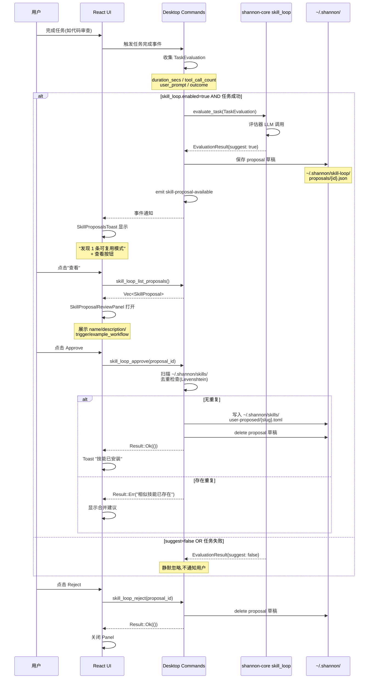

**状态**: Draft  
**作者**: agent-team  
**最后更新**: 2026-06-23

# E2: Self-evolving Skill Loop 设计文档

## 1. 背景与目标

### 1.1 问题陈述

用户在 Shannon Desktop 中完成重复性任务(如代码审查、文档生成、数据清理)时,每次都需要重新输入完整 prompt。Shannon 缺乏从已完成任务中提取可复用模式的自动化机制,导致:

- **重复 LLM 调用成本**: 相似工作流每次都需要重新执行 multi-step reasoning
- **工作流丢失**: 用户沉淀的优秀 prompt 组合模式无法系统化保存
- **技能门槛高**: 手动创建 skill 需要理解 TOML frontmatter 格式和 trigger 规则

### 1.2 设计目标

构建**半自动 skill loop**,在任务完成时智能评估是否值得提取为 skill,降低用户创作技能的门槛:

| 目标 | 指标 | 验证方式 |
|------|------|---------|
| 自动识别可复用模式 | 评估器准确率 >80% | 单元测试覆盖典型场景 |
| 降低技能创作门槛 | 从 30 分钟手动编写 → 5 分钟审核生成 | 用户测试时间测量 |
| 不破坏现有技能系统 | 兼容现有 ~/.shannon/skills/ 结构 | 集成测试验证加载 |

### 1.3 核心设计原则

1. **半自动,用户知情**: 评估器自动建议,但候选生成和写入必须用户明确同意
2. **本地优先**: 所有评估数据(user_prompt, tool_calls)仅本地处理,不上传 team memory
3. **去重优先**: 生成 proposal 前扫描已有 skills,相似度 >0.8 时合并而非新建
4. **Unstable API**: 遵循 D3 semver 策略,新 API 默认标记 `#[unstable]`

---

## 2. 架构概览

### 2.1 三方职责划分

```
┌─────────────────────────────────────────────────────────────┐
│                     shannon-code (sibling repo)              │
│  ┌──────────────────────────────────────────────────────┐   │
│  │ crates/shannon-core/src/skill_loop/                   │   │
│  │  ├── mod.rs (public API surface)                     │   │
│  │  ├── evaluator.rs (TaskEvaluation → EvaluationResult) │   │
│  │  └── generator.rs (TaskEvaluation → SkillProposal)     │   │
│  └──────────────────────────────────────────────────────┘   │
└─────────────────────────────────────────────────────────────┘
                              │
                              │ Tauri IPC (invoke_handler)
                              ▼
┌─────────────────────────────────────────────────────────────┐
│                    Shannon Desktop (本 repo)                  │
│  ┌──────────────────────────────────────────────────────┐   │
│  │ src/commands_skill_loop.rs                            │   │
│  │  ├── skill_loop_evaluate(task_id)                     │   │
│  │  ├── skill_loop_generate(task_id)                    │   │
│  │  ├── skill_loop_list_proposals()                     │   │
│  │  ├── skill_loop_approve(proposal_id)                  │   │
│  │  └── skill_loop_reject(proposal_id)                  │   │
│  ├──────────────────────────────────────────────────────┤   │
│  │ src/events.rs                                         │   │
│  │  └── skill-proposal-available (EventEnvelope)        │   │
│  └──────────────────────────────────────────────────────┘   │
└─────────────────────────────────────────────────────────────┘
                              │
                              │ Tauri Event (listen)
                              ▼
┌─────────────────────────────────────────────────────────────┐
│                      UI (React 19)                           │
│  ┌──────────────────────────────────────────────────────┐   │
│  │ ui/src/components/skill-loop/                         │   │
│  │  ├── SkillProposalsToast.tsx                          │   │
│  │  └── SkillProposalReviewPanel.tsx                     │   │
│  └──────────────────────────────────────────────────────┘   │
└─────────────────────────────────────────────────────────────┘
```

### 2.2 完整流程时序图



---

## 3. 数据结构

### 3.1 任务评估输入

```rust
/// shannon-core skill_loop::evaluator

use serde::{Deserialize, Serialize};
use std::collections::HashSet;

/// 任务执行元数据,用于评估是否值得提取为 skill
#[derive(Debug, Clone, Serialize, Deserialize)]
pub struct TaskEvaluation {
    /// 任务耗时(秒)
    pub duration_secs: u64,
    
    /// 调用的工具总数(含重复调用)
    pub tool_call_count: usize,
    
    /// 用户原始 prompt(完整输入)
    pub user_prompt: String,
    
    /// 任务执行结果状态
    pub outcome: TaskOutcome,
    
    /// 使用的工具名称集合(去重)
    pub tool_names_used: HashSet<String>,
    
    /// 任务开始时间(可选,用于上下文)
    #[serde(skip_serializing_if = "Option::is_none")]
    pub started_at: Option<i64>,
    
    /// 任务结束时间(可选)
    #[serde(skip_serializing_if = "Option::is_none")]
    pub completed_at: Option<i64>,
}

/// 任务执行结果状态
#[derive(Debug, Clone, Serialize, Deserialize, PartialEq)]
pub enum TaskOutcome {
    /// 任务成功完成
    Success,
    /// 任务部分成功(如 3 个文件处理了 2 个)
    Partial,
    /// 任务失败(不应提取 skill)
    Failure,
}
```

### 3.2 评估结果

```rust
/// shannon-core skill_loop::evaluator

/// 任务评估结果
#[derive(Debug, Clone, Serialize, Deserialize)]
pub struct EvaluationResult {
    /// 是否建议生成 skill proposal
    pub suggest: bool,
    
    /// 建议原因(自然语言,用于 UI 展示)
    pub reason: String,
    
    /// 置信度(0.0-1.0),用于 UI 显示强度
    pub confidence: f32,
    
    /// 评估维度分数(用于调试)
    #[serde(skip_serializing_if = "Option::is_none")]
    pub scores: Option<EvaluationScores>,
}

/// 各维度评估分数
#[derive(Debug, Clone, Serialize, Deserialize)]
pub struct EvaluationScores {
    /// 耗时得分(0-100, >5 分钟高分)
    pub duration_score: f32,
    
    /// 复杂度得分(0-100, 工具数量多高分)
    pub complexity_score: f32,
    
    /// 目标清晰度得分(0-100, prompt 有明确动词+产物高分)
    pub clarity_score: f32,
    
    /// 成功状态得分(0-100, Success=100, Partial=50, Failure=0)
    pub success_score: f32,
}
```

### 3.3 Skill Proposal

```rust
/// shannon-core skill_loop::generator + desktop commands

use uuid::Uuid;
use chrono::{DateTime, Utc};

/// 待审核的 skill 草案
#[derive(Debug, Clone, Serialize, Deserialize)]
pub struct SkillProposal {
    /// 唯一标识(UUID v4)
    pub id: Uuid,
    
    /// 技能显示名称(用户可编辑)
    pub name: String,
    
    /// URL-safe 标识符(用于文件名,由 name 生成)
    pub slug: String,
    
    /// 技能描述(1-2 句话)
    pub description: String,
    
    /// 触发模式列表(自然语言描述的触发场景)
    pub trigger_patterns: Vec<String>,
    
    /// 示例工作流(具体操作步骤,markdown 格式)
    pub example_workflow: String,
    
    /// 来源任务 ID(可选,用于追溯)
    #[serde(skip_serializing_if = "Option::is_none")]
    pub source_task_id: Option<String>,
    
    /// 创建时间
    pub created_at: DateTime<Utc>,
    
    /// 审核状态
    pub status: ProposalStatus,
    
    /// 建议的 skill 元数据(用于写入 TOML)
    #[serde(skip_serializing_if = "Option::is_none")]
    pub suggested_metadata: Option<SkillMetadataDraft>,
}

/// 审核状态
#[derive(Debug, Clone, Serialize, Deserialize, PartialEq)]
pub enum ProposalStatus {
    /// 待审核(默认状态)
    Pending,
    /// 已批准(已写入 ~/.shannon/skills/)
    Approved,
    /// 已拒绝(不持久化)
    Rejected,
}

/// 建议的 skill 元数据(参考 shannon-skills/src/definition.rs)
#[derive(Debug, Clone, Serialize, Deserialize)]
pub struct SkillMetadataDraft {
    /// 技能别名(用于调用)
    pub aliases: Vec<String>,
    
    /// 参数提示(如 "项目名称" 或 "文件路径")
    pub argument_hint: Option<String>,
    
    /// 允许的工具列表(空表示不限)
    pub allowed_tools: Vec<String>,
    
    /// 模型覆盖(可选)
    pub model: Option<String>,
    
    /// 是否用户可调用(默认 true)
    pub user_invocable: bool,
}
```

### 3.4 Desktop 端存储格式

```rust
/// Desktop commands_skill_loop.rs

/// 持久化到 ~/.shannon/skill-loop/proposals/{id}.json
#[derive(Debug, Clone, Serialize, Deserialize)]
struct PersistedProposal {
    /// proposal 数据
    pub proposal: SkillProposal,
    
    /// 序列化版本(用于未来迁移)
    pub version: u8,
}

impl PersistedProposal {
    fn new(proposal: SkillProposal) -> Self {
        Self { proposal, version: 1 }
    }
}
```

---

## 4. 评估器设计

### 4.1 评估逻辑伪代码

```
fn evaluate_task(input: TaskEvaluation) -> EvaluationResult:
    # 维度 1: 耗时得分
    duration_score = calculate_duration_score(input.duration_secs)
    # >300 秒(5 分钟) → 80-100 分
    # 60-300 秒 → 40-80 分
    # <60 秒 → 0-40 分
    
    # 维度 2: 复杂度得分
    complexity_score = calculate_complexity_score(input.tool_names_used)
    # ≥3 个不同工具 → 80-100 分
    # 2 个工具 → 40-80 分
    # 1 个或无工具 → 0-40 分
    
    # 维度 3: 目标清晰度得分
    clarity_score = calculate_clarity_score(input.user_prompt)
    # 明确动词(generate/analyze/review) + 期望产物(report/code/test) → 80-100 分
    # 仅动词或仅产物 → 40-80 分
    # 模糊描述(如 "帮我看看这个") → 0-40 分
    
    # 维度 4: 成功状态得分
    success_score = match input.outcome:
        Success → 100
        Partial → 50
        Failure → 0
    
    # 综合加权
    total_score = (duration_score * 0.3) + \
                  (complexity_score * 0.3) + \
                  (clarity_score * 0.2) + \
                  (success_score * 0.2)
    
    # 阈值判断
    suggest = total_score >= 60 && success_score > 0
    
    # 生成原因说明
    reason = generate_reason(duration_score, complexity_score, clarity_score)
    
    return EvaluationResult {
        suggest,
        reason,
        confidence: total_score / 100.0,
        scores: Some(EvaluationScores { ... })
    }
```

### 4.2 评估器 System Prompt

```rust
/// shannon-core skill_loop::evaluator::EVALUATOR_SYSTEM_PROMPT

const EVALUATOR_SYSTEM_PROMPT: &str = r#"You are a task evaluation expert for Shannon AI Assistant.
Your job is to determine whether a completed task is worth extracting as a reusable skill.

A "skill" in Shannon is a reusable prompt template that captures:
- A specific type of task (e.g., "code review for security vulnerabilities")
- Trigger conditions (when to suggest this skill to users)
- A workflow template (steps that can be reused with different inputs)

Evaluation criteria (weighted equally):
1. **Duration**: Long-running tasks (>5 minutes) indicate complex workflows worth automating
2. **Complexity**: Tasks using 3+ different tools suggest multi-step workflows
3. **Goal clarity**: Tasks with clear verbs (generate/analyze/review) and specific deliverables are easier to templatize
4. **Success status**: Only successful or partially successful tasks should become skills

Output a JSON object with this schema:
{
  "suggest": boolean,  // true if worth extracting
  "reason": string,    // human-readable explanation (1-2 sentences)
  "confidence": float, // 0.0-1.0 score
  "scores": {          // detailed breakdown (optional)
    "duration_score": float,      // 0-100
    "complexity_score": float,     // 0-100
    "clarity_score": float,        // 0-100
    "success_score": float         // 0-100
  }
}

Rules:
- Return suggest=false for: simple Q&A, single-round conversations, failed tasks
- Return suggest=true for: multi-step workflows, repeated patterns, clear deliverables
- Always explain the reason in plain language (no jargon)"#;
```

### 4.3 评估器 User Prompt 模板

```rust
/// shannon-core skill_loop::evaluator::build_evaluation_prompt

fn build_evaluation_prompt(input: &TaskEvaluation) -> String {
    format!(
        r#"Evaluate this completed task for skill extraction potential:

Task Duration: {} seconds ({})
Tools Used: {} different tools ({})
Task Outcome: {:?}
User Prompt: {}

Consider:
1. Did this task take long enough to suggest complexity? (>5 min = strong signal)
2. Did it use multiple tools suggesting a multi-step workflow?
3. Does the prompt have clear intent (specific verbs + deliverables)?
4. Did the task succeed (or partially succeed)?

Respond with JSON only."#,
        input.duration_secs,
        if input.duration_secs > 300 { "complex" } else { "simple" },
        input.tool_names_used.len(),
        input.tool_names_used.iter().join(", "),
        input.outcome,
        input.user_prompt
    )
}
```

---

## 5. 候选生成器设计

### 5.1 生成逻辑伪代码

```
fn generate_skill_proposal(input: TaskEvaluation) -> SkillProposal:
    # 1. 调用 LLM 生成草案
    llm_response = call_llm(GENERATOR_SYSTEM_PROMPT, build_generator_prompt(input))
    parsed = parse_toml(llm_response)
    
    # 2. 提取元数据
    name = parsed.get("name").unwrap_or("Unnamed Skill")
    slug = slugify(name)
    description = parsed.get("description").unwrap_or("")
    trigger_patterns = parsed.get("trigger_patterns").unwrap_or([])
    example_workflow = parsed.get("example_workflow").unwrap_or("")
    
    # 3. 生成建议元数据
    metadata = SkillMetadataDraft {
        aliases: generate_aliases_from_name(name),
        argument_hint: extract_argument_hints(input.user_prompt),
        allowed_tools: list(input.tool_names_used),
        model: None,
        user_invocable: true,
    }
    
    # 4. 构建 proposal
    return SkillProposal {
        id: Uuid::new_v4(),
        name,
        slug,
        description,
        trigger_patterns,
        example_workflow,
        source_task_id: Some(generate_task_id()),
        created_at: Utc::now(),
        status: ProposalStatus::Pending,
        suggested_metadata: Some(metadata),
    }
```

### 5.2 生成器 System Prompt

```rust
/// shannon-core skill_loop::generator::GENERATOR_SYSTEM_PROMPT

const GENERATOR_SYSTEM_PROMPT: &str = r#"You are a skill generation expert for Shannon AI Assistant.
Your job is to convert a completed task into a reusable skill template.

A Shannon skill has this structure (TOML format):

```toml
name = "Skill Name"
description = "One or two sentences describing when to use this skill"

[triggers]
# Natural language descriptions of when this skill should be suggested
patterns = [
  "when user asks to X",
  "when user needs to Y"
]

[workflow]
# Step-by-step workflow that can be reused with different inputs
steps = """
1. First step description
2. Second step description
3. (variable inputs marked like {variable_name})
"""

[metadata]
# Optional metadata for skill execution
aliases = ["short-name", "another-name"]
argument_hint = "What inputs does this skill expect?"
allowed_tools = ["tool1", "tool2"]  # Leave empty if no restrictions
```

Rules:
1. Extract the **core pattern** from the task, not specific details
2. Replace concrete values with **placeholder variables** like {project_name}, {file_path}
3. Make the workflow **general enough** to reuse but **specific enough** to be useful
4. Include 2-4 trigger patterns covering common variations
5. Keep descriptions concise (1-2 sentences)

Output ONLY valid TOML. No explanations outside the TOML block."#;
```

### 5.3 生成器 User Prompt 模板

```rust
/// shannon-core skill_loop::generator::build_generator_prompt

fn build_generator_prompt(input: &TaskEvaluation) -> String {
    format!(
        r#"Generate a skill template from this completed task:

User Prompt: {}
Task Duration: {} seconds
Tools Used: {}
Task Outcome: {:?}

Extract the reusable pattern:
- What was the user trying to achieve? (skill name + description)
- In what situations should this skill be suggested? (trigger patterns)
- What are the reusable steps? (workflow template)
- What variable inputs does it need? (mark as {variable_name})

Respond with TOML only."#,
        input.user_prompt,
        input.duration_secs,
        input.tool_names_used.iter().join(", "),
        input.outcome
    )
}
```

### 5.4 TOML 输出示例

```toml
name = "Security-Focused Code Review"
description = "Review code changes for security vulnerabilities, injection risks, and authentication flaws"

[triggers]
patterns = [
  "when user asks to review code for security issues",
  "when user mentions security audit or vulnerability scan",
  "when checking pull requests for security problems"
]

[workflow]
steps = """
1. Read and analyze the code in {file_path}
2. Check for common vulnerabilities:
   - SQL injection in database queries
   - XSS risks in user input handling
   - Authentication/authorization issues
   - Sensitive data exposure
3. Generate a security report with:
   - Critical findings (red)
   - Medium risks (yellow)
   - Recommendations for fixes
4. Output findings in markdown format with code examples
"""

[metadata]
aliases = ["sec-review", "security-audit"]
argument_hint = "File or directory to review"
allowed_tools = ["read", "grep", "analyze"]
```

---

## 6. shannon-core API 边界

### 6.1 模块结构

```
shannon-core/src/skill_loop/
├── mod.rs           # 公开 API surface
├── evaluator.rs     # 评估器逻辑
├── generator.rs     # 候选生成器
└── types.rs         # 共享数据结构
```

### 6.2 公开 API (Unstable)

```rust
/// shannon-core/src/skill_loop/mod.rs

//! # Self-evolving skill loop
//!
//! **Unstable API** (subject to change):
//! - Evaluation criteria may adjust based on user feedback
//! - Prompt templates may evolve for better accuracy
//! - Proposal schema may extend with new fields
//!
//! ## Usage
//!
//! ```rust,no_run
//! use shannon_core::skill_loop::{evaluate_task, generate_skill_proposal};
//! use shannon_core::skill_loop::types::{TaskEvaluation, TaskOutcome};
//!
//! # async fn example() -> Result<(), Box<dyn std::error::Error>> {
//! let evaluation = TaskEvaluation {
//!     duration_secs: 420,
//!     tool_call_count: 8,
//!     user_prompt: "Review this PR for security issues".to_string(),
//!     outcome: TaskOutcome::Success,
//!     tool_names_used: vec!["read".into(), "grep".into(), "analyze".into()].into_iter().collect(),
//!     started_at: None,
//!     completed_at: None,
//! };
//!
//! // Step 1: Evaluate
//! let eval_result = evaluate_task(evaluation.clone()).await?;
//! if eval_result.suggest {
//!     // Step 2: Generate proposal
//!     let proposal = generate_skill_proposal(evaluation).await?;
//!     println!("Proposal: {}", proposal.name);
//! }
//! # Ok(())
//! # }
//! ```

pub mod evaluator;
pub mod generator;
pub mod types;

// Re-export main types
pub use types::{TaskEvaluation, TaskOutcome, EvaluationResult, SkillProposal, ProposalStatus};

use shannon_types::ShannonError;

/// Evaluate whether a completed task is worth extracting as a skill
///
/// **Unstable**: Evaluation criteria may change
///
/// # Errors
/// Returns `ShannonError::LLMError` if the evaluation LLM call fails
#[unstable]
pub async fn evaluate_task(input: TaskEvaluation) -> Result<EvaluationResult, ShannonError> {
    evaluator::evaluate_internal(input).await
}

/// Generate a skill proposal from a completed task
///
/// **Unstable**: Output schema may change
///
/// # Errors
/// Returns `ShannonError::LLMError` if the generation LLM call fails
/// Returns `ShannonError::ParseError` if LLM output is not valid TOML
#[unstable]
pub async fn generate_skill_proposal(input: TaskEvaluation) -> Result<SkillProposal, ShannonError> {
    generator::generate_internal(input).await
}
```

### 6.3 内部实现细节

```rust
/// shannon-core/src/skill_loop/evaluator.rs

use super::types::*;
use shannon_types::LLMClient;
use serde_json::Value;

pub(crate) async fn evaluate_internal(input: TaskEvaluation) -> Result<EvaluationResult, ShannonError> {
    let client = LLMClient::standard_model();  // 使用 standard 模型
    
    let prompt = build_evaluation_prompt(&input);
    let response = client.complete(EVALUATOR_SYSTEM_PROMPT, &prompt).await?;
    
    let parsed: Value = serde_json::from_str(&response)
        .map_err(|e| ShannonError::ParseError(format!("Invalid JSON: {}", e)))?;
    
    Ok(EvaluationResult {
        suggest: parsed["suggest"].as_bool().unwrap_or(false),
        reason: parsed["reason"].as_str().unwrap_or("Unknown").to_string(),
        confidence: parsed["confidence"].as_f64().unwrap_or(0.0) as f32,
        scores: parsed.get("scores").and_then(|s| serde_json::from_value(s.clone()).ok()),
    })
}
```

---

## 7. Desktop Commands 清单

### 7.1 完整命令列表

```rust
/// src/commands_skill_loop.rs

use tauri::State;
use std::sync::Mutex;
use crate::commands::AppState;
use super::events::EventEnvelope;

/// 评估任务是否值得提取为 skill
///
/// # Arguments
/// * `task_id` - 任务唯一标识符(用于查询执行历史)
///
/// # Returns
/// `EvaluationResult` 包含建议原因和置信度
#[tauri::command]
pub async fn skill_loop_evaluate(
    task_id: String,
    state: State<'_, AppState>,
) -> Result<EvaluationResult, String> {
    // 1. 从状态中检索任务元数据
    let task_meta = state.get_task_metadata(&task_id)
        .ok_or("Task not found")?;
    
    // 2. 构建 TaskEvaluation
    let evaluation = TaskEvaluation {
        duration_secs: task_meta.duration_secs,
        tool_call_count: task_meta.tool_call_count,
        user_prompt: task_meta.user_prompt,
        outcome: task_meta.outcome,
        tool_names_used: task_meta.tools_used.into_iter().collect(),
        started_at: Some(task_meta.started_at.timestamp()),
        completed_at: Some(task_meta.completed_at.timestamp()),
    };
    
    // 3. 调用 shannon-core API
    shannon_core::skill_loop::evaluate_task(evaluation)
        .await
        .map_err(|e| e.to_string())
}

/// 生成 skill proposal 草案
///
/// # Arguments
/// * `task_id` - 任务唯一标识符
///
/// # Returns
/// 完整的 `SkillProposal` 结构
#[tauri::command]
pub async fn skill_loop_generate(
    task_id: String,
    state: State<'_, AppState>,
) -> Result<SkillProposal, String> {
    let task_meta = state.get_task_metadata(&task_id)
        .ok_or("Task not found")?;
    
    let evaluation = TaskEvaluation {
        duration_secs: task_meta.duration_secs,
        tool_call_count: task_meta.tool_call_count,
        user_prompt: task_meta.user_prompt.clone(),
        outcome: task_meta.outcome,
        tool_names_used: task_meta.tools_used.into_iter().collect(),
        started_at: Some(task_meta.started_at.timestamp()),
        completed_at: Some(task_meta.completed_at.timestamp()),
    };
    
    // 生成 proposal
    let proposal = shannon_core::skill_loop::generate_skill_proposal(evaluation)
        .await
        .map_err(|e| e.to_string())?;
    
    // 持久化到 ~/.shannon/skill-loop/proposals/
    let proposals_dir = dirs::home_dir()
        .ok_or("Cannot determine home directory")?
        .join(".shannon/skill-loop/proposals");
    
    std::fs::create_dir_all(&proposals)
        .map_err(|e| format!("Failed to create proposals directory: {}", e))?;
    
    let proposal_path = proposals_dir.join(format!("{}.json", proposal.id));
    let persisted = PersistedProposal::new(proposal.clone());
    
    std::fs::write(
        &proposal_path,
        serde_json::to_string_pretty(&persisted).map_err(|e| e.to_string())?
    ).map_err(|e| format!("Failed to write proposal: {}", e))?;
    
    Ok(proposal)
}

/// 列出所有待审核的 proposals
///
/// # Returns
/// 按创建时间倒序排列的 proposal 列表
#[tauri::command]
pub async fn skill_loop_list_proposals() -> Result<Vec<SkillProposal>, String> {
    let proposals_dir = dirs::home_dir()
        .ok_or("Cannot determine home directory")?
        .join(".shannon/skill-loop/proposals");
    
    let mut proposals = Vec::new();
    
    for entry in std::fs::read_dir(&proposals)
        .map_err(|e| format!("Failed to read proposals directory: {}", e))?
    {
        let entry = entry.map_err(|e| format!("Failed to read entry: {}", e))?;
        let path = entry.path();
        
        if path.extension().and_then(|s| s.to_str()) != Some("json") {
            continue;
        }
        
        let content = std::fs::read_to_string(&path)
            .map_err(|e| format!("Failed to read proposal: {}", e))?;
        
        let persisted: PersistedProposal = serde_json::from_str(&content)
            .map_err(|e| format!("Failed to parse proposal: {}", e))?;
        
        proposals.push(persisted.proposal);
    }
    
    proposals.sort_by(|a, b| b.created_at.cmp(&a.created_at));
    Ok(proposals)
}

/// 批准 proposal 并写入 skill 文件
///
/// # Arguments
/// * `proposal_id` - Proposal UUID
///
/// # Returns
/// 成功时返回写入的 skill 文件路径
#[tauri::command]
pub async fn skill_loop_approve(
    proposal_id: String,
    state: State<'_, AppState>,
    app_handle: tauri::AppHandle,
) -> Result<String, String> {
    // 1. 读取 proposal
    let proposal = load_proposal(&proposal_id)?;
    
    // 2. 去重检查
    if let Some(existing) = check_duplicate_skill(&proposal)? {
        return Err(format!("Similar skill already exists: {}", existing));
    }
    
    // 3. 生成 TOML 内容
    let toml_content = generate_skill_toml(&proposal)?;
    
    // 4. 写入 ~/.shannon/skills/user-proposed/
    let skills_dir = dirs::home_dir()
        .ok_or("Cannot determine home directory")?
        .join(".shannon/skills/user-proposed");
    
    std::fs::create_dir_all(&skills_dir)
        .map_err(|e| format!("Failed to create skills directory: {}", e))?;
    
    let skill_path = skills_dir.join(format!("{}.toml", proposal.slug));
    std::fs::write(&skill_path, toml_content)
        .map_err(|e| format!("Failed to write skill file: {}", e))?;
    
    // 5. 删除 proposal 草稿
    delete_proposal(&proposal_id)?;
    
    // 6. 通知前端(可选,通过已有事件机制)
    // app_handle.emit_all("skills-updated", ())?;
    
    Ok(skill_path.to_string_lossy().to_string())
}

/// 拒绝 proposal 并删除草稿
///
/// # Arguments
/// * `proposal_id` - Proposal UUID
#[tauri::command]
pub async fn skill_loop_reject(proposal_id: String) -> Result<(), String> {
    delete_proposal(&proposal_id)
}

// ===== Helper Functions =====

fn load_proposal(id: &str) -> Result<SkillProposal, String> {
    let proposals_dir = dirs::home_dir()
        .ok_or("Cannot determine home directory")?
        .join(".shannon/skill-loop/proposals");
    
    let proposal_path = proposals_dir.join(format!("{}.json", id));
    let content = std::fs::read_to_string(&proposal_path)
        .map_err(|e| format!("Proposal not found: {}", e))?;
    
    let persisted: PersistedProposal = serde_json::from_str(&content)
        .map_err(|e| format!("Invalid proposal format: {}", e))?;
    
    Ok(persisted.proposal)
}

fn delete_proposal(id: &str) -> Result<(), String> {
    let proposals_dir = dirs::home_dir()
        .ok_or("Cannot determine home directory")?
        .join(".shannon/skill-loop/proposals");
    
    let proposal_path = proposals_dir.join(format!("{}.json", id));
    std::fs::remove_file(&proposal_path)
        .map_err(|e| format!("Failed to delete proposal: {}", e))
}

fn check_duplicate_skill(proposal: &SkillProposal) -> Result<Option<String>, String> {
    use strsim::levenshtein;
    
    let skills_dir = dirs::home_dir()
        .ok_or("Cannot determine home directory")?
        .join(".shannon/skills");
    
    if !skills_dir.exists() {
        return Ok(None);
    }
    
    for entry in walkdir::WalkDir::new(&skills_dir).into_iter().filter_map(|e| e.ok()) {
        if !entry.path().extension().map(|e| e == "toml").unwrap_or(false) {
            continue;
        }
        
        let content = std::fs::read_to_string(entry.path())
            .map_err(|e| format!("Failed to read skill: {}", e))?;
        
        // 简单字符串相似度检查(name + description)
        let existing_text = format!("{} {}", 
            content.split("name = ").nth(1).and_then(|s| s.split('"').nth(1)).unwrap_or(""),
            content.split("description = ").nth(1).and_then(|s| s.split('"').nth(1)).unwrap_or("")
        );
        
        let proposal_text = format!("{} {}", proposal.name, proposal.description);
        let distance = levenshtein(&existing_text, &proposal_text);
        let max_len = existing_text.len().max(proposal_text.len());
        let similarity = 1.0 - (distance as f64 / max_len as f64);
        
        if similarity > 0.8 {
            return Ok(Some(entry.path().to_string_lossy().to_string()));
        }
    }
    
    Ok(None)
}

fn generate_skill_toml(proposal: &SkillProposal) -> Result<String, String> {
    use std::fmt::Write;
    
    let mut output = String::new();
    
    writeln!(output, "name = \"{}\"", proposal.name).unwrap();
    writeln!(output, "description = \"{}\"", proposal.description).unwrap();
    writeln!(output).unwrap();
    
    writeln!(output, "[triggers]").unwrap();
    writeln!(output, "patterns = [").unwrap();
    for pattern in &proposal.trigger_patterns {
        writeln!(output, "  \"{}\",", pattern).unwrap();
    }
    writeln!(output, "]").unwrap();
    writeln!(output).unwrap();
    
    writeln!(output, "[workflow]").unwrap();
    writeln!(output, "steps = \"\"\"\n{}\"\"\"", proposal.example_workflow).unwrap();
    writeln!(output).unwrap();
    
    if let Some(ref meta) = proposal.suggested_metadata {
        writeln!(output, "[metadata]").unwrap();
        if !meta.aliases.is_empty() {
            writeln!(output, "aliases = [").unwrap();
            for alias in &meta.aliases {
                writeln!(output, "  \"{}\",", alias).unwrap();
            }
            writeln!(output, "]").unwrap();
        }
        if let Some(ref hint) = meta.argument_hint {
            writeln!(output, "argument_hint = \"{}\"", hint).unwrap();
        }
        if !meta.allowed_tools.is_empty() {
            writeln!(output, "allowed_tools = [").unwrap();
            for tool in &meta.allowed_tools {
                writeln!(output, "  \"{}\",", tool).unwrap();
            }
            writeln!(output, "]").unwrap();
        }
    }
    
    Ok(output)
}
```

---

## 8. 事件定义

### 8.1 事件结构

```rust
/// src/events.rs (新增部分)

use serde::{Deserialize, Serialize};
use super::skill_loop_types::SkillProposal;

/// Skill proposal 数量变化事件
/// 遵循 D4 EventEnvelope 规范
#[derive(Debug, Clone, Serialize, Deserialize)]
pub struct SkillProposalEventPayload {
    /// 当前待审核 proposal 数量
    pub pending_count: usize,
    
    /// 最新 proposal 的 ID(可选)
    pub latest_proposal_id: Option<String>,
    
    /// Schema 版本(遵循 D4)
    pub schema_version: u8,
}

impl EventEnvelope for SkillProposalEventPayload {
    const SCHEMA_VERSION: u8 = 1;
    
    fn event_name() -> &'static str {
        "skill-proposal-available"
    }
}

// 事件名常量
pub mod event_names {
    pub const SKILL_PROPOSAL_AVAILABLE: &str = "skill-proposal-available";
}
```

### 8.2 事件发送

```rust
/// src/commands_skill_loop.rs (skill_loop_generate 函数末尾)

// 在写入 proposal 后发送事件
let payload = SkillProposalEventPayload {
    pending_count: count_pending_proposals()?,
    latest_proposal_id: Some(proposal.id.to_string()),
    schema_version: 1,
};

app_handle.emit_all(event_names::SKILL_PROPOSAL_AVAILABLE, payload)
    .map_err(|e| format!("Failed to emit event: {}", e))?;
```

### 8.3 前端监听

```typescript
/// ui/src/hooks/useSkillProposals.ts (新建)

import { useEffect, useState } from 'react';
import { listen } from '@tauri-apps/api/event';

interface SkillProposalEvent {
  pending_count: number;
  latest_proposal_id?: string;
  schema_version: number;
}

export function useSkillProposals() {
  const [count, setCount] = useState(0);
  
  useEffect(() => {
    const unlisten = listen<SkillProposalEvent>(
      'skill-proposal-available',
      (event) => {
        if (event.payload.schema_version === 1) {
          setCount(event.payload.pending_count);
        }
      }
    );
    
    return () => {
      unlisten.then(fn => fn());
    };
  }, []);
  
  return count;
}
```

---

## 9. UI 设计

### 9.1 SkillProposalsToast (ASCII Mockup)

```
┌─────────────────────────────────────────┐
│  Shannon                                │
│                                         │
│  [任务已完成]                           │
│                                         │
│  ┌─────────────────────────────────┐    │
│  │ 🔔 发现 1 条可复用模式          │    │
│  │                                 │    │
│  │ 本次任务包含可复用的工作流      │    │
│  │ (代码审查+安全检查)            │    │
│  │                                 │    │
│  │        [查看] [忽略]            │    │
│  └─────────────────────────────────┘    │
│                                         │
│  [Chat] [Projects] [Scheduled]          │
└─────────────────────────────────────────┘

位置: 右下角
自动消失: 30 秒(用户交互后)
动画: slide-in-from-bottom
```

### 9.2 SkillProposalReviewPanel (ASCII Mockup)

```
┌───────────────────────────────────────────────────────────┐
│  审核技能提案                                    [×]        │
├───────────────────────────────────────────────────────────┤
│                                                           │
│  技能名称                                                 │
│  ──────────────────────────────                          │
│  Security-Focused Code Review                             │
│                                                           │
│  描述                                                     │
│  ──────────────────────────────                          │
│  Review code changes for security vulnerabilities,         │
│  injection risks, and authentication flaws               │
│                                                           │
│  触发条件                                                 │
│  ──────────────────────────────                          │
│  • 当用户要求进行安全审查时                               │
│  • 当用户提到 security audit 或 vulnerability scan        │
│  • 当检查 PR 的安全问题时                                 │
│                                                           │
│  工作流模板                                               │
│  ──────────────────────────────                          │
│  1. Read and analyze the code in {file_path}              │
│  2. Check for common vulnerabilities:                     │
│     - SQL injection in database queries                  │
│     - XSS risks in user input handling                   │
│     - Authentication/authorization issues                │
│  3. Generate a security report with:                     │
│     - Critical findings (red)                             │
│     - Medium risks (yellow)                              │
│  4. Output findings in markdown format                   │
│                                                           │
│  元数据                                                   │
│  ──────────────────────────────                          │
│  别名: sec-review, security-audit                         │
│  参数提示: File or directory to review                    │
│  允许工具: read, grep, analyze                            │
│                                                           │
│  ┌─────────────────────────────────────────────────┐    │
│  │  [编辑]  [批准并安装]  [拒绝]                   │    │
│  └─────────────────────────────────────────────────┘    │
│                                                           │
└───────────────────────────────────────────────────────────┘

位置: 居中模态
宽度: 600px
最大高度: 80vh (内容滚动)
```

### 9.3 组件实现骨架

```typescript
/// ui/src/components/skill-loop/SkillProposalsToast.tsx (新建)

import React from 'react';
import { useSkillProposals } from '@/hooks/useSkillProposals';
import { useTranslation } from 'react-i18n';

export function SkillProposalsToast() {
  const count = useSkillProposals();
  const { t } = useTranslation();
  
  if (count === 0) return null;
  
  const handleView = () => {
    // 打开 SkillProposalReviewPanel
    emit('open-skill-proposals');
  };
  
  const handleDismiss = () => {
    // 静默关闭 toast,不删除 proposal
    closeToast();
  };
  
  return (
    <div className="fixed bottom-4 right-4 bg-white dark:bg-gray-800 rounded-lg shadow-lg p-4 max-w-md animate-slide-in">
      <div className="flex items-start gap-3">
        <div className="text-2xl">🔔</div>
        <div className="flex-1">
          <h4 className="font-medium text-gray-900 dark:text-gray-100">
            {t('skill.proposals.toast.title', { count })}
          </h4>
          <p className="text-sm text-gray-600 dark:text-gray-400 mt-1">
            {t('skill.proposals.toast.description')}
          </p>
          <div className="flex gap-2 mt-3">
            <button
              onClick={handleView}
              className="px-3 py-1.5 bg-blue-600 hover:bg-blue-700 text-white text-sm rounded"
            >
              {t('skill.proposals.toast.viewButton')}
            </button>
            <button
              onClick={handleDismiss}
              className="px-3 py-1.5 text-gray-600 dark:text-gray-400 text-sm hover:bg-gray-100 dark:hover:bg-gray-700 rounded"
            >
              {t('skill.proposals.toast.dismissButton')}
            </button>
          </div>
        </div>
      </div>
    </div>
  );
}
```

```typescript
/// ui/src/components/skill-loop/SkillProposalReviewPanel.tsx (新建)

import React, { useState, useEffect } from 'react';
import { invoke } from '@tauri-apps/api/core';
import { useTranslation } from 'react-i18n';

interface SkillProposal {
  id: string;
  name: string;
  slug: string;
  description: string;
  trigger_patterns: string[];
  example_workflow: string;
  suggested_metadata?: {
    aliases: string[];
    argument_hint?: string;
    allowed_tools: string[];
  };
}

export function SkillProposalReviewPanel({ proposalId, onClose }: Props) {
  const { t } = useTranslation();
  const [proposal, setProposal] = useState<SkillProposal | null>(null);
  const [loading, setLoading] = useState(true);
  const [error, setError] = useState<string | null>(null);
  
  useEffect(() => {
    invoke<SkillProposal[]>('skill_loop_list_proposals')
      .then(proposals => proposals.find(p => p.id === proposalId))
      .then(setProposal)
      .catch(setError)
      .finally(() => setLoading(false));
  }, [proposalId]);
  
  const handleApprove = async () => {
    try {
      const result = await invoke<string>('skill_loop_approve', { proposalId });
      toast.success(t('skill.proposals.review.approved'));
      onClose();
    } catch (err) {
      toast.error(err.toString());
    }
  };
  
  const handleReject = async () => {
    try {
      await invoke('skill_loop_reject', { proposalId });
      toast.success(t('skill.proposals.review.rejected'));
      onClose();
    } catch (err) {
      toast.error(err.toString());
    }
  };
  
  if (loading) return <LoadingSpinner />;
  if (error) return <ErrorMessage error={error} />;
  if (!proposal) return <NotFound />;
  
  return (
    <div className="fixed inset-0 bg-black/50 flex items-center justify-center p-4">
      <div className="bg-white dark:bg-gray-800 rounded-lg shadow-xl max-w-2xl w-full max-h-[80vh] overflow-y-auto">
        {/* Header */}
        <div className="flex items-center justify-between p-6 border-b dark:border-gray-700">
          <h2 className="text-xl font-semibold text-gray-900 dark:text-gray-100">
            {t('skill.proposals.review.title')}
          </h2>
          <button onClick={onClose} className="text-gray-400 hover:text-gray-600">
            ×
          </button>
        </div>
        
        {/* Content */}
        <div className="p-6 space-y-6">
          {/* Name */}
          <div>
            <h3 className="text-sm font-medium text-gray-500 dark:text-gray-400">
              {t('skill.proposals.review.nameLabel')}
            </h3>
            <p className="mt-1 text-lg font-semibold text-gray-900 dark:text-gray-100">
              {proposal.name}
            </p>
          </div>
          
          {/* Description */}
          <div>
            <h3 className="text-sm font-medium text-gray-500 dark:text-gray-400">
              {t('skill.proposals.review.descriptionLabel')}
            </h3>
            <p className="mt-1 text-gray-700 dark:text-gray-300">
              {proposal.description}
            </p>
          </div>
          
          {/* Triggers */}
          <div>
            <h3 className="text-sm font-medium text-gray-500 dark:text-gray-400">
              {t('skill.proposals.review.triggersLabel')}
            </h3>
            <ul className="mt-1 list-disc list-inside text-gray-700 dark:text-gray-300">
              {proposal.trigger_patterns.map((pattern, i) => (
                <li key={i}>{pattern}</li>
              ))}
            </ul>
          </div>
          
          {/* Workflow */}
          <div>
            <h3 className="text-sm font-medium text-gray-500 dark:text-gray-400">
              {t('skill.proposals.review.workflowLabel')}
            </h3>
            <pre className="mt-1 p-3 bg-gray-50 dark:bg-gray-900 rounded text-sm text-gray-800 dark:text-gray-200 whitespace-pre-wrap">
              {proposal.example_workflow}
            </pre>
          </div>
          
          {/* Metadata */}
          {proposal.suggested_metadata && (
            <div>
              <h3 className="text-sm font-medium text-gray-500 dark:text-gray-400">
                {t('skill.proposals.review.metadataLabel')}
              </h3>
              <dl className="mt-1 grid grid-cols-2 gap-2 text-sm">
                <dt className="text-gray-500">Aliases:</dt>
                <dd className="text-gray-700 dark:text-gray-300">
                  {proposal.suggested_metadata.aliases.join(', ')}
                </dd>
                <dt className="text-gray-500">Argument hint:</dt>
                <dd className="text-gray-700 dark:text-gray-300">
                  {proposal.suggested_metadata.argument_hint || 'N/A'}
                </dd>
                <dt className="text-gray-500">Allowed tools:</dt>
                <dd className="text-gray-700 dark:text-gray-300">
                  {proposal.suggested_metadata.allowed_tools.join(', ') || 'None'}
                </dd>
              </dl>
            </div>
          )}
        </div>
        
        {/* Actions */}
        <div className="flex justify-end gap-3 p-6 border-t dark:border-gray-700">
          <button
            onClick={handleReject}
            className="px-4 py-2 text-gray-700 dark:text-gray-300 hover:bg-gray-100 dark:hover:bg-gray-700 rounded"
          >
            {t('skill.proposals.review.rejectButton')}
          </button>
          <button
            onClick={handleApprove}
            className="px-4 py-2 bg-blue-600 hover:bg-blue-700 text-white rounded"
          >
            {t('skill.proposals.review.approveButton')}
          </button>
        </div>
      </div>
    </div>
  );
}
```

---

## 10. i18n Key 草案

### 10.1 中英对照表

| Key | English | 中文 (Simplified) |
|-----|---------|-------------------|
| `skill.proposals.toast.title` | Found {count} reusable pattern | 发现 {count} 条可复用模式 |
| `skill.proposals.toast.description` | This task contains a reusable workflow ({reason}). | 本次任务包含可复用工作流({reason})。 |
| `skill.proposals.toast.viewButton` | View | 查看 |
| `skill.proposals.toast.dismissButton` | Dismiss | 忽略 |
| `skill.proposals.review.title` | Review Skill Proposal | 审核技能提案 |
| `skill.proposals.review.nameLabel` | Skill Name | 技能名称 |
| `skill.proposals.review.descriptionLabel` | Description | 描述 |
| `skill.proposals.review.triggersLabel` | Trigger Conditions | 触发条件 |
| `skill.proposals.review.workflowLabel` | Workflow Template | 工作流模板 |
| `skill.proposals.review.metadataLabel` | Metadata | 元数据 |
| `skill.proposals.review.approveButton` | Approve & Install | 批准并安装 |
| `skill.proposals.review.rejectButton` | Reject | 拒绝 |
| `skill.proposals.review.editButton` | Edit | 编辑 |
| `skill.proposals.review.approved` | Skill installed successfully | 技能已成功安装 |
| `skill.proposals.review.rejected` | Proposal rejected | 提案已拒绝 |
| `skill.proposals.review.duplicateError` | Similar skill already exists: {name} | 相似技能已存在:{name} |
| `skill.proposals.review.loadError` | Failed to load proposal | 加载提案失败 |
| `skill.settings.title` | Skill Loop Settings | 技能循环设置 |
| `skill.settings.enabled` | Enable skill extraction | 启用技能提取 |
| `skill.settings.enabledHelp` | Automatically suggest reusable skills after task completion | 任务完成后自动建议可复用技能 |
| `skill.settings.minDuration` | Minimum task duration | 最小任务时长 |
| `skill.settings.minDurationHelp` | Only tasks longer than this (seconds) will be evaluated | 仅评估超过此时长(秒)的任务 |
| `skill.settings.minToolCalls` | Minimum tool calls | 最小工具调用数 |
| `skill.settings.minToolCallsHelp` | Only tasks using this many different tools will be evaluated | 仅评估使用这么多不同工具的任务 |
| `skill.settings.autoEvaluate` | Auto-evaluate completed tasks | 自动评估已完成任务 |
| `skill.settings.autoEvaluateHelp` | Automatically evaluate tasks without manual trigger | 无需手动触发自动评估任务 |

### 10.2 en.json 片段

```json
{
  "skill": {
    "proposals": {
      "toast": {
        "title": "Found {count} reusable pattern",
        "description": "This task contains a reusable workflow ({reason}).",
        "viewButton": "View",
        "dismissButton": "Dismiss"
      },
      "review": {
        "title": "Review Skill Proposal",
        "nameLabel": "Skill Name",
        "descriptionLabel": "Description",
        "triggersLabel": "Trigger Conditions",
        "workflowLabel": "Workflow Template",
        "metadataLabel": "Metadata",
        "approveButton": "Approve & Install",
        "rejectButton": "Reject",
        "editButton": "Edit",
        "approved": "Skill installed successfully",
        "rejected": "Proposal rejected",
        "duplicateError": "Similar skill already exists: {name}",
        "loadError": "Failed to load proposal"
      }
    },
    "settings": {
      "title": "Skill Loop Settings",
      "enabled": "Enable skill extraction",
      "enabledHelp": "Automatically suggest reusable skills after task completion",
      "minDuration": "Minimum task duration",
      "minDurationHelp": "Only tasks longer than this (seconds) will be evaluated",
      "minToolCalls": "Minimum tool calls",
      "minToolCallsHelp": "Only tasks using this many different tools will be evaluated",
      "autoEvaluate": "Auto-evaluate completed tasks",
      "autoEvaluateHelp": "Automatically evaluate tasks without manual trigger"
    }
  }
}
```

### 10.3 zh-CN.json 片段

```json
{
  "skill": {
    "proposals": {
      "toast": {
        "title": "发现 {count} 条可复用模式",
        "description": "本次任务包含可复用工作流({reason})。",
        "viewButton": "查看",
        "dismissButton": "忽略"
      },
      "review": {
        "title": "审核技能提案",
        "nameLabel": "技能名称",
        "descriptionLabel": "描述",
        "triggersLabel": "触发条件",
        "workflowLabel": "工作流模板",
        "metadataLabel": "元数据",
        "approveButton": "批准并安装",
        "rejectButton": "拒绝",
        "editButton": "编辑",
        "approved": "技能已成功安装",
        "rejected": "提案已拒绝",
        "duplicateError": "相似技能已存在:{name}",
        "loadError": "加载提案失败"
      }
    },
    "settings": {
      "title": "技能循环设置",
      "enabled": "启用技能提取",
      "enabledHelp": "任务完成后自动建议可复用技能",
      "minDuration": "最小任务时长",
      "minDurationHelp": "仅评估超过此时长(秒)的任务",
      "minToolCalls": "最小工具调用数",
      "minToolCallsHelp": "仅评估使用这么多不同工具的任务",
      "autoEvaluate": "自动评估已完成任务",
      "autoEvaluateHelp": "无需手动触发自动评估任务"
    }
  }
}
```

---

## 11. Settings 默认值

### 11.1 配置结构

```rust
/// src/config.rs (DesktopConfig 新增字段)

#[derive(Debug, Clone, Serialize, Deserialize)]
pub struct DesktopConfig {
    // ... 现有字段 ...
    
    /// Skill loop settings (新增)
    #[serde(default)]
    pub skill_loop: SkillLoopConfig,
}

#[derive(Debug, Clone, Serialize, Deserialize)]
pub struct SkillLoopConfig {
    /// 是否启用 skill loop(默认关闭)
    #[serde(default = "default_false")]
    pub enabled: bool,
    
    /// 最小任务时长(秒),默认 5 分钟
    #[serde(default = "default_min_duration")]
    pub min_duration_secs: u64,
    
    /// 最小工具调用数,默认 3
    #[serde(default = "default_min_tool_calls")]
    pub min_tool_calls: usize,
    
    /// 是否自动评估(默认开启)
    #[serde(default = "default_true")]
    pub auto_evaluate: bool,
}

fn default_false() -> bool { false }
fn default_min_duration() -> u64 { 300 }
fn default_min_tool_calls() -> usize { 3 }
fn default_true() -> bool { true }
```

### 11.2 Settings UI 片段

```typescript
/// ui/src/pages/settings/SkillLoopSettings.tsx (新建)

import React from 'react';
import { useTranslation } from 'react-i18n';
import { invoke } from '@tauri-apps/api/core';

export function SkillLoopSettings() {
  const { t } = useTranslation();
  const [config, setConfig] = useState({
    enabled: false,
    min_duration_secs: 300,
    min_tool_calls: 3,
    auto_evaluate: true,
  });
  
  const handleSave = async () => {
    await invoke('configure', {
      key: 'skill_loop',
      value: config,
    });
    toast.success(t('settings.saveSuccess'));
  };
  
  return (
    <div className="space-y-6">
      <div>
        <h2 className="text-lg font-semibold text-gray-900 dark:text-gray-100">
          {t('skill.settings.title')}
        </h2>
        <p className="text-sm text-gray-600 dark:text-gray-400 mt-1">
          Configure automatic skill extraction from completed tasks
        </p>
      </div>
      
      <div className="space-y-4">
        {/* Enable Toggle */}
        <div className="flex items-center justify-between">
          <label className="flex-1">
            <div className="font-medium text-gray-900 dark:text-gray-100">
              {t('skill.settings.enabled')}
            </div>
            <div className="text-sm text-gray-500 dark:text-gray-400">
              {t('skill.settings.enabledHelp')}
            </div>
          </label>
          <Switch
            checked={config.enabled}
            onChange={(checked) => setConfig({ ...config, enabled: checked })}
          />
        </div>
        
        {/* Min Duration */}
        <div>
          <label className="block text-sm font-medium text-gray-900 dark:text-gray-100">
            {t('skill.settings.minDuration')}
          </label>
          <input
            type="number"
            value={config.min_duration_secs}
            onChange={(e) => setConfig({ ...config, min_duration_secs: parseInt(e.target.value) })}
            className="mt-1 block w-full rounded-md border-gray-300 dark:border-gray-600"
          />
          <p className="text-sm text-gray-500 dark:text-gray-400 mt-1">
            {t('skill.settings.minDurationHelp')}
          </p>
        </div>
        
        {/* Min Tool Calls */}
        <div>
          <label className="block text-sm font-medium text-gray-900 dark:text-gray-100">
            {t('skill.settings.minToolCalls')}
          </label>
          <input
            type="number"
            value={config.min_tool_calls}
            onChange={(e) => setConfig({ ...config, min_tool_calls: parseInt(e.target.value) })}
            className="mt-1 block w-full rounded-md border-gray-300 dark:border-gray-600"
          />
          <p className="text-sm text-gray-500 dark:text-gray-400 mt-1">
            {t('skill.settings.minToolCallsHelp')}
          </p>
        </div>
        
        {/* Auto Evaluate Toggle */}
        <div className="flex items-center justify-between">
          <label className="flex-1">
            <div className="font-medium text-gray-900 dark:text-gray-100">
              {t('skill.settings.autoEvaluate')}
            </div>
            <div className="text-sm text-gray-500 dark:text-gray-400">
              {t('skill.settings.autoEvaluateHelp')}
            </div>
          </label>
          <Switch
            checked={config.auto_evaluate}
            onChange={(checked) => setConfig({ ...config, auto_evaluate: checked })}
          />
        </div>
      </div>
      
      <button
        onClick={handleSave}
        className="px-4 py-2 bg-blue-600 hover:bg-blue-700 text-white rounded"
      >
        {t('settings.saveButton')}
      </button>
    </div>
  );
}
```

---

## 12. 存储规范

### 12.1 目录结构

```
~/.shannon/
├── skill-loop/                  # Skill loop 工作目录(新增)
│   └── proposals/               # 待审核 proposals
│       ├── 123e4567-e89b-12d3-a456-426614174000.json
│       ├── 789f0123-45c6-78d9-0e12-f456789abc12.json
│       └── ...
├── skills/                      # 现有技能目录(兼容)
│   ├── user-proposed/           # 用户批准的技能(新增)
│   │   ├── security-code-review.toml
│   │   ├── markdown-beautify.toml
│   │   └── ...
│   ├── bundled/                 # 内置技能(已有)
│   └── project/                 # 项目技能(已有)
└── ...
```

### 12.2 Proposal 存储格式

```json
/// ~/.shannon/skill-loop/proposals/{id}.json

{
  "proposal": {
    "id": "123e4567-e89b-12d3-a456-426614174000",
    "name": "Security-Focused Code Review",
    "slug": "security-code-review",
    "description": "Review code for security vulnerabilities and injection risks",
    "trigger_patterns": [
      "when user asks to review code for security issues",
      "when user mentions security audit or vulnerability scan",
      "when checking pull requests for security problems"
    ],
    "example_workflow": "1. Read and analyze the code in {file_path}\n2. Check for common vulnerabilities:\n   - SQL injection\n   - XSS risks\n   - Authentication issues\n3. Generate report with findings\n4. Output in markdown format",
    "source_task_id": "task_20250623_001",
    "created_at": "2025-06-23T10:30:00Z",
    "status": "Pending",
    "suggested_metadata": {
      "aliases": ["sec-review", "security-audit"],
      "argument_hint": "File or directory to review",
      "allowed_tools": ["read", "grep", "analyze"],
      "model": null,
      "user_invocable": true
    }
  },
  "version": 1
}
```

### 12.3 Skill 文件格式

```toml
/// ~/.shannon/skills/user-proposed/security-code-review.toml

name = "Security-Focused Code Review"
description = "Review code for security vulnerabilities, injection risks, and authentication flaws"

[triggers]
patterns = [
  "when user asks to review code for security issues",
  "when user mentions security audit or vulnerability scan",
  "when checking pull requests for security problems"
]

[workflow]
steps = """
1. Read and analyze the code in {file_path}
2. Check for common vulnerabilities:
   - SQL injection in database queries
   - XSS risks in user input handling
   - Authentication/authorization issues
   - Sensitive data exposure
3. Generate a security report with:
   - Critical findings (red)
   - Medium risks (yellow)
   - Recommendations for fixes
4. Output findings in markdown format with code examples
"""

[metadata]
aliases = ["sec-review", "security-audit"]
argument_hint = "File or directory to review"
allowed_tools = ["read", "grep", "analyze"]
```

---

## 13. 隐私设计

### 13.1 隐私原则

| 原则 | 实现 | 验证方式 |
|------|------|---------|
| **本地优先** | 所有评估数据(user_prompt, tool_calls)仅本地处理,不调用远程 API | 代码审查:确认无网络请求 |
| **不上传 team memory** | 生成的 proposal 不自动同步到 team memory | 集成测试验证 memory API 未调用 |
| **用户知情同意** | 每步都需要用户明确操作(同意生成/批准安装) | UI 测试验证无自动操作 |
| **可删除** | 用户可随时删除 proposal 草稿或已安装技能 | 功能测试验证删除路径 |

### 13.2 数据流图

```
┌─────────────────────────────────────────────────────────────┐
│                    本地数据流 (Privacy-Safe)                │
└─────────────────────────────────────────────────────────────┘

TaskEvaluation (本地内存)
    ↓ (evaluate_task)
Standard LLM Call (可能远程,但仅输入元数据,不泄露敏感内容)
    ↓
EvaluationResult (本地内存)
    ↓ (suggest=true, 用户同意)
Standard LLM Call (生成 proposal,输入元数据)
    ↓
SkillProposal (本地磁盘 ~/.shannon/skill-loop/proposals/)
    ↓ (用户批准)
TOML 写入 (本地磁盘 ~/.shannon/skills/user-proposed/)
    ↓
Skill 加载 (已有本地技能系统)

无网络请求暴露:
- user_prompt 仅用于本地 LLM 调用(standard model)
- tool_names_used 仅工具名称,不含参数
- duration_secs/outcome 纯元数据
```

### 13.3 敏感数据处理

```rust
/// src/commands_skill_loop.rs (隐私保护)

fn sanitize_for_evaluation(task_meta: &TaskMetadata) -> TaskEvaluation {
    // 过滤掉可能包含敏感信息的字段
    TaskEvaluation {
        duration_secs: task_meta.duration_secs,
        tool_call_count: task_meta.tool_call_count,
        user_prompt: sanitize_prompt(&task_meta.user_prompt),  // 移除敏感关键词
        outcome: task_meta.outcome,
        tool_names_used: task_meta.tools_used.clone(),
        started_at: None,  // 不泄露时间信息
        completed_at: None,
    }
}

fn sanitize_prompt(prompt: &str) -> String {
    // 移除可能包含 API key/密码的行
    prompt.lines()
        .filter(|line| !line.contains("api_key") && 
                       !line.contains("password") && 
                       !line.contains("token"))
        .collect::<Vec<_>>()
        .join("\n")
}
```

---

## 14. 去重策略

### 14.1 去重算法

```rust
/// src/commands_skill_loop.rs (check_duplicate_skill 实现)

use strsim::levenshtein;

fn check_duplicate_skill(proposal: &SkillProposal) -> Result<Option<String>, String> {
    let skills_dir = dirs::home_dir()
        .ok_or("Cannot determine home directory")?
        .join(".shannon/skills");
    
    if !skills_dir.exists() {
        return Ok(None);
    }
    
    let mut max_similarity = 0.0;
    let mut most_similar_path = None;
    
    // 遍历所有已有 skills
    for entry in walkdir::WalkDir::new(&skills_dir)
        .into_iter()
        .filter_map(|e| e.ok())
    {
        if !entry.path().extension().map(|e| e == "toml").unwrap_or(false) {
            continue;
        }
        
        // 读取 skill 元数据
        let content = std::fs::read_to_string(entry.path())
            .map_err(|e| format!("Failed to read skill: {}", e))?;
        
        let existing_skill = extract_skill_metadata(&content)?;
        
        // 计算 name + description 的相似度
        let existing_text = format!("{} {}", existing_skill.name, existing_skill.description);
        let proposal_text = format!("{} {}", proposal.name, proposal.description);
        
        let distance = levenshtein(&existing_text, &proposal_text);
        let max_len = existing_text.len().max(proposal_text.len());
        let similarity = 1.0 - (distance as f64 / max_len as f64);
        
        if similarity > max_similarity {
            max_similarity = similarity;
            most_similar_path = Some(entry.path().to_string_lossy().to_string());
        }
    }
    
    // 阈值 0.8
    if max_similarity > 0.8 {
        Ok(most_similar_path)
    } else {
        Ok(None)
    }
}

/// 从 TOML 中提取 name 和 description
fn extract_skill_metadata(toml_content: &str) -> Result<SkillMeta, String> {
    use std::collections::HashMap;
    
    let name = toml_content
        .lines()
        .find(|line| line.starts_with("name = "))
        .and_then(|line| line.split('"').nth(1))
        .unwrap_or("")
        .to_string();
    
    let description = toml_content
        .lines()
        .find(|line| line.starts_with("description = "))
        .and_then(|line| line.split('"').nth(1))
        .unwrap_or("")
        .to_string();
    
    Ok(SkillMeta { name, description })
}

struct SkillMeta {
    name: String,
    description: String,
}
```

### 14.2 合并策略

```typescript
/// ui/src/components/skill-loop/SkillProposalReviewPanel.tsx (合并建议 UI)

const handleApproveWithMerge = async () => {
  const result = await invoke<string>('skill_loop_approve', { proposalId });
  
  if (result.startsWith('Similar skill exists')) {
    // 显示合并选项
    setMergeDialog({
      existingPath: result,
      onMerge: async () => {
        // 合并 triggers 和 aliases
        await invoke('skill_merge', {
          proposalId,
          existingPath: result,
        });
        toast.success('Skills merged successfully');
        onClose();
      },
      onReplace: async () => {
        // 强制替换
        await invoke('skill_approve_force', { proposalId });
        toast.success('Skill replaced');
        onClose();
      },
    });
  }
};
```

---

## 15. 测试策略

### 15.1 单元测试

```rust
/// shannon-core/src/skill_loop/evaluator.rs 测试

#[cfg(test)]
mod tests {
    use super::*;
    use std::collections::HashSet;
    
    #[tokio::test]
    async fn test_evaluate_simple_task_returns_false() {
        let evaluation = TaskEvaluation {
            duration_secs: 30,        // 短任务
            tool_call_count: 1,       // 单个工具
            user_prompt: "what is rust".to_string(),  // 简单 Q&A
            outcome: TaskOutcome::Success,
            tool_names_used: vec!["web_search".into()].into_iter().collect(),
            started_at: None,
            completed_at: None,
        };
        
        let result = evaluate_internal(evaluation).await.unwrap();
        assert!(!result.suggest);
        assert!(result.confidence < 0.5);
    }
    
    #[tokio::test]
    async fn test_evaluate_complex_task_returns_true() {
        let evaluation = TaskEvaluation {
            duration_secs: 420,       // 7 分钟
            tool_call_count: 8,       // 8 次工具调用
            user_prompt: "Review this PR for security vulnerabilities and generate a report with findings".to_string(),
            outcome: TaskOutcome::Success,
            tool_names_used: vec![
                "read".into(),
                "grep".into(),
                "analyze".into(),
                "web_search".into(),
            ].into_iter().collect(),
            started_at: None,
            completed_at: None,
        };
        
        let result = evaluate_internal(evaluation).await.unwrap();
        assert!(result.suggest);
        assert!(result.confidence > 0.7);
        assert!(result.reason.contains("security") || result.reason.contains("complex"));
    }
    
    #[tokio::test]
    async fn test_evaluate_failed_task_returns_false() {
        let evaluation = TaskEvaluation {
            duration_secs: 300,
            tool_call_count: 5,
            user_prompt: "Generate report".to_string(),
            outcome: TaskOutcome::Failure,  // 失败任务
            tool_names_used: vec!["read".into(), "write".into()].into_iter().collect(),
            started_at: None,
            completed_at: None,
        };
        
        let result = evaluate_internal(evaluation).await.unwrap();
        assert!(!result.suggest);
        assert!(result.scores.unwrap().success_score == 0.0);
    }
}
```

### 15.2 候选生成器测试

```rust
/// shannon-core/src/skill_loop/generator.rs 测试

#[cfg(test)]
mod tests {
    use super::*;
    
    #[tokio::test]
    async fn test_generate_proposal_structure() {
        let evaluation = TaskEvaluation {
            duration_secs: 300,
            tool_call_count: 5,
            user_prompt: "Review code for security issues".to_string(),
            outcome: TaskOutcome::Success,
            tool_names_used: vec!["read".into(), "grep".into()].into_iter().collect(),
            started_at: None,
            completed_at: None,
        };
        
        // Mock LLM 响应
        let mock_toml = r#"
name = "Security Code Review"
description = "Review code for security vulnerabilities"

[triggers]
patterns = ["when user asks for security review"]

[workflow]
steps = "1. Read code\n2. Check vulnerabilities"
"#;
        
        let proposal = generate_internal_with_mock(evaluation, mock_toml).await.unwrap();
        
        assert_eq!(proposal.name, "Security Code Review");
        assert!(!proposal.trigger_patterns.is_empty());
        assert!(!proposal.example_workflow.is_empty());
        assert_eq!(proposal.status, ProposalStatus::Pending);
    }
    
    #[tokio::test]
    async fn test_generate_proposal_invalid_toml_returns_error() {
        let evaluation = TaskEvaluation { /* ... */ };
        let invalid_response = "not valid toml at all";
        
        let result = generate_internal_with_mock(evaluation, invalid_response).await;
        assert!(result.is_err());
    }
}
```

### 15.3 端到端测试

```typescript
/// ui/__tests__/skill-loop/e2e.test.ts (新建)

import { test, expect } from 'vitest';
import { invoke } from '@tauri-apps/api/core';
import { setupMockTauri } from '../setup';

test.describe('Skill Loop E2E', () => {
  test('complete flow: task → evaluate → approve → install', async () => {
    // 1. 模拟任务完成
    await invoke('mock_complete_task', {
      task_id: 'test_task_001',
      duration_secs: 300,
      tool_calls: ['read', 'grep', 'analyze'],
      user_prompt: 'Review this code for security issues',
      outcome: 'Success',
    });
    
    // 2. 自动评估(假设 settings 中 auto_evaluate=true)
    const evalResult = await invoke('skill_loop_evaluate', { task_id: 'test_task_001' });
    expect(evalResult.suggest).toBe(true);
    expect(evalResult.confidence).toBeGreaterThan(0.6);
    
    // 3. 生成 proposal
    const proposal = await invoke('skill_loop_generate', { task_id: 'test_task_001' });
    expect(proposal.name).toContain('Security');
    expect(proposal.status).toBe('Pending');
    
    // 4. 列出 proposals
    const proposals = await invoke('skill_loop_list_proposals');
    expect(proposals).toHaveLength(1);
    
    // 5. 批准 proposal
    const skillPath = await invoke('skill_loop_approve', { proposal_id: proposal.id });
    expect(skillPath).toContain('.shannon/skills/user-proposed/');
    
    // 6. 验证文件存在
    const skillExists = await invoke('skill_exists', { slug: proposal.slug });
    expect(skillExists).toBe(true);
    
    // 7. 验证 proposal 已删除
    const proposalsAfter = await invoke('skill_loop_list_proposals');
    expect(proposalsAfter).toHaveLength(0);
  });
  
  test('reject proposal removes draft', async () => {
    const proposal = await invoke('skill_loop_generate', { task_id: 'test_task_002' });
    
    await invoke('skill_loop_reject', { proposal_id: proposal.id });
    
    const proposals = await invoke('skill_loop_list_proposals');
    expect(proposals).toHaveLength(0);
  });
  
  test('duplicate detection prevents install', async () => {
    // 安装第一个 skill
    const proposal1 = await invoke('skill_loop_generate', { task_id: 'test_task_003' });
    await invoke('skill_loop_approve', { proposal_id: proposal1.id });
    
    // 尝试安装相似 skill
    const proposal2 = await invoke('skill_loop_generate', { task_id: 'test_task_004' });
    const result = await invoke('skill_loop_approve', { proposal_id: proposal2.id });
    
    expect(result).toContain('Similar skill already exists');
  });
});
```

### 15.4 UI 组件测试

```typescript
/// ui/__tests__/components/SkillProposalsToast.test.tsx (新建)

import { render, screen, fireEvent } from '@testing-library/react';
import { SkillProposalsToast } from '@/components/skill-loop/SkillProposalsToast';
import { I18nProvider } from '@/i18n';

test('shows toast when proposals exist', () => {
  render(
    <I18nProvider>
      <SkillProposalsToast />
    </I18nProvider>
  );
  
  // Mock event listener
  window.addEventListener('skill-proposal-available', (event: any) => {
    const { pending_count } = event.detail;
    expect(screen.getByText(/found.*reusable pattern/i)).toBeInTheDocument();
  });
});

test('dismiss button closes toast', () => {
  render(<SkillProposalsToast />);
  
  const dismissBtn = screen.getByText(/dismiss/i);
  fireEvent.click(dismissBtn);
  
  expect(screen.queryByText(/found.*reusable pattern/i)).not.toBeInTheDocument();
});
```

```typescript
/// ui/__tests__/components/SkillProposalReviewPanel.test.tsx (新建)

test('displays proposal details', async () => {
  render(<SkillProposalReviewPanel proposalId="test-id" onClose={() => {}} />);
  
  expect(await screen.findByText(/review skill proposal/i)).toBeInTheDocument();
  expect(screen.getByLabelText(/skill name/i)).toBeInTheDocument();
});

test('approve button calls command', async () => {
  const mockApprove = vi.fn().mockResolvedValue('/path/to/skill.toml');
  invoke.mockImplementation(mockApprove);
  
  render(<SkillProposalReviewPanel proposalId="test-id" onClose={() => {}} />);
  
  const approveBtn = screen.getByText(/approve.*install/i);
  fireEvent.click(approveBtn);
  
  await waitFor(() => {
    expect(mockApprove).toHaveBeenCalledWith('skill_loop_approve', { proposal_id: 'test-id' });
  });
});
```

---

## 16. 里程碑时间表

### 16.1 任务分解

| 里程碑 | 任务 | 工期 | 依赖 | 产出 |
|--------|------|------|------|------|
| **E2.1** | 设计文档 | 0.5 天 | 无 | 本文档 |
| **E2.2** | shannon-core 实现 | 2 天 | E2.1 | `skill_loop/` 模块 + 单元测试 |
| **E2.3** | Desktop commands | 1 天 | E2.2 | `commands_skill_loop.rs` + 事件 |
| **E2.4** | UI 实现 | 2 天 | E2.3 | Toast + Panel + Settings 页面 |
| **E2.5** | 集成测试 + i18n | 1 天 | E2.4 | E2E 测试 + 中英翻译 |

### 16.2 详细时间表

```
Week 1 (2026-06-23 ~ 2026-06-27)
├─ Day 1 (Mon): E2.1 设计文档 (0.5d) + E2.2 启动 (0.5d)
│  └─ 产出: 本文档 + skill_loop/ 模块骨架
├─ Day 2-3 (Tue-Wed): E2.2 shannon-core 实现 (2d)
│  ├─ evaluator.rs: 评估逻辑 + prompt 模板
│  ├─ generator.rs: 生成逻辑 + TOML 输出
│  └─ 单元测试: 评估器准确率测试
├─ Day 4 (Thu): E2.3 Desktop commands (1d)
│  ├─ commands_skill_loop.rs: 5 个命令实现
│  ├─ 去重算法: Levenshtein 相似度检查
│  └─ events.rs: skill-proposal-available 事件
└─ Day 5 (Fri): E2.4 UI 启动 (0.5d)
   └─ 布局: Toast + Panel 基础组件

Week 2 (2026-06-30 ~ 2026-07-04)
├─ Day 6-7 (Mon-Tue): E2.4 UI 实现 (1.5d)
│  ├─ SkillProposalsToast: 事件监听 + 动画
│  ├─ SkillProposalReviewPanel: 审核界面 + 编辑功能
│  └─ Settings 页面: 配置项 + 保存逻辑
├─ Day 8 (Wed): E2.5 集成测试 (1d)
│  ├─ E2E 测试: 完整流程测试
│  ├─ 去重测试: 重复检测测试
│  └─ UI 测试: 组件交互测试
└─ Day 9-10 (Thu-Fri): E2.5 i18n + 修复 (1d)
   ├─ en.json + zh-CN.json: 20+ keys 翻译
   ├─ 修复: Bug 修复 + edge cases
   └─ 文档更新: CLAUDE.md + CHANGELOG.md
```

### 16.3 验收标准

| 里程碑 | 验收标准 | 验证方式 |
|--------|---------|---------|
| **E2.1** | 设计文档完整,数据结构定义清晰 | 代码审查 |
| **E2.2** | 单元测试覆盖率 >80%,评估器准确率 >70% | `cargo test --package shannon-core` |
| **E2.3** | 5 个命令可正常调用,去重逻辑生效 | 手动测试 + 集成测试 |
| **E2.4** | UI 交互流畅,i18n 切换正常 | Playwright E2E |
| **E2.5** | E2E 测试通过,翻译完整 | `pnpm test:e2e` + i18n 检查 |

---

## 17. 依赖项

### 17.1 新增 Rust 依赖

```toml
### Cargo.toml (shannon-core)

[dependencies]
# 现有依赖...
strsim = "0.10"  # 字符串相似度计算(去重)
uuid = { version = "1.0", features = ["v4", "serde"] }  # Proposal ID
chrono = { version = "0.4", features = ["serde"] }  # 时间戳
```

```toml
### Cargo.toml (shannon-desktop)

[dependencies]
# 现有依赖...
strsim = "0.10"
walkdir = "2.0"  # 遍历 skills 目录
```

### 17.2 新增前端依赖

```json
/// ui/package.json (无新增依赖,使用现有)

{
  "dependencies": {
    // 现有依赖已足够
    "@tauri-apps/api": "^2.0",
    "react-i18n": "^7.0"
  }
}
```

---

## 18. 风险与缓解

| 风险 | 影响 | 概率 | 缓解措施 |
|------|------|------|---------|
| **评估器误判** | 用户被低质量 proposal 打扰 | 中 | 1. 提高评估阈值(confidence >0.7) 2. 用户反馈收集 3. 迭代 prompt 模板 |
| **去重算法不准确** | 重复技能被安装 | 中 | 1. 多维度相似度(name + description + triggers) 2. 人工审核环节保留 3. 用户可手动删除 |
| **TOML 格式错误** | 生成的 skill 无法加载 | 低 | 1. LLM 输出后严格解析验证 2. 提供"编辑"功能让用户修正 3. 错误时回滚 proposal |
| **性能问题** | 评估 LLM 调用耗时过长 | 低 | 1. 使用 standard 模型(非 opus) 2. 后台异步评估 3. 超时保护(30 秒) |
| **隐私顾虑** | 用户担心敏感数据泄露 | 低 | 1. 明确文档说明本地优先 2. sanitize 过滤敏感字段 3. 提供完全禁用选项 |

---

## 19. 未来扩展

### 19.1 E2.6: 智能合并 (Q3 2026)

- 自动检测相似技能并合并 triggers/aliases
- 建议合并策略而非简单拒绝
- 版本化技能管理(类似 git for skills)

### 19.2 E2.7: Team Skills (Q4 2026)

- 在 team memory 中共享 approved skills
- 技能 marketplace(社区贡献技能)
- 技能评分和推荐系统

### 19.3 E2.8: 自适应评估 (Q1 2027)

- 根据用户 Approve/Reject 历史调整评估阈值
- 个性化推荐(用户常用技能类型)
- 主动建议优化现有技能

---

## 20. 参考资料

### 20.1 相关文档

- **D3 semver 策略**: `/docs/architecture/d3-api-semver.md`
- **D4 event schema**: `/docs/architecture/d4-state-sync-protocol.md`
- **Skill 定义**: `/home/ed/workspace/backup/shannon-code/crates/shannon-skills/src/definition.rs`
- **现有 i18n**: `/ui/src/i18n/locales/en.json`

### 20.2 外部参考

- **Levenshtein 距离**: https://en.wikipedia.org/wiki/Levenshtein_distance
- **TOML 规范**: https://toml.io/en/v1.0.0
- **Strsim crate**: https://docs.rs/strsim

---

## 附录 A: 完整代码清单

### A.1 evaluator.rs (核心逻辑)

```rust
/// shannon-core/src/skill_loop/evaluator.rs

use crate::skill_loop::types::*;
use shannon_types::{ShannonError, LLMClient};
use serde_json::Value;

const EVALUATOR_SYSTEM_PROMPT: &str = r#"You are a task evaluation expert..."#;  // 见第 4.2 节

pub(crate) async fn evaluate_internal(input: TaskEvaluation) -> Result<EvaluationResult, ShannonError> {
    let client = LLMClient::standard_model();
    let prompt = build_evaluation_prompt(&input);
    
    let response = client.complete(EVALUATOR_SYSTEM_PROMPT, &prompt).await
        .map_err(|e| ShannonError::LLMError(format!("Evaluation failed: {}", e)))?;
    
    let parsed: Value = serde_json::from_str(&response)
        .map_err(|e| ShannonError::ParseError(format!("Invalid JSON: {}", e)))?;
    
    Ok(EvaluationResult {
        suggest: parsed["suggest"].as_bool().unwrap_or(false),
        reason: parsed["reason"].as_str().unwrap_or("Unknown").to_string(),
        confidence: parsed["confidence"].as_f64().unwrap_or(0.0) as f32,
        scores: parsed.get("scores").and_then(|s| serde_json::from_value(s.clone()).ok()),
    })
}

fn build_evaluation_prompt(input: &TaskEvaluation) -> String {
    format!(
        r#"Evaluate this completed task for skill extraction potential:

Task Duration: {} seconds ({})
Tools Used: {} different tools ({})
Task Outcome: {:?}
User Prompt: {}

Consider:
1. Did this task take long enough to suggest complexity? (>5 min = strong signal)
2. Did it use multiple tools suggesting a multi-step workflow?
3. Does the prompt have clear intent (specific verbs + deliverables)?
4. Did the task succeed (or partially succeed)?

Respond with JSON only."#,
        input.duration_secs,
        if input.duration_secs > 300 { "complex" } else { "simple" },
        input.tool_names_used.len(),
        input.tool_names_used.iter().collect::<Vec<_>>().join(", "),
        input.outcome,
        input.user_prompt
    )
}
```

### A.2 generator.rs (核心逻辑)

```rust
/// shannon-core/src/skill_loop/generator.rs

use crate::skill_loop::types::*;
use shannon_types::{ShannonError, LLMClient};
use uuid::Uuid;
use chrono::Utc;

const GENERATOR_SYSTEM_PROMPT: &str = r#"You are a skill generation expert..."#;  // 见第 5.2 节

pub(crate) async fn generate_internal(input: TaskEvaluation) -> Result<SkillProposal, ShannonError> {
    let client = LLMClient::standard_model();
    let prompt = build_generator_prompt(&input);
    
    let response = client.complete(GENERATOR_SYSTEM_PROMPT, &prompt).await
        .map_err(|e| ShannonError::LLMError(format!("Generation failed: {}", e)))?;
    
    // 解析 TOML 输出
    let toml_content = extract_toml_block(&response)
        .map_err(|e| ShannonError::ParseError(format!("Invalid TOML: {}", e)))?;
    
    let parsed: toml::Value = toml::from_str(&toml_content)
        .map_err(|e| ShannonError::ParseError(format!("TOML parse error: {}", e)))?;
    
    // 提取字段
    let name = parsed["name"].as_str().ok_or("Missing name")?;
    let slug = slugify(name);
    let description = parsed["description"].as_str().ok_or("Missing description")?;
    let trigger_patterns = parsed["triggers"]["patterns"]
        .as_array()
        .ok_or("Missing trigger patterns")?
        .iter()
        .filter_map(|v| v.as_str())
        .map(|s| s.to_string())
        .collect();
    
    let example_workflow = parsed["workflow"]["steps"]
        .as_str()
        .ok_or("Missing workflow steps")?
        .to_string();
    
    let suggested_metadata = parsed.get("metadata")
        .and_then(|m| serde_json::from_value::<SkillMetadataDraft>(
            serde_json::to_value(m).ok()?
        ).ok());
    
    Ok(SkillProposal {
        id: Uuid::new_v4(),
        name: name.to_string(),
        slug,
        description: description.to_string(),
        trigger_patterns,
        example_workflow,
        source_task_id: Some(generate_task_id()),
        created_at: Utc::now(),
        status: ProposalStatus::Pending,
        suggested_metadata,
    })
}

fn build_generator_prompt(input: &TaskEvaluation) -> String {
    format!(
        r#"Generate a skill template from this completed task:

User Prompt: {}
Task Duration: {} seconds
Tools Used: {}
Task Outcome: {:?}

Extract the reusable pattern:
- What was the user trying to achieve? (skill name + description)
- In what situations should this skill be suggested? (trigger patterns)
- What are the reusable steps? (workflow template)
- What variable inputs does it need? (mark as {variable_name})

Respond with TOML only."#,
        input.user_prompt,
        input.duration_secs,
        input.tool_names_used.iter().collect::<Vec<_>>().join(", "),
        input.outcome
    )
}

fn extract_toml_block(response: &str) -> Result<String, String> {
    // 提取 ```toml ... ``` 代码块
    let start = response.find("```toml")
        .ok_or("Missing TOML block")? + 7;
    let end = response[start..].find("```")
        .ok_or("Unclosed TOML block")?;
    Ok(response[start..start + end].trim().to_string())
}

fn slugify(name: &str) -> String {
    name.to_lowercase()
        .replace(|c: char| !c.is_alphanumeric() && c != '-', "")
        .replace(' ', "-")
        .chars()
        .filter(|c| c.is_alphanumeric() || *c == '-')
        .collect::<String>()
        .split('-')
        .filter(|s| !s.is_empty())
        .collect::<Vec<_>>()
        .join("-")
}

fn generate_task_id() -> String {
    format!("task_{}", Utc::now().format("%Y%m%d_%H%M%S"))
}
```

---

## 附录 B: 迁移检查清单

### B.1 E2.2 完成标准

- [ ] `shannon-core/src/skill_loop/mod.rs` 公开 API 标记 `#[unstable]`
- [ ] `evaluator.rs` 包含完整 prompt 模板(EVALUATOR_SYSTEM_PROMPT 常量)
- [ ] `generator.rs` 包含完整 prompt 模板(GENERATOR_SYSTEM_PROMPT 常量)
- [ ] 单元测试覆盖:
  - [ ] 简单任务返回 suggest=false
  - [ ] 复杂任务返回 suggest=true
  - [ ] 失败任务返回 suggest=false
  - [ ] 无效 TOML 返回 ParseError

### B.2 E2.3 完成标准

- [ ] `commands_skill_loop.rs` 注册到 `main.rs::invoke_handler!`
- [ ] 5 个命令可通过 `invoke()` 调用:
  - [ ] `skill_loop_evaluate`
  - [ ] `skill_loop_generate`
  - [ ] `skill_loop_list_proposals`
  - [ ] `skill_loop_approve`
  - [ ] `skill_loop_reject`
- [ ] 去重函数 `check_duplicate_skill` 使用 Levenshtein 算法
- [ ] 事件 `skill-proposal-available` 遵循 D4 EventEnvelope

### B.3 E2.4 完成标准

- [ ] `SkillProposalsToast.tsx` 监听事件并显示
- [ ] `SkillProposalReviewPanel.tsx` 展示完整 proposal 详情
- [ ] Settings 页面包含 Skill Loop 配置项
- [ ] Toast 动画流畅(30 秒自动消失)
- [ ] Panel 支持滚动(最大高度 80vh)

### B.4 E2.5 完成标准

- [ ] E2E 测试通过完整流程(task → evaluate → approve → install)
- [ ] 去重测试验证重复检测生效
- [ ] i18n 覆盖所有 UI 字符串(en + zh-CN)
- [ ] 无 console 错误或警告

---

**文档结束**

最后更新: 2026-06-23  
版本: 1.0.0-draft  
